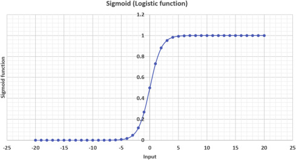
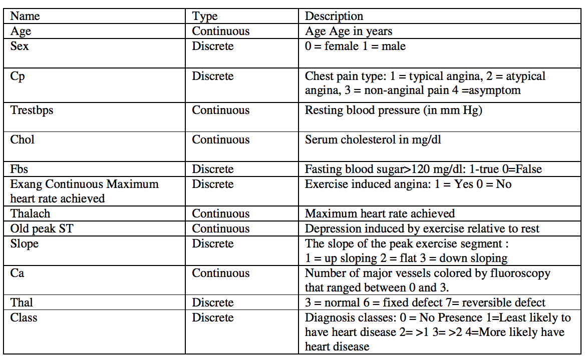

```{r setup, include=FALSE}
knitr::opts_chunk$set(echo = TRUE)
```

# Parte Teórica

## Introdução

A regressão logística é um modelo estatístico fundamental para problemas de classificação binária, onde a variável dependente é categórica. Ela estima a probabilidade de um evento ocorrer com base em variáveis independentes, sendo amplamente aplicada em diversas áreas, como medicina, ciências sociais, marketing e mais.

## Parte Matemática

### Função Sigmoide (Logística)

A função logística, também conhecida como função sigmoide, é o cerne da regressão logística:

$P(Y=1|X) = \frac{1}{e^{-(\beta_0+\beta_1X)}}$, onde:

$P(Y=1|X)$ é probabilidade condicional de Y ser igual a 1 dado o conjunto de preditores X

$\beta_0$ e $\beta_1$ são os coeficientes de interceptação e inclinação, respectivamente

Se traçar essa equação de regressão logística, você obterá uma curva S, conforme mostrado abaixo:



Como você pode ver, a função logit retorna somente valores entre 0 e 1 para a variável dependente, quaisquer que sejam os valores da variável independente. É assim que a regressão logística estima o valor da variável dependente. Os métodos de regressão logística também modelam equações entre múltiplas variáveis independentes e uma variável dependente. Para previsões binárias, você pode dividir a população em dois grupos com um limite de 0.5. Tudo acima de 0.5 é considerado pertencente ao grupo A e tudo abaixo é considerado pertencente ao grupo B.

### Equação da Regressão Logística

A equação de regressão logística é expressa como:

$logit(P)=log(\frac{P}{1-P})=\beta_0+\beta_1X$, em que:

$P$ é a probabilidade condicional de $Y$ ser igual a 1 dado $X$

$logit$ é o logaritmo natural da razão de probabilidades.

## Treinamento do Modelo

O treinamento busca otimizar os coeficientes $\beta$ que maximizem a verossimilhança dos dados observados, geralmente usando técnicas como Máxima Verossimilhança ou Descida de Gradiente.

### Máxima Verossimilhança

Na Máxima Verossimilhança, o objetivo é maximizar a função de verossimilhança dos parâmetros do modelo, ou seja, encontrar os coeficientes que tornam os dados observados mais prováveis. Para a regressão logística, a função de verossimilhança é:

$L(\beta)=\prod^n_{i=1}P(Y_i|X_i,\beta)$, onde:

$L(\beta)$ é a função de verossimilhança

$Y_i$ a variável dependente para a i-ésima observação

$X_i$ os preditores para a i-ésima observação

$\beta$ o conjunto de coeficientes.

A maximização de $L(\beta)$ é geralmente realizada usando técnicas computacionais como o algoritmo de Newton-Raphson ou métodos de otimização numérica, buscando encontrar os valores de $\beta$ que maximizam a probabilidade conjunta dos dados observados.

### Descida de Gradiente (DG)

A Descida de Gradiente é um método iterativo de otimização usado para encontrar os mínimos locais ou globais de uma função. Na regressão logística, o objetivo é minimizar a função de custo (também chamada de função de perda), que pode ser definida como a negativa da função de verossimilhança, chamada de log-verossimilhança:

$-\log L(\beta) = -\sum_{i=1}^{n} \left[ Y_i \log(P(Y_i = 1 \mid X_i, \beta)) + (1 - Y_i) \log(1 - P(Y_i = 1 \mid X_i; \beta)) \right]$

A Descida de Gradiente consiste em atualizar iterativamente os valores dos coeficientes usando a derivada da função de custo em relação aos parâmetros. O processo segue uma direção descendente na função de custo para encontrar os valores dos coeficientes que minimizam essa função.

## Interpretação dos Coeficientes

Um incremento de uma unidade em $X$ está associado a um aumento/decréscimo de $e^{\beta_1}$ vezes na razão de chances de $Y$ ocorrer

O sinal de $\beta$ (positivo/negativo) indica a direção da relação entre o preditor e a variável dependente.

## Aplicações

A regressão logística é empregada em diversas áreas, incluindo medicina (previsão de doenças), marketing (análise de comportamento do consumidor), ciências sociais e economia, para prever eventos binários usando múltiplos preditores.

## Conclusão

A regressão logística é uma ferramenta essencial em análise estatística, permitindo a compreensão e previsão de eventos binários. Sua aplicação em várias áreas permite insights valiosos para tomada de decisão e compreensão de relações entre variáveis. Dominar esse modelo é crucial para análise preditiva e interpretativa.

# Prática no R

Para a parte prática vamos analisar dados de saúde de pacientes de Cleveland, EUA, retirados do Kaggle.

## Introdução

Milhões de pessoas desenvolvem algum tipo de doença cardíaca todos os anos e a doença cardíaca é a maior causa de morte de homens e mulheres nos Estados Unidos e em todo o mundo. A análise estatística identificou muitos fatores de risco associados a doenças cardíacas, como idade, pressão arterial, colesterol total, diabetes, hipertensão, histórico familiar de doenças cardíacas, obesidade, falta de exercícios físicos, etc. Neste notebook, vamos realizar testes estatísticos e modelos de regressão logística para avaliar um fator específico - a frequência cardíaca máxima que se pode atingir durante o exercício e como ela está associada a uma maior probabilidade de contrair doenças cardíacas.

```{r message=FALSE, warning=FALSE}
###Carregando pacote tidyverse
library(tidyverse)

#Carregando os dados
hd_data = read_csv("Cleveland_hd.csv")

#Prmeiras linhas:
head(hd_data)

#estrutura dos dados
glimpse(hd_data)
```

## Conversão para fator

A classe da variável de resultado tem mais de dois níveis. De acordo com o livro de códigos, qualquer valor diferente de zero pode ser codificado como um "evento". Vamos criar uma nova variável chamada 'hd' para representar um resultado binário 1/0.

Existem algumas outras variáveis categóricas/discretas no conjunto de dados. Vamos também converter o sexo em um 'fator' para a próxima etapa de análise. Caso contrário, o R tratará isso como contínuo por padrão.

O dicionário de dados completo está abaixo:



```{r}
#Alterando a classe da coluna para um fator binário (hd)
hd_data = hd_data %>% 
  mutate(hd = factor(if_else(class > 0, 1, 0)),
         hd_labelled = if_else(class > 0, "Disease", "No Disease")) %>%
  
  #Mudando a coluna de sexo para fator
  mutate(sex = factor(sex, levels = c(0, 1), labels = c("Female", "Male")))

#Verificando a coluna de sexo
str(hd_data$sex)
```

## Testes estatísticos

Agora, vamos usar testes estatísticos para ver quais preditores estão relacionados a doenças cardíacas. Podemos explorar as associações para cada variável no conjunto de dados. Dependendo do tipo de dados (isto é, contínuo ou categórico), usamos o teste t ou o teste qui-quadrado para calcular os valores-p

```{r}
# Verificando se o sexo tem efeito.
chisq.test(hd_data$sex, hd_data$hd)

# Verificando se a idade tem efeito.
t.test(age ~ hd, data = hd_data)

# Verificando se o thalach (max batimento cardíaco) tem efeito.
t.test(thalach ~ hd, data = hd_data)
```

## Gráficos

Além dos valores-p dos testes estatísticos, podemos plotar as distribuições de idade, sexo e frequência cardíaca máxima em relação à nossa variável de resultado. Isso nos dará uma noção da direção e da magnitude da relação.

Primeiro, vamos plotar a idade usando um boxplot, já que é uma variável contínua.

```{r message=FALSE, warning=FALSE}
library(plotly)

#idade x hd(doença cardiaca)
 ggplotly(
    ggplot(data = hd_data, aes(x = hd_labelled, y = age)) +
    geom_boxplot() +
    theme_minimal()
)
```

Em seguida, vamos plotar o sexo usando um barplot, pois é uma variável binária neste conjunto de dados.

```{r}
#sex vs hd
ggplotly(
  ggplot(hd_data) +
    aes(x = hd_labelled, fill = sex) +
    geom_bar(position = "fill") +
    scale_fill_manual(
     values = c(Female = "#690000",
      Male = "#70BCF8")
    ) +
    labs(y = "Sexo %", x = "Ocorrência", fill="Sexo") +
    theme_minimal()
)
```

E, finalmente, vamos plotar talach (batimento cardíaco máximo) usando um boxplot, pois é uma variável contínua.

```{r}
#thalach vs hd
 ggplotly(
    ggplot(data = hd_data, aes(x = hd_labelled, y = thalach)) +
      geom_boxplot() +
      theme_minimal()
      
)
```

## Modelo inicial

Os gráficos e os testes estatísticos confirmaram que todas as três variáveis estão associadas de forma altamente significativa com nosso resultado (p\<0,001 para todos os testes).

Em geral, queremos usar a regressão logística múltipla quando temos uma variável de resultado binária e duas ou mais variáveis de previsão. A variável binária é a variável dependente (Y); estamos estudando o efeito que as variáveis independentes (X) têm sobre a probabilidade de se obter um determinado valor da variável dependente. Por exemplo, podemos querer saber o efeito que a frequência cardíaca máxima, a idade e o sexo têm sobre a probabilidade de uma pessoa ter uma doença cardíaca no próximo ano. O modelo também nos dirá qual é o efeito remanescente da frequência cardíaca máxima após controlarmos ou ajustarmos os efeitos dos outros dois efetores.

```{r message=FALSE, warning=FALSE}
library(tidymodels)

#Primeiro, vamos dividir os dados para treinamento e teste
set.seed(42)

# Preparando a divisão inicial
initial_split = initial_split(hd_data, prop = 0.80)

# dados para treinamento
train = training(initial_split)

# dados para teste
test = testing(initial_split)

#Criando a receita do modelo
recipe <- recipe(hd ~ age + sex + thalach, data = train)

#criando o workflow
wkflow <- workflow() %>% add_recipe(recipe)

#Criando as especificações do modelo
glm_spec <- logistic_reg() %>%
  set_mode("classification") %>%
  set_engine("glm")

#atualizando o wkflow e treinando nos dados de treinamento
wkflow_1 <- wkflow %>% 
  add_model(glm_spec) %>%
  fit(train)

#Visualizando o modelo
summary(wkflow_1$fit$fit$fit)
```

## Odds Ratio (OR)

É prática comum na pesquisa médica relatar o Odds Ratio (OR) para quantificar a intensidade com que a presença ou ausência da propriedade A está associada à presença ou ausência do resultado. Quando o OR é maior que 1, dizemos que A está positivamente associado ao resultado B (aumenta as chances de ter B). Caso contrário, dizemos que A está negativamente associado a B (diminui as chances de ter B).

A tabela de coeficiente glm (a coluna 'estimate' no output) em R representa o log(Odds Ratios) do resultado. Portanto, precisamos converter os valores para a escala OR original e calcular o Intervalo de Confiança (IC) de 95% correspondente das Odds Ratios estimadas ao relatar os resultados de uma regressão logística

```{r}
# calcular OR
modelo_tidy = tidy(wkflow_1) %>%
  mutate(OR = exp(estimate),
         ##calcular o IC de 95% e salvar como IC inferior e IC superior
         IC_inferior = exp(estimate - 1.96 * std.error),
         IC_superior = exp(estimate + 1.96 * std.error))

modelo_tidy
```

## Previsões

Até agora, construímos um modelo de regressão logística e examinamos os coeficientes/ORs do modelo. Podemos nos perguntar como podemos usar esse modelo que desenvolvemos para prever a probabilidade de uma pessoa ter uma doença cardíaca, considerando sua idade, sexo e frequência cardíaca máxima. Além disso, gostaríamos de traduzir a probabilidade prevista em uma regra de decisão para uso clínico definindo um valor de corte na escala de probabilidade. Na prática, quando um indivíduo chega para um check-up de saúde, o médico gostaria de saber a probabilidade prevista de doença cardíaca, para valores específicos dos preditores: uma mulher de 45 anos com frequência cardíaca máxima de 150. Para fazer isso, criamos um dataframe chamado newdata, no qual incluímos os valores desejados para nossa previsão.

```{r}
#obtendo a probabilidade prevista em nosso conjunto de dados
prob_wkflow1 = predict(wkflow_1, test, type = "prob")  %>%
  mutate(hd = test$hd)

#criando um novo dataframe e uma regra de decisão usando probabilidade 0.5 como corte

results_wkflow1 = tibble(hd = test$hd,
                 predict(wkflow_1, test, type="class"))

# criando um novo dataframe para salvar uma nova informação de caso
novo_dado = tibble(age = 45, sex = "Female", thalach = 150)

# previsão de probabilidade para este novo caso
p_novo = predict(wkflow_1, novo_dado, type = "prob")
p_novo
```

## Métricas de Desempenho

As previsões são precisas? Quão bem o modelo se ajusta aos nossos dados? Vamos usar algumas métricas comuns para avaliar o desempenho do modelo. A mais direta é a Acurácia, que é a proporção do número total de previsões corretas. Por outro lado, podemos calcular a taxa de erro de classificação usando 1-acurácia No entanto, a acurácia pode ser enganosa quando a resposta é rara (ou seja, resposta desequilibrada). Outra métrica popular, a Área sob a curva ROC (AUC), tem a vantagem de ser independente da mudança na proporção de respondentes. A AUC varia de 0 a 1. Quanto mais próximo de 1, melhor o desempenho do modelo. Por fim, uma matriz de confusão é uma matriz N X N, onde N é o nível de resultado. Para o problema em questão, temos N=2 e, portanto, obtemos uma matriz 2 X 2. Ele compara os níveis de resultados previstos com os níveis de resultados reais.

Depois que essas métricas forem calculadas, veremos (na tabela OR de regressão logística) que idade avançada, ser homem e ter uma frequência cardíaca máxima mais baixa são fatores de risco para doenças cardíacas. Também podemos aplicar nosso modelo para prever a probabilidade de ter doenças cardíacas. Para uma mulher de 45 anos com frequência cardíaca máxima de 150, nosso modelo gerou uma probabilidade de doença cardíaca de 0,1986, indicando baixo risco de doença cardíaca.

```{r}
## Curva ROC
prob_wkflow1 %>%
  roc_curve(hd, .pred_0) %>%
  autoplot()

## Area sob a curva (AUC)
auc <- prob_wkflow1 %>% 
  roc_auc(hd, .pred_0)

# Acurácia
acuracia <- results_wkflow1 %>%
  accuracy(hd, .pred_class)

# imprimindo as métricas na tela
print(paste("AUC =", auc$.estimate))
print(paste("Acurácia =", acuracia$.estimate))

## Matriz de confusão
conf_mat(data = results_wkflow1, truth = hd, estimate = .pred_class)
```

Embora nosso modelo tenha uma precisão geral de 0,6885, há casos que foram classificados erroneamente conforme mostrado na matriz de confusão. Uma maneira de melhorar nosso modelo atual é incluir outros preditores relevantes do conjunto de dados em nosso modelo.

## Modelo robusto

Primeiro vamos preparar um novo conjunto de dados e mudar todas as variáveis discretas para fatores

```{r}
hd_data <- hd_data %>%
  
  #excluindo a coluna de classe
  select(-class, -hd_labelled) %>%
  
  #mudando outras variáveis discretas para fatores
  mutate(
         cp = factor(cp, levels = c(1, 2, 3, 4), labels = c("typical angina", "atypical angina", "non angina pain", "asymptom"), ordered= TRUE),
         fbs = ifelse(fbs == 1,  TRUE, FALSE),
         exang = ifelse(exang == 1, TRUE, FALSE),
         slope = factor(slope, levels = c(1, 2, 3), labels = c("up sloping", "flat", "down sloping"), ordered = TRUE),
         thal = factor(thal, levels = c(3, 6, 7), labels = c("normal", "fixed defect", "reversible defect"), ordered = TRUE),
         )

glimpse(hd_data)
```

Agora, vamos atualizar nosso workflow

```{r}
#nova receita
recipe_2 <- recipe(hd ~ ., data=hd_data)

#atualizando o wkflow e treinando nos dados de treinamento
wkflow_2 <- wkflow %>% 
  update_recipe(recipe_2) %>%
  add_model(glm_spec) %>%
  fit(train)

#Visualizando o modelo
summary(wkflow_2$fit$fit$fit)
```

Agora que temos nosso modelo usando todas as variáveis, vamos prever nos dados de teste e ver os resultados

```{r}
#obtendo a probabilidade prevista em nosso conjunto de dados
prob_wkflow2 = predict(wkflow_2, test, type = "prob")  %>%
  mutate(hd = test$hd)

#criando um novo dataframe e uma regra de decisão usando probabilidade 0.5 como corte

results_wkflow2 = tibble(hd = test$hd,
                 predict(wkflow_2, test, type="class"))
```

Vamos calcular o desempenho desse modelo:

```{r}
## Curva ROC
prob_wkflow2 %>%
  roc_curve(hd, .pred_0) %>%
  autoplot()

## Area sob a curva (AUC)
auc2 <- prob_wkflow2 %>% 
  roc_auc(hd, .pred_0)

# Acurácia
acuracia2 <- results_wkflow2 %>%
  accuracy(hd, .pred_class)

# imprimindo as métricas na tela
print(paste("AUC1 =", round(auc$.estimate, 4),"VS","AUC2 =", round(auc2$.estimate, 4)))
print(paste("Acurácia1 =", round(acuracia$.estimate, 4),"VS", "Acurácia2 =", round(acuracia2$.estimate, 4)))
```

## Conclusão

Portanto, o modelo que usa todas as variáveis é muito melhor do que o modelo original e podemos esperar que ele preveja se um paciente tem probabilidade de ter uma doença cardíaca e esteja correto em 81% das vezes. O próximo passo seria testar outros tipos de modelos de classificação, como 'random forests', 'xgboost' etc. Porém, fica para outro momento.

# Referencias

-   Hosmer Jr, D. W., Lemeshow, S., & Sturdivant, R. X. (2013). Applied Logistic Regression. John Wiley & Sons.

-   Agresti, A. (2015). Foundations of Linear and Generalized Linear Models. John Wiley & Sons.

-   Gelman, A., & Hill, J. (2006). Data Analysis Using Regression and Multilevel/Hierarchical Models. Cambridge University Press.
