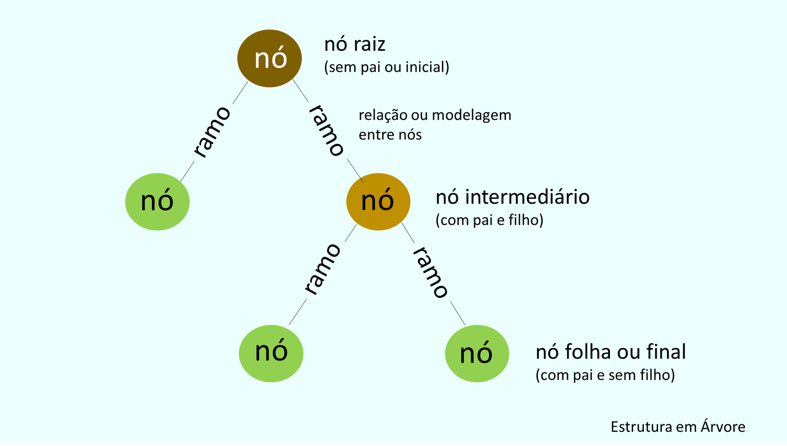
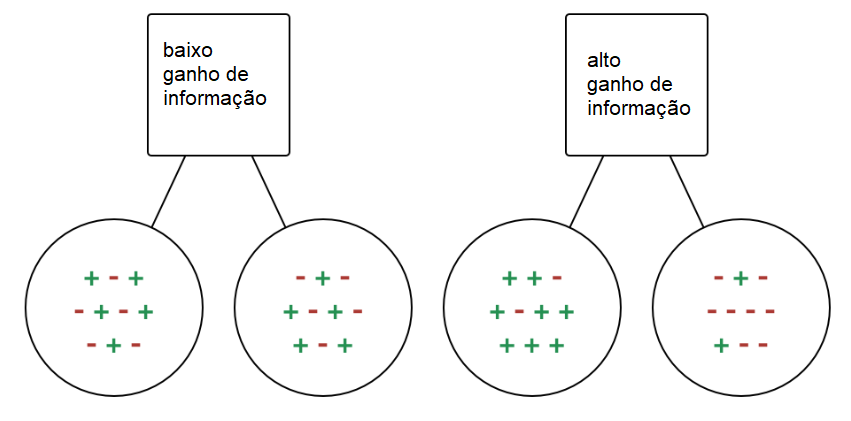

```{r setup, include=FALSE}
knitr::opts_chunk$set(echo = TRUE)
```

# Teoria

## Introdução

A classificação é um processo de duas etapas, passo de aprendizado e passo de previsão, na aprendizagem de máquina. No passo de aprendizado, o modelo é desenvolvido com base nos dados de treinamento fornecidos. No passo de previsão, o modelo é utilizado para prever a resposta para os dados de teste fornecidos. A Árvore de Decisão é um dos algoritmos de classificação mais simples e populares para entender e interpretar.

## Algoritmo

O algoritmo da Árvore de Decisão pertence à família de algoritmos de aprendizado supervisionado. Ao contrário de outros algoritmos de aprendizado supervisionado, o algoritmo da árvore de decisão pode ser usado para resolver tanto problemas de regressão, como problemas de classificação.

O objetivo de usar uma Árvore de Decisão é criar um modelo de treinamento que possa ser usado para prever a classe ou valor da variável-alvo aprendendo regras de decisão simples inferidas a partir de dados anteriores (dados de treinamento).

Nas Árvores de Decisão, para prever um rótulo de classe para um registro, começamos pela raiz da árvore. Comparamos os valores do atributo raiz com o atributo do registro. Com base na comparação, seguimos o ramo correspondente a esse valor e passamos para o próximo nó.

## Tipos de Árvores

Os diferente tipos de árvores de decisão são baseados no tipo de variável-alvo que temos. Podem ser de dois tipos:

-   Árvore de Decisão de Variável Categórica: Árvore de Decisão que possui uma variável-alvo categórica é chamada de árvore de decisão de variável categórica.

-   Árvore de Decisão de Variável Contínua: Árvore de Decisão que possui uma variável-alvo contínua é chamada de árvore de decisão de variável contínua.

Exemplo: Digamos que temos um problema para prever se um cliente pagará sua renovação de prêmio com uma companhia de seguros (sim/não). Aqui sabemos que a renda dos clientes é uma variável significativa, mas a companhia de seguros não possui detalhes de renda para todos os clientes. Agora, como sabemos que essa é uma variável importante, podemos construir uma árvore de decisão para prever a renda do cliente com base na ocupação, produto e várias outras variáveis. Neste caso, estamos prevendo valores para as variáveis contínuas.

## Terminologias

-   **Nó Raiz**: Representa toda a população ou amostra e é posteriormente dividido em dois ou mais conjuntos homogêneos.

-   **Divisão**: É um processo de dividir um nó em dois ou mais subnós.

-   **Nó de Decisão**: Quando um subnó se divide em mais subnós, é chamado de nó de decisão.

-   **Nó Folha / Terminal**: Nós que não se dividem são chamados de nó folha ou terminal.

-   **Poda**: Quando removemos subnós de um nó de decisão, esse processo é chamado de poda. Pode-se dizer que é o processo oposto à divisão.

-   **Ramo / Subárvore**: Uma subseção da árvore inteira é chamada de ramo ou subárvore.

-   **Nó Pai e Filho**: Um nó que se divide em subnós é chamado de nó pai dos subnós, enquanto os subnós são filhos de um nó pai.



As árvores de decisão classificam os exemplos ao ordená-los pela árvore, desde a raiz até algum nó folha/terminal, onde o nó folha/terminal fornece a classificação do exemplo.

Cada nó na árvore atua como um caso de teste para algum atributo, e cada ramo descendente do nó corresponde às possíveis respostas para o caso de teste. Esse processo é recursivo e é repetido para cada subárvore enraizada no novo nó.

## Pressuposições ao criar uma Árvore de Decisão

Abaixo estão algumas das pressuposições que fazemos ao usar uma árvore de decisão:

-   No início, todo o conjunto de treinamento é considerado como a raiz.

-   Valores de características são preferencialmente categóricos. Se os valores forem contínuos, eles são discretizados antes de construir o modelo.

-   Os registros são distribuídos de forma recursiva com base nos valores dos atributos.

-   A ordem de colocação dos atributos como raiz ou nó interno da árvore é feita usando alguma abordagem estatística.

As Árvores de Decisão seguem a representação da Soma dos Produtos (SOP). A Soma dos Produtos (SOP) também é conhecida como Forma Normal Disjuntiva. Para uma classe, cada ramo da raiz da árvore até um nó folha que possui a mesma classe é uma conjunção (produto) de valores; diferentes ramos que terminam nessa classe formam uma disjunção (soma).

O desafio principal na implementação da árvore de decisão é identificar quais atributos devemos considerar como nó raiz e em cada nível. Lidar com isso é conhecido como seleção de atributos. Temos diferentes medidas de seleção de atributos para identificar qual atributo pode ser considerado como o nó raiz em cada nível.

## Como funciona uma Árvore de Decisão

A decisão de realizar divisões estratégicas afeta significativamente a precisão de uma árvore. Os critérios de decisão são diferentes para árvores de classificação e regressão.

As árvores de decisão utilizam diversos algoritmos para decidir se dividem um nó em dois ou mais subnós. A criação de subnós aumenta a homogeneidade dos subnós resultantes. Em outras palavras, podemos dizer que a pureza do nó aumenta em relação à variável-alvo. A árvore de decisão divide os nós em todas as variáveis disponíveis e então seleciona a divisão que resulta nos subnós mais homogêneos.

A seleção do algoritmo também é baseada no tipo de variáveis-alvo. Vamos dar uma olhada em alguns algoritmos usados em Árvores de Decisão:

-   ID3 → (extensão do D3)
-   C4.5 → (sucessor do ID3)
-   CART → (Classificação e Regressão de Árvore de Decisão)
-   CHAID → (Detecção Automática de Interação Qui-Quadrado. Realiza divisões multinível ao calcular árvores de classificação)
-   MARS → (spline de regressão adaptativa multivariada)

O algoritmo ID3 constrói árvores de decisão usando uma abordagem gananciosa de busca de cima para baixo através do espaço de possíveis ramos sem retrocesso. Um algoritmo ganancioso, como o nome sugere, sempre faz a escolha que parece ser a melhor naquele momento.

### Passo a passo do algoritmo ID3

-   Começa com o conjunto original S como o nó raiz.

-   Em cada iteração do algoritmo, ele passa por cada atributo não utilizado do conjunto S e calcula Entropia (H) e Ganho de Informação (IG) desse atributo.

-   Em seguida, seleciona o atributo que tem a menor Entropia ou o maior Ganho de Informação.

-   O conjunto S é então dividido pelo atributo selecionado para produzir um subconjunto dos dados.

-   O algoritmo continua a se repetir em cada subconjunto, considerando apenas atributos nunca selecionados antes.

### Medidas de Seleção de Atributos

Se o conjunto de dados consistir em N atributos, decidir qual atributo colocar na raiz ou em diferentes níveis da árvore como nós internos é uma etapa complicada. Escolher qualquer nó aleatoriamente para ser a raiz não resolve o problema. Se seguirmos uma abordagem aleatória, pode nos fornecer resultados ruins com baixa precisão.

Para resolver esse problema de seleção de atributos, os pesquisadores trabalharam e elaboraram algumas soluções. Eles sugeriram usar alguns critérios como:

-   Entropia,
-   Ganho de Informação,
-   Índice de Gini,
-   Taxa de Ganho,
-   Redução na Variância
-   Qui-Quadrado

Esses critérios calcularão valores para cada atributo. Os valores são ordenados, e os atributos são colocados na árvore seguindo a ordem, ou seja, o atributo com um valor alto (no caso do ganho de informação) é colocado na raiz.

Ao usar o Ganho de Informação como critério, assumimos que os atributos são categóricos, e para o Índice de Gini, assume-se que os atributos são contínuos.

#### **Entropia**

Entropia é uma medida da aleatoriedade das informações sendo processadas. Quanto maior a entropia, mais difícil é tirar conclusões dessas informações. Jogar uma moeda é um exemplo de uma ação que fornece informações aleatórias.

```{r echo=FALSE, message=FALSE, warning=FALSE}
# Função para calcular a entropia
entropy <- function(p) {
  if (p == 0 || p == 1) {
    return(0)
  } else {
    return(-p * log2(p) - (1 - p) * log2(1 - p))
  }
}

# Valores de probabilidade de X = 1 (de 0 a 1)
probabilities <- seq(0, 1, by = 0.01)

# Calcular entropia para cada probabilidade
entropies <- sapply(probabilities, entropy)

# Plotar o gráfico
plot(probabilities, entropies, type = "l", xlab = "P(X = 1)", ylab = "H(X)", lwd=3)
```

A partir do gráfico acima, é bastante evidente que a entropia $H(X)$ é zero quando a probabilidade é igual a 0 ou 1. A entropia é máxima quando a probabilidade é 0.5 porque isso representa uma aleatoriedade perfeita nos dados e não há chance de determinar perfeitamente o resultado.

O algoritmo ID3 segue a regra de que um ramo com entropia zero é um nó folha, e um ramo com entropia maior que zero precisa de mais divisões.

Matematicamente, a Entropia para 1 atributo é representada como:

$E(S)=\sum_{i=1}^c - p_i log_2(p_i)$

**Exemplo**:

Defina a variável jogar golfe (G). Se 9 pessoas jogam golfe e 5 não jogam, então:

$E(G)=E(5,9)=E(0.36,0.64)=-(0.36log_2(0.36)-(0.64log_2(0.64)))=0.94$

Matematicamente, a Entropia para múltiplos atributos é representada como:

$E(T,X)=\sum_{c \in X }P(c)E(c)$

**Exemplo 2**:

Defina as variáveis jogar golfe (G) e tempo (T), distribuídas de acordo com a tabela:

```{r echo=FALSE, message=FALSE, warning=FALSE}
df <- tibble::tibble(golfe = c(rep("sim", 9), rep("não", 5)),
                     tempo = c(rep("sol", 3), rep("nublado",4), rep("chuva",2), rep("sol", 2), rep("chuva", 3))
)

gtsummary::tbl_cross(df)
```

$E(G, T) = P(sol)*E(3, 2)+P(nublado)*E(4,0)+P(chuva)*E(2,3)$

$= \frac{5}{14} * 0.971+\frac{4}{14}*0+\frac{5}{14}*0.971=0.693$

#### **Ganho de Informação**:

Ganho de informação (IG) é uma propriedade estatística que mede quão bem um atributo dado separa os exemplos de treinamento de acordo com sua classificação alvo. Construir uma árvore de decisão trata principalmente de encontrar um atributo que retorne o maior ganho de informação e a menor entropia.



Ganho de informação é uma diminuição na entropia. Ele calcula a diferença entre a entropia antes da divisão e a entropia média após a divisão do conjunto de dados com base nos valores do atributo fornecido. O algoritmo de árvore de decisão ID3 (Iterative Dichotomiser) usa o ganho de informação.

Matematicamente, o ganho de informação é representado como:

$IG(T,X)=E(T)-E(T,X)$

Dos exemplos anteriores:

$IG(G,T)=E(G)-E(G,T)=0.940-0.693=0.247$

De um modo mais simples, podemos concluir que:

Ganho de Informação = Entropia (antes) - $\sum_{j=1}^K$ Entropia (j, depois)

Onde antes é o conjunto de dados antes da divisão, K é o número de subconjuntos gerados pela divisão e (j, depois) é o subconjunto j após a divisão.

#### **Indice de Gini**:

Você pode interpretar o índice de Gini como uma função de custo usada para avaliar divisões no conjunto de dados. É calculado subtraindo a soma das probabilidades ao quadrado de cada classe de um. Ele favorece partições maiores e é fácil de implementar, enquanto o ganho de informação favorece partições menores com valores distintos.

$Gini=1-\sum_{i=1}^C(p_i)^2$

O Índice de Gini trabalha com a variável-alvo categórica "Sucesso" ou "Falha". Ele realiza apenas divisões binárias.

Um valor mais alto do Índice de Gini implica em maior desigualdade, maior heterogeneidade.

Passos para calcular o índice de Gini:

-   Calcule o Gini para os subnós, utilizando a fórmula acima para sucesso (p) e falha (q) (p²+q²).
-   Calcule o índice de Gini para a divisão usando a pontuação de Gini ponderada de cada nó dessa divisão.

O CART (Classification and Regression Tree) utiliza o método do índice de Gini para criar pontos de divisão.

#### **Taxa de Ganho**:

O ganho de informação tem tendência a escolher atributos com um grande número de valores como nós raiz. Isso significa que ele prefere o atributo com um grande número de valores distintos.

O C4.5, uma melhoria do ID3, utiliza a Razão de Ganho, que é uma modificação do Ganho de Informação que reduz seu viés e geralmente é a melhor opção. A Razão de Ganho supera o problema do ganho de informação levando em consideração o número de ramos que resultariam antes de fazer a divisão. Ela corrige o ganho de informação levando em conta a informação intrínseca de uma divisão.

Vamos considerar um conjunto de dados que contenha usuários e suas preferências de gênero de filme com base em variáveis como gênero, faixa etária, classificação, etc. Com a ajuda do ganho de informação, você divide pelo 'Gênero' (supondo que tenha o maior ganho de informação) e agora as variáveis 'Faixa Etária' e 'Classificação' podem ser igualmente importantes. Com o auxílio da razão de ganho, ele penalizará uma variável com mais valores distintos, o que nos ajudará a decidir a divisão no próximo nível.

$Gain Ratio=\frac{Information Gain}{SplitInfo}=\frac{Entropia(antes)-\sum_{j=1}^KEntropia(j, depois)}{\sum_{j=1}^K w_jlog_2(w_j)}$

#### **Redução na Variancia**

Redução na variância é um algoritmo usado para variáveis-alvo contínuas (problemas de regressão). Esse algoritmo utiliza a fórmula padrão de variância para escolher a melhor divisão. A divisão com menor variância é selecionada como critério para dividir a população:

$Var=\frac{\sum(X-\bar{X})^2}{n}$,  onde $\bar{X}$ é a média dos valores atuais X e n é o número de valores

Passos para calcular a Variância:

-   Calcular a variância para cada nó.
-   Calcular a variância para cada divisão como a média ponderada da variância de cada nó.

#### **Qui-Quadrado**


A sigla CHAID significa Chi-squared Automatic Interaction Detector. É um dos métodos mais antigos de classificação de árvores. Ele identifica a significância estatística entre as diferenças entre os subnós e o nó pai. Medimos isso pela soma dos quadrados das diferenças padronizadas entre as frequências observadas e esperadas da variável-alvo.

Ele trabalha com a variável-alvo categórica "Sucesso" ou "Falha". Pode realizar duas ou mais divisões. Quanto maior o valor do Qui-Quadrado, maior a significância estatística das diferenças entre o subnó e o nó pai.

Ele gera uma árvore chamada CHAID (Chi-square Automatic Interaction Detector).

Matematicamente, o Qui-Quadrado é representado como:

$X^2=\sum \frac{(O-E)^2}{E}$, onde:

$X^2$ é o valor de qui-quadrado obtido, $O$ são os valores observados e $E$ os valores esperados


Passos para Calcular o Qui-quadrado para uma divisão:

-   Calcular o Qui-quadrado para um nó individual calculando a discrepância para Sucesso e Falha.
-   Calcular o Qui-quadrado da Divisão usando a soma de todos os Qui-quadrados de sucesso e falha de cada nó da divisão.


## Como evitar/reduzir o 'Overfitting'

Um problema comum das árvores de decisão, especialmente quando se tem uma tabela cheia de colunas, é que elas se ajustam demais. Às vezes, parece que a árvore memorizou o conjunto de dados de treinamento. Se não houver limite definido em uma árvore de decisão, ela fornecerá 100% de precisão no conjunto de dados de treinamento, porque, no pior caso, ela acabará criando 1 folha para cada observação. Isso afeta a precisão ao prever amostras que não fazem parte do conjunto de treinamento.

Aqui estão duas maneiras de evitar o overfitting:

-   Poda de Árvores de Decisão.
-   Floresta Aleatória (Random Forest).

### Poda de Árvores de Decisão 

O processo de divisão resulta em árvores completamente desenvolvidas até que os critérios de parada sejam atingidos. No entanto, a árvore completamente desenvolvida tende a superajustar os dados, resultando em baixa precisão em dados não vistos.

Na poda, você remove os ramos da árvore, ou seja, elimina os nós de decisão começando pelo nó folha, de modo que a precisão geral não seja afetada. Isso é feito segregando o conjunto de dados de treinamento real em dois conjuntos: conjunto de dados de treinamento, D, e conjunto de dados de validação, V. Prepare a árvore de decisão usando o conjunto de dados de treinamento segregado, D. Em seguida, continue podando a árvore de acordo para otimizar a precisão do conjunto de dados de validação, V.

### Floresta Aleatória (Random Forest)

'Random Forest' é um exemplo de aprendizado de conjunto, no qual combinamos vários algoritmos de aprendizado de máquina para obter um melhor desempenho preditivo. Veremos em um próximo post o funcionamento desse algoritmo.

## Hiper-parâmetros

Ao utilizar o pacote tidymodels para modelar uma árvore de decisão, precisamos tunar os  hiper-parâmetros:

-   Cost/Complexity (Cp):

É um parâmetro que afeta a complexidade da árvore de decisão. Em modelos CART (Classificação e Regressão por Árvores), o Cp é usado para controlar o trade-off entre a complexidade da árvore e seu desempenho. Quanto maior o Cp, mais simples é a árvore (menos ramificações), o que pode ajudar a evitar o overfitting.

-   Profundidade Máxima da Árvore (tree_depth):

Este parâmetro define o limite máximo para a profundidade da árvore. Limitar a profundidade pode ajudar a prevenir um crescimento excessivo da árvore, o que também pode levar ao overfitting. Uma árvore com profundidade limitada terá menos ramificações e, portanto, menos complexidade.

-   Mínimo de Pontos de Dados em um Nó (min_n):

Esse parâmetro define o número mínimo de pontos de dados necessários em um nó para que ele possa ser dividido ainda mais. Se o número de pontos de dados em um nó for menor que esse limite mínimo, a divisão não ocorrerá. Isso é útil para evitar divisões em nós que têm muito poucos dados, o que pode levar a ramificações muito específicas e superespecificação (overfitting).

Esses hiperparâmetros são fundamentais para controlar o processo de construção da árvore de decisão e ajustar sua complexidade para alcançar um equilíbrio entre a capacidade de generalização e o ajuste aos dados de treinamento. Ajustar esses parâmetros pode ajudar a melhorar o desempenho e a capacidade de generalização do modelo de árvore de decisão.

CHEGA DE TEORIA, VAMOS PARA A PRÁTICA!!!

# Prática

Para colocarmos em prática o que aprendemos, vamos utilizar um conjunto de dados sobre doces de Halloween, retirado do pacote 'fivethirtyeight', que inclui todos os tipos de informações diferentes sobre diferentes tipos de doces. Por exemplo, um doce é achocolatado? Tem nougat? Como seu custo se compara a outros doces? Quantas pessoas preferem um doce a outro? Etc.

## Importando os dados

```{r message=FALSE, warning=FALSE}
# Carregando pacotes
library(tidyverse)
library(tidymodels)
library(ggcorrplot)
library(fivethirtyeight)
library(plotly)

# Carregando o conjunto de dados candy_rankings do pacote fivethirtyeight
data(candy_rankings)

# Dando uma olhada no conjunto de dados
glimpse(candy_rankings)

#numero de NA's
colSums(is.na(candy_rankings))

#resumo dos dados
summary(candy_rankings)
```
Ok! Parece que não há muita limpeza a ser realizada nesses dados. Vamos começar algumas análises!

## Variáveis Categóricas

Vamos fazer um gráfico de barras mostrando o número de TRUEs e FALSEs para cada tipo de doce (característica).

```{r message=FALSE, warning=FALSE}
library(DataExplorer)

#plotando variaveis categóricas com no máximo 5 categorias
plot_bar(candy_rankings, maxcat = 5)
```

## Variável 'pricepercent'

Essa variável registra a classificação percentil do preço do doce em relação a todos os outros doces no conjunto de dados. Vamos ver qual é o mais caro e qual é o menos caro.

```{r, fig.height=13}
# Colocando a variavel 'competitorname' em ordem de acordo com 'pricepercent'
candy_rankings$competitorname = fct_reorder(candy_rankings$competitorname, candy_rankings$pricepercent)

# Fazendo um gráfico lollipop de preço por cento
ggplotly(
  ggplot(candy_rankings, aes(x = competitorname, y = pricepercent)) +
  geom_point() +
  geom_segment(aes(xend = competitorname, yend = 0)) +
  coord_flip() +
  labs(x = "competitorname") +
  theme_minimal()
)
```

Um dos aspectos mais interessantes deste gráfico é que muitos dos doces compartilham o mesmo ranking, então parece que alguns deles têm o mesmo preço.

## Variável 'winpercent'

Continuando, veremos outra variável numérica no conjunto de dados: ‘winpercent’. Essa variável é a porcentagem de pessoas que preferem esse doce a outro doce escolhido aleatoriamente no conjunto de dados.

Vamos começar com um histograma!

```{r}
# Traçando um histograma de 'winpercent'
# Traçando um histograma de 'winpercent'
ggplotly(
  ggplot(candy_rankings, aes(x = winpercent)) +
  geom_histogram(aes(y = stat(density)),  fill="black") +
  geom_density( color = "red",  alpha=0.3, fill="red") +
  labs(title = "Histograma e Densidade") +
  theme_minimal()
)

```

Agora que vimos o histograma, vamos fazer outro gráfico lollipop para visualizar as classificações.

```{r, fig.height=13}
#reordenando a coluna 'competitorname'
candy_rankings$competitorname = fct_reorder(candy_rankings$competitorname, candy_rankings$winpercent)

# Fazendo um gráfico lollipop de 'winpercent'
ggplotly(
  ggplot(candy_rankings, aes(x = competitorname, y = winpercent)) +
  geom_point() +
  geom_segment(aes(xend = reorder(competitorname, winpercent), yend = 0)) +
  coord_flip() +
  labs(x = "competitorname") +
  theme_minimal()
)
```

Parece que os Reese’s Peanut Butter Cups são os favoritos deste conjunto de doces!

## Correlações

Agora que exploramos o conjunto de dados uma variável por vez, veremos como as variáveis interagem umas com as outras. Isso é importante quando nos preparamos para modelar os dados porque nos dará alguma intuição sobre quais variáveis podem ser úteis como variáveis explicativas.

```{r message=FALSE, warning=FALSE, fig.height=7}
# Plotando a matriz de correlação
matriz_correlacao = candy_rankings %>%
  select(-competitorname) %>%
  cor() %>%
  ggcorrplot(method = "circle",
             type = "l")

ggplotly(matriz_correlacao)
```

Olhando para este gráfico, parece que os doces de chocolate quase nunca são frutados, o que faz sentido! Isso também nos permite verificar possíveis multicolinearidades, o que poderia ser um problema para uma possível modelagem de regressão. Parece que está tudo ok!

## Modelo de Regressão

Vamos nos aprofundar na modelagem criando um modelo de ‘winpercent’ usando todas as outras variáveis, exceto o nome do concorrente.

Como ‘competitorname’ é uma variável categórica com um valor exclusivo em cada linha, esta variável não adiciona nenhuma informação que o modelo possa usar porque os nomes não se relacionam com nenhum dos atributos dos doces.

Vamos ajustar o modelo e explorá-lo. Talvez isso nos dê uma ideia de por que as pessoas tendem a preferir um doce a outro!

```{r}
#fazendo a divisão de dados de teste e treinamento
set.seed(123)
initial_split <- initial_split(candy_rankings, prop = 0.8)
train <- training(initial_split)
test <- testing(initial_split)
```

Agora que dividimos nossos dados, vamos pegar os dados de treinamento e criar várias folds para otimizarmos nosso modelo:

```{r}
##criando as amostras
folds <- vfold_cv(train, times = 5)
```

Vamos criar a receita e o workflow do nosso modelo, normalizando variáveis numericas

```{r}
#criando a receita com os pre-processamentos
recipe <- recipe(formula = winpercent ~., data = train) %>%
  step_normalize(all_numeric_predictors())

#criando o workflow da regressão
workflow_reg <- workflow() %>% add_recipe(recipe)
```

Temos a receita e o workflow criados, agora criamos a especificação do modelo, com o parâmetros a otimizar e atualizamos o workflow:

```{r}
#especificações do modelo
trees_reg_spec <- decision_tree(cost_complexity = tune(), tree_depth = tune(), min_n = tune()) %>%
  set_mode("regression") %>%
  set_engine("rpart")

#atualizando o workflow com as especificações
workflow_reg <- workflow_reg %>%
  add_model(trees_reg_spec)
```

Hora de tunar os parâmetros. Para isso vamos extrair os parâmetros do modelo e criar um 'grid' com várias combinações de valores usando a função 'grid_latin_hypercube', que é usado para construir grades de parâmetros que tentam cobrir o espaço de parâmetros de forma que qualquer parte do espaço tenha uma combinação observada que não esteja muito distante dela. Além disso, vamos processar em paralelo para acelerar o processo.

```{r message=FALSE, warning=FALSE}
#extraindo os parâmetros
parametros <- extract_parameter_set_dials(trees_reg_spec)

#criando o grid
tree_grid <- grid_latin_hypercube(parametros, size = 100)

#biblioteca para processamento em paralelo
library(doParallel)

cores <- parallel::detectCores()

cl <- makePSOCKcluster(cores)
registerDoParallel(cl)

##hora de tunar os parametros na amostra
reg_results <- tune_grid(object = workflow_reg, 
                         resamples = folds,  
                         grid=tree_grid, 
                         metrics = metric_set(rmse, rsq, mae, mape))


stopCluster(cl)
```
### Visualização das métricas

```{r}
collect_metrics(reg_results)
```

```{r}
autoplot(reg_results)
```
Podemos ver que os erros são menores quando a complexidade é menor, min_n menor e tree_depth também menor. Podemos ver isso selecionando os melhores modelos, usando a função 'show_best'

```{r}
show_best(reg_results, "mape")
```

Agora, vamos selecionar o melhor conjunto de parâmetros e finalizar o modelo

```{r}
#melhor modelo de acordo com a métrica 'rmse'
select_best(reg_results, "rmse")

workflow_reg <- finalize_workflow(workflow_reg, select_best(reg_results, "rmse"))

workflow_reg
```

Este modelo workflow_reg foi atualizado e finalizado (não mais ajustável), mas não foi treinado. Todos os seus hiperparâmetros estão definidos, mas ele não foi ajustado a nenhum conjunto de dados. Temos algumas opções para como treinar este modelo. Podemos ajustar o workflow_reg aos dados de treinamento usando fit(), ou à divisão de teste/treinamento usando last_fit(), que nos fornecerá alguns outros resultados juntamente com o 'output' ajustado.

```{r}
final_tree_reg <- last_fit(workflow_reg, initial_split)
```
Podemos coletas as métricas, ver quais as variáveis mais importantes na decisão e visualizar a árvore (nesse caso não será muito útil)

```{r out.height=12, out.width=12}
#métricas
collect_metrics(final_tree_reg)

#Variáveis mais importantes
library(vip)

final_tree_reg %>%
  extract_fit_parsnip() %>%
  vip()

#visualizar arvore
final_tree_reg %>%
  extract_fit_engine()
```
Essas são as informações que serão plotadas. Por ser uma árvore contínua, são muitas informações, você pode tentar dar zoom para ler as divisões.

```{r fig.width=50, fig.height=10}
library(rpart.plot)
final_tree_reg %>%
  extract_fit_engine() %>%
  rpart.plot(roundint = FALSE)
```

## Modelo de Classificação

Agora vamos tentar uma árvore de clasificação! Estaremos tentando prever se um doce é achocolatado ou não com base em todos os outros recursos do conjunto de dados. 

Vamos primeiro criar uma nova especificação do modelo e a receita:

```{r}
#especificações modelo de classificação
tree_clas_spec <- decision_tree(cost_complexity = tune(),
                                tree_depth = tune(),
                                min_n = tune()) %>%
  set_mode("classification")  %>%
  set_engine("rpart")

#criacao da receita mudando variaveis logicas para fator
recipe_clas <- recipe(formula=chocolate ~ ., data = train) %>%
  step_rm(competitorname) %>%
  step_bin2factor(all_logical())
```

Agora que temos nossa especificação, vamos criar um workflow de classificação

```{r}
#criando workflow e adicionando a receita e a especificação
workflow_class <- workflow() %>%
  add_recipe(recipe_clas) %>%
  add_model(tree_clas_spec)
```

Já temos os dados de treinamento e teste que criamos durante o modelo de regressão e também ja temos algumas outras variáveis que vamos reutilizar. Então já podemos otimizar os hiper-parâmetros

```{r}
#processamento paralelo
cores <- parallel::detectCores()

cl <- makePSOCKcluster(cores)
registerDoParallel(cl)

##hora de tunar os parametros na amostra
class_results <- tune_grid(object = workflow_class, 
                         resamples = folds,  
                         grid=tree_grid, 
                         metrics = metric_set(roc_auc, accuracy, sensitivity, specificity))

#parar processamento em paralelo
stopCluster(cl)
```
Agora, vamos ver as métricas

```{r}
collect_metrics(class_results)

autoplot(class_results, metric = "roc_auc")
```
Bom, parece que a performance do modelo é melhor quando o min_n está entre 20 e  30, porém, o desempenho com os outros dois parâmetros vai depender muito mais da combinação final, do que do valor em si. Vamos finalizar o workflow com o melhor modelo:

```{r}
workflow_class <- finalize_workflow(workflow_class, select_best(class_results))

workflow_class
```
Com o wokflow final em mãos, basta treinar o modelo no conjunto de treinamento completo com a função 'last_fit'. Em seguida, podemos ver as métricas finais de desempenho, visualizar a árvore e as variáveis mais importantes para sua construção:

```{r message=FALSE, warning=FALSE}
#modelo final já ajustado
final_tree_class <- last_fit(workflow_class, initial_split)

#métricas no conjunto de teste
collect_metrics(final_tree_class)

#viisualizar árvore
final_tree_class %>%
  extract_fit_engine() %>%
  rpart.plot()

#visualizar importancia das variaáveis
final_tree_class %>%
  extract_fit_parsnip() %>%
  vip() + theme_minimal()
```
### Conclusões

-   Obtivemos uma acurácia de 94%, uma métrica excelente.
-   As variáveis mais importantes para a construção da árvore são 'fruity', 'pricepercent' e 'winpercent'. 

## Referências:

-   Hastie, T., Tibshirani, R., & Friedman, J. (2009). The Elements of Statistical Learning. Springer.
-   Breiman, L., Friedman, J. H., Olshen, R. A., & Stone, C. J. (1984). Classification and Regression Trees. CRC Press.
-   Quinlan, J. R. (1993). C4.5: Programs for Machine Learning. Morgan Kaufmann.
