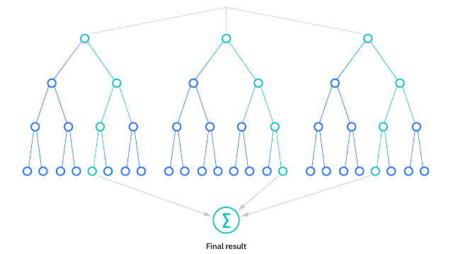

```{r setup, include=FALSE}
knitr::opts_chunk$set(echo = T)
```

# Teoria

## O que é uma Floresta Aleatória?

'Random Forest' é um algoritmo de aprendizado de máquina comumente usado, registrado por Leo Breiman e Adele Cutler, que combina a saída de várias árvores de decisão para chegar a um único resultado. Sua facilidade de uso e flexibilidade impulsionaram sua adoção, já que ele lida tanto com problemas de classificação quanto de regressão

### Árvores de decisão

Como o modelo de 'random forests' é composto por várias árvores de decisão, seria útil começar descrevendo brevemente o algoritmo da árvore de decisão

A árvore de decisão é um algoritmo de aprendizado de máquina capaz de se ajustar a conjuntos de dados complexos e realizar tanto tarefas de classificação quanto de regressão. A ideia por trás de uma árvore é buscar um par de variável-valor dentro do conjunto de treinamento e dividi-lo de tal forma que gere os "melhores" dois subconjuntos filhos. O objetivo é criar ramos e folhas com base em um critério de divisão ótimo, um processo chamado de crescimento da árvore. Especificamente, em cada ramo ou nó, uma declaração condicional classifica o ponto de dados com base em um limite fixo em uma variável específica, dividindo assim os dados. Para fazer previsões, toda nova instância começa no nó raiz (topo da árvore) e se move ao longo dos ramos até alcançar um nó folha onde não há mais ramificações possíveis.

O algoritmo usado para treinar uma árvore é chamado de CART(®) (Árvore de Classificação e Regressão). Como mencionamos anteriormente, o algoritmo procura o melhor par de característica-valor para criar nós e ramos. Após cada divisão, essa tarefa é realizada de forma recursiva até que a profundidade máxima da árvore seja alcançada ou uma árvore ótima seja encontrada. Dependendo da tarefa, o algoritmo pode usar uma métrica diferente (impureza de Gini, ganho de informação ou erro médio quadrático) para medir a qualidade da divisão. É importante mencionar que, devido à natureza gananciosa do algoritmo CART, encontrar uma árvore ótima não é garantido e, geralmente, uma estimativa razoavelmente boa é suficiente.

As árvores têm um alto risco de superajuste aos dados de treinamento, bem como de se tornarem computacionalmente complexas se não forem devidamente limitadas e regularizadas durante a etapa de crescimento. Esse superajuste implica em um viés baixo e alta variância no modelo. Portanto, para lidar com esse problema, usamos o Aprendizado em Conjunto ('Ensemble Learning'), uma abordagem que nos permite corrigir o 'overfittng' e, assim, obter resultados melhores e mais robustos.

Para mais informações sobre árvores de decisões, confira esse artigo completo: [Árvores de decisão](https://feyama.netlify.app/posts/2023-12-28-decision-tree/)

### Aprendizado em conjunto

Métodos de aprendizado em conjunto são compostos por um conjunto de classificadores, como árvores de decisão, e suas previsões são agregadas para identificar o resultado mais popular. Os métodos de aprendizado em conjunto mais conhecidos são o bagging, também conhecido como agregação bootstrap, e o boosting. Em 1996, Leo Breiman introduziu o método de bagging; neste método, uma amostra aleatória de dados em um conjunto de treinamento é selecionada com reposição, o que significa que os pontos de dados individuais podem ser escolhidos mais de uma vez. Após várias amostras de dados serem geradas, esses modelos são então treinados independentemente e, dependendo do tipo de tarefa - seja regressão ou classificação - a média ou a maioria dessas previsões produzem uma estimativa mais precisa. Essa abordagem é comumente usada para reduzir a variância dentro de um conjunto de dados ruidoso.

### Algoritmo

O algoritmo de floresta aleatória é uma extensão do método de bagging, pois utiliza tanto o bagging quanto a aleatoriedade de características para criar uma floresta de árvores de decisão não correlacionadas. A aleatoriedade de características, também conhecida como 'feature bagging' ou 'método do subespaço aleatório', gera um subconjunto aleatório de características, garantindo baixa correlação entre as árvores de decisão. Essa é uma diferença chave entre árvores de decisão e florestas aleatórias. Enquanto as árvores de decisão consideram todas as possíveis divisões de características, as florestas aleatórias selecionam apenas um subconjunto dessas características.

Se voltarmos ao exemplo de 'devo surfar?', as perguntas que posso fazer para determinar a previsão podem não ser tão abrangentes quanto o conjunto de perguntas de outra pessoa. Ao considerar toda a variabilidade potencial nos dados, podemos reduzir o risco de superajuste, viés e variância geral, resultando em previsões mais precisas.

## Como funciona?

Os algoritmos de floresta aleatória possuem três hiperparâmetros principais que precisam ser definidos antes do treinamento. Estes incluem o tamanho do nó, o número de árvores e o número de características amostradas. A partir daí, o classificador de floresta aleatória pode ser utilizado para resolver problemas de regressão ou classificação.

O algoritmo de floresta aleatória é composto por uma coleção de árvores de decisão, e cada árvore no conjunto é composta por uma amostra de dados retirada de um conjunto de treinamento com reposição, chamada amostra de bootstrap. Dessa amostra de treinamento, um terço dela é separado como dados de teste, conhecido como amostra out-of-bag (oob), sobre a qual voltaremos mais tarde. Outra instância de aleatoriedade é então introduzida através do 'feature bagging', adicionando mais diversidade ao conjunto de dados e reduzindo a correlação entre as árvores de decisão. Dependendo do tipo de problema, a determinação da previsão irá variar. Para uma tarefa de regressão, as árvores de decisão individuais serão em média, e para uma tarefa de classificação, um voto majoritário - ou seja, a variável categórica mais frequente - resultará na classe prevista. Finalmente, a amostra 'oob' é então utilizada para validação cruzada, finalizando essa previsão.



## Benefícios e Desvantagens

Há uma série de vantagens e desvantagens que o algoritmo de floresta aleatória apresenta ao ser utilizado para problemas de classificação ou regressão. Alguns deles incluem:

**BENEFÍCIOS**:

-   Risco reduzido de superajuste: Árvores de decisão correm o risco de superajustar, já que tendem a se ajustar rigidamente a todas as amostras dentro dos dados de treinamento. No entanto, quando há um número robusto de árvores de decisão em uma floresta aleatória, o classificador não superajustará o modelo, pois a média de árvores não correlacionadas reduz a variância geral e o erro de previsão.

-   Oferece flexibilidade: Como a floresta aleatória pode lidar tanto com tarefas de regressão quanto de classificação com alto grau de precisão, ela é um método popular entre os cientistas de dados. O 'feature bagging' também torna o classificador de floresta aleatória uma ferramenta eficaz para estimar valores ausentes, pois mantém a precisão quando uma parte dos dados está faltando.

-   Fácil determinação da importância das características: A floresta aleatória facilita a avaliação da importância ou contribuição das variáveis para o modelo. Existem algumas maneiras de avaliar a importância das características. A importância de Gini e a diminuição média na impureza (MDI) são normalmente usadas para medir o quanto a precisão do modelo diminui quando uma variável específica é excluída. No entanto, a importância por permutação, também conhecida como diminuição média na precisão (MDA), é outra medida de importância. A MDA identifica a diminuição média na precisão ao permutar aleatoriamente os valores das características nas amostras oob.

**DESVANTAGENS**:

-   Processo demorado: Como os algoritmos de floresta aleatória podem lidar com conjuntos de dados grandes, eles podem fornecer previsões mais precisas, mas podem ser lentos para processar os dados, já que estão computando dados para cada árvore de decisão individual.

-   Requer mais recursos: Como as florestas aleatórias processam conjuntos de dados maiores, elas requerem mais recursos para armazenar esses dados.

-   Mais complexo: A previsão de uma única árvore de decisão é mais fácil de interpretar quando comparada a uma floresta delas.

# Prática


## Introdução

Para a parte prática, analisaremos os dados sobre Pokemons, que contém informações sobre todos os 802 pokemons, como altura, peso, classificação, habilidades etc. Nosso objetivo será criar um modelo para classificar se um pokemon é lendário ou não.

O primeiro passo é abrir o Pokédex, um guia enciclopédico para 801 Pokémon de todas as sete gerações.

```{r message=FALSE, warning=FALSE}
#Carregando pacote tidyverse
library(tidyverse)

# Importando o conjunto de dados
pokedex = read_csv("pokedex.csv")

#convertendo as variáveis  'name', 'type' e 'is_legendary' em fatores
pokedex = pokedex %>%
  mutate(name = as_factor(name),
         type = as_factor(type),
         is_legendary = as_factor(is_legendary))

# Seis primeiras linhas
head(pokedex)
```

Vamos ver a estrutura dos nossos dados:

```{r}
library(skimr)
skim(pokedex)
```

Depois de navegar na Pokédex, podemos ver várias variáveis que poderiam explicar de forma viável o que torna um Pokémon lendário. Temos uma série de estatísticas numéricas do lutador – ataque, defesa, velocidade e assim por diante – bem como uma categorização do tipo de Pokémon (inseto, escuro, dragão, etc.). ‘is_legendary’ é a variável de classificação binária que eventualmente estaremos prevendo, marcada como 1 se um Pokémon for lendário e 0 se não for. 

Se olharmos na tabela acima, vemos que 70 são lendários e 731 não são. Ou seja, nossa variável resposta está bem desbalanceada.

## Altura x Peso

Agora sabemos que existem 70 Pokémon lendários – uma minoria considerável de 9% da população! Vamos começar a explorar algumas de suas características.

Primeiramente, traçaremos a relação entre ‘height_m’ e ‘weight_kg’ para todos os 801 Pokémon, destacando aqueles que são classificados como lendários. Também adicionaremos rótulos condicionais ao gráfico, que mostrarão apenas o nome de um Pokémon se ele tiver mais de 7,5 m de altura ou mais de 600 kg.

```{r message=FALSE, warning=FALSE}
grafico_lendario_altura_peso = pokedex %>% 
  ggplot(aes(x=height_m, y=weight_kg)) +
  geom_point(aes(color = is_legendary), size = 2) +
  geom_text(aes(label = ifelse(height_m > 7.5 | weight_kg > 600,
                               as.character(name), '')), 
            vjust = 0, hjust = 0) +
  geom_smooth(method = "lm", se = FALSE, col = "black", linetype = "dashed") +
  expand_limits(x=17) +
  labs(title = "Pokémons Lendários por altura e peso",
       x = "Altura (m)",
       y = "Peso (kg)",
       color = "status do pokémon") +
  scale_color_manual(labels = c("Não-lendário", "Lendário"),
                     values = c("#F8766D", "#00BFC4"))

grafico_lendario_altura_peso
```

Parece que Pokémons lendários são geralmente mais pesados e altos, mas com muitas exceções. Por exemplo, Onix (Geração 1), Steelix (Geração 2) e Wailord (Geração 3) são todos extremamente altos, mas nenhum deles tem status lendário. Deve haver outros fatores em jogo.

## Tipo de Pokemon

Veremos agora o efeito do tipo de um Pokémon em sua classificação lendário/não lendário. São 18 tipos possíveis, variando do comum (Grama/Normal/Água) ao raro (Fada/Voador/Gelo). Calcularemos a proporção de Pokémon lendários dentro de cada categoria e, em seguida, plotaremos essas proporções usando um gráfico de barras simples.

```{r}
# Preparando os dados
lendario_tipo = pokedex %>% 
    group_by(type) %>% 
    mutate(is_legendary = as.numeric(is_legendary) - 1) %>% 
    summarise(prop_legendary = mean(is_legendary)) %>% 
    ungroup() %>% 
    mutate(type = fct_reorder(type, prop_legendary))

# Preparando o gráfico
grafico_lendario_tipo = lendario_tipo %>% 
    ggplot(aes(x = type, y = prop_legendary, fill = prop_legendary)) + 
    geom_col() +
    labs(title = "Proporção de Pokémon Lendário por tipo",
         x = "Tipo",
         y = "Proporção") +
    coord_flip() +
    guides(fill = "none")

# grafico
library(plotly)
ggplotly(grafico_lendario_tipo)
```

Existem diferenças claras entre os tipos de Pokémon em sua relação com o status lendário. Embora mais de 30% dos Pokémon voadores e psíquicos sejam lendários, não existem Pokémons venenosos ou lutadores lendários!

## Atributos de Lutador

Antes de ajustar o modelo, vamos considerar a influência das estatísticas do lutador de um Pokémon (ataque, defesa, etc.) em seu status. Em vez de considerar cada estatística isoladamente, produziremos um boxplot para todas elas simultaneamente.

```{r}
library(DataExplorer)
plot_boxplot(pokedex[, c('is_legendary', 'attack', 'sp_attack', 'defense', 'sp_defense', 'hp', 'speed')], 
             by = 'is_legendary', , 
             ncol=3, 
             title = 'Estatísticas de luta do Pokémon')
```

Como poderíamos esperar, os Pokémon lendários superam seus equivalentes comuns em todas as estatísticas de lutador. Embora não tenhamos testado formalmente uma diferença nas médias, os boxplots sugerem uma diferença significativa em relação a todas as seis variáveis. No entanto, existem vários outliers em cada caso, o que significa que alguns Pokémon lendários são anormalmente fracos.

## Testes Estatísticos

Vamos testar se as médias são estatisticamente menores nos pokemons não lendários:

```{r}
#selecionando as variaveis para teste
vars_teste.t <- pokedex %>% 
  select(is_legendary, attack, sp_attack, defense, sp_defense, hp, speed)

#testando a diferença de médias
map(2:6, ~ t.test(vars_teste.t[[.x]] ~ vars_teste.t$is_legendary, alternative = "l"))
```

Como podemos ver, em todos os testes, os valores-p estão abaixo de 0.001 e assim descartamos a hipótese inicial com 99% de confiança. Portanto, pokemons nao lendarios posuem medias menores em todas as variáveis ao comparar com lendários.

## Dados de treinamento/teste

Já exploramos todas as variáveis de previsão que usaremos para explicar o que torna um Pokémon lendário. Antes de ajustar nosso modelo, vamos fazer o pré-processamento dos dados e dividir a pokedex em um conjunto de treinamento (pokedex_treinamento) e um conjunto de teste (pokedex_teste). Isso nos permitirá testar o modelo em dados não vistos.

```{r message=FALSE, warning=FALSE}
#Criando conjunto de treinamento e teste
#Definindo a semente para reprodutibilidade
library(tidymodels)
set.seed(1)
initial_split = initial_split(pokedex, prop = 0.8 ,strata = is_legendary)
train = training(initial_split)
test = testing(initial_split)
```

Para o pre-processamento, vamos visualizar dados ausentes:

```{r, fig.height=5, fig.width=8}
plot_missing(pokedex)
```

Vamos ver a correlação:

```{r fig.height=4, message=FALSE, warning=FALSE}
plot_correlation(pokedex %>% na.omit(), 
                 type = "c", 
                 theme_config = list(
                   axis.text.x = element_text(angle = 45, hjust = 1)
                   )
                 )
```

Podemos ver que há alguns dados ausentes em 3 variaveis. Não vamos usar a variável percentage_male, pois ela quase não apresenta correlação e faltam muitas observações. As outras duas, como há pouca correlação com outras variáveis vamos imputar valores usando árvores de decisão, usando todas as outras variáveis como preditoras. Além disso, vamos dummyficar todas as variáveis categóricas(fatores), pois alguns algoritmos de machine learning somente aceitam números e normalizar todas as variáveis numéricas.

Além disso, como nossa variável resposta está bem desbalanceada, vamos balanceá-la usando 'step_smote', que gera novos exemplos da classe minoritária usando os vizinhos mais próximos desses casos.

```{r}
#criação da receita ('recipe') e pré-processamento
#Definindo a semente para reprodutibilidade
library(themis)
set.seed(2) 
recipe = recipe(train, is_legendary ~ attack + defense + height_m + hp + sp_attack + sp_defense + speed + type + weight_kg) %>% 
  step_impute_bag(height_m, weight_kg, impute_with = imp_vars(all_predictors())) %>%
  step_normalize(all_numeric_predictors()) %>%
  step_dummy(all_factor_predictors()) %>%
  step_smote(is_legendary)
```

Vamos ver como ficam nossos dados depois do pre-processamento:

```{r}
prep <- recipe %>% prep() %>% juice()
skim(prep)
```

Podemos ver que todas as variáveis agora são numéricas, exceto a resposta. As médias das variáveis numéricas estão muito próximas de 0 e desvio padrão próximo de 1. Ademais, os fatores foram dummyficados e a variável resposta 'is_legendary' está esquilibrada.

Feito o pre-processamento, vamos especificar o modelo e criar o workflow:

```{r}
#especificação da floresta com 1000 árvores
rf_spec <- rand_forest(mtry = tune(), trees = 1000, min_n = tune()) %>%
  set_mode("classification") %>%
  set_engine("ranger", importance = "impurity")

#Workflow
rf_workflow <- workflow() %>%
  add_recipe(recipe) %>%
  add_model(rf_spec)
```

Com o workflow em mãos, vamos otimizar os parâmetros da floresta. Para isso, devemos criar um grid com combinações de parâmetros, amostras para validação cruzada e depois 'tunar':

```{r}
set.seed(4)
#criando as amostras
resamples <- vfold_cv(train, 10)

#Especificando os parâmetros
params <- extract_parameter_set_dials(rf_spec) %>%
  finalize(train)

#Vou criar 30 grids, então vou especificar direto na função
tune_res <- tune_grid(rf_workflow, 
                      resamples = resamples, 
                      param_info = params, 
                      grid = 30, 
                      metrics = metric_set(accuracy, roc_auc, sensitivity,
                                           specificity))
```

Agora, vamos ver os melhores resultados:

```{r}
show_best(tune_res)
```
Visualização dos resultados da nossa otimização:

```{r}
autoplot(tune_res)
```

Olhando as métricas e os gráficos, não há muita diferença em performance entre os melhores e, além disso, é muito difícil perceber algum padrão de parâmetros que melhora a performance. Portanto, estou satisfeito com essa otimização. Devemos, agora, finalizar o workflow:

```{r}
rf_workflow <- finalize_workflow(rf_workflow, select_best(tune_res))
```
Com o workflow final, é hora de avaliar o modelo nos dados de teste, que ainda não foram usados.

```{r}
rf_last_fit <- rf_workflow %>%
  last_fit(initial_split)
```

Podemos computar as métricas de desempenho nos dados de teste.

```{r}
rf_last_fit %>% collect_metrics()
```
Ótimos resultados, uma acurácia de 93% e área sob a curva ROC de 0.94.

Visualizar a curva ROC:

```{r}
rf_last_fit %>%
  collect_predictions() %>%
  roc_curve(is_legendary, .pred_0) %>%
  autoplot()
```

E analisar a importância das variáveis ao criar as várias árvores que compõe a floresta:

```{r}
library(vip)
rf_last_fit %>%
  extract_fit_engine() %>%
  vip() +
  theme_minimal()
```

## Conclusão

Podemos ver que as variáveis mais importantes na formação das árvores para determinar se um pokemon é ou não lendário são: ataque, defesa e velocidade. O gráfico não nos diz se as variáveis têm um efeito positivo ou negativo, mas sabemos por nossa análise exploratória que a relação é geralmente positiva, um resultado que era de se esperar.

# Referências

-   Breiman, L. (2001). Random forests. Machine Learning, 45(1), 5-32. <https://www.stat.berkeley.edu/~breiman/randomforest2001.pdf>

-   IBM. (n.d.). Random forest. Retrieved from: <https://www.ibm.com/topics/random-forest>
