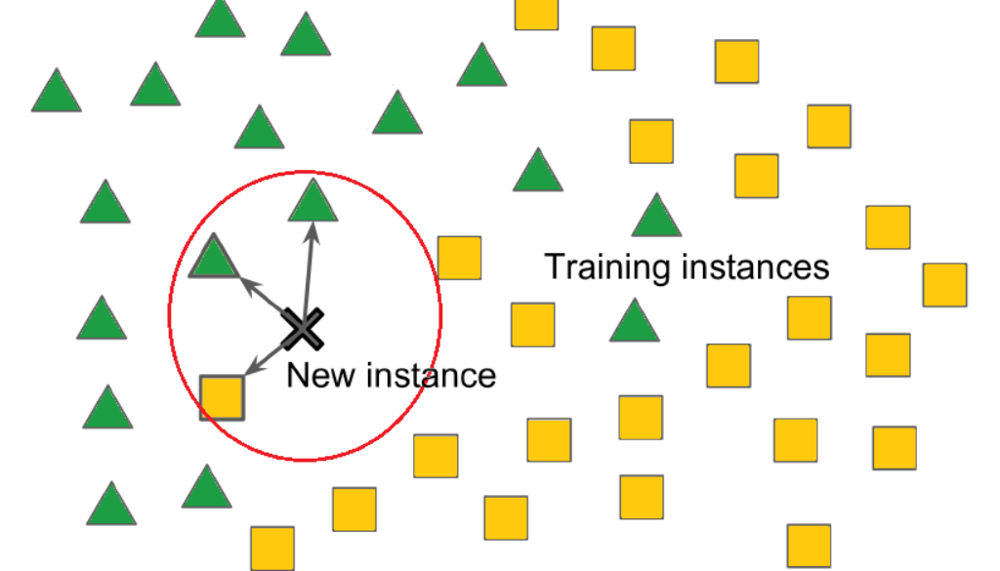

```{r setup, include=FALSE}
knitr::opts_chunk$set(echo = TRUE)
```

# Teoria

## Introdução

O algoritmo 'k-nearest neighbors' também conhecido como KNN ou k-NN, é um classificador de aprendizado supervisionado não paramétrico que utiliza proximidade para fazer classificações ou previsões sobre a agrupação de um ponto de dados individual. Embora possa ser usado para problemas de regressão ou classificação, é normalmente utilizado como um algoritmo de classificação, baseando-se na premissa de que pontos semelhantes podem ser encontrados próximos uns dos outros.

Para problemas de classificação, um rótulo de classe é atribuído com base em uma votação majoritária, ou seja, o rótulo mais frequentemente representado ao redor de um determinado ponto de dados é utilizado. Embora tecnicamente isso seja considerado "votação de pluralidade", o termo "voto majoritário" é mais comumente usado na literatura. A distinção entre esses termos está no fato de que "votação majoritária" tecnicamente requer uma maioria superior a 50%, o que funciona principalmente quando há apenas duas categorias. Quando você tem múltiplas classes, por exemplo, quatro categorias, não é necessário ter 50% dos votos para concluir sobre uma classe; você pode atribuir um rótulo de classe com um voto superior a 25%.



Os problemas de regressão utilizam um conceito semelhante ao problema de classificação, mas, neste caso, é feita a média dos k vizinhos mais próximos para fazer uma previsão sobre uma classificação. A principal distinção aqui é que a classificação é utilizada para valores discretos, enquanto a regressão é utilizada com valores contínuos. No entanto, antes que uma classificação possa ser feita, a distância deve ser definida. A distância euclidiana é a mais comumente utilizada, sobre a qual vamos nos aprofundar mais adiante.

Vale ressaltar também que o algoritmo KNN faz parte de uma família de modelos de "aprendizado preguiçoso", o que significa que ele armazena apenas um conjunto de dados de treinamento em vez de passar por uma fase de treinamento. Isso também significa que toda a computação ocorre quando uma classificação ou previsão está sendo feita. Como depende muito da memória para armazenar todos os seus dados de treinamento, também é referido como um método de aprendizado baseado em instâncias ou baseado em memória.

## Detalhes

Dado um número inteiro positivo K e uma observação de teste $X_0$, o classificador KNN primeiro identifica os K pontos nos dados de treinamento que estão mais próximos de $X_0$, representados por $N_0$. Em seguida, ele estima a probabilidade condicional para a classe j como a fração de pontos em $N_0$ cujos valores de resposta são iguais a j:

$\text{Pr}(Y = j|X = x_0) = \frac{1}{K} \sum_{i \in N_0} I(y_i = j)$

Finalmente, o KNN classifica a observação de teste $x_0$ para a classe com a maior probabilidade de acordo com a fórmula acima.

A Figura 1 fornece um exemplo ilustrativo da abordagem KNN. No painel da esquerda, plotamos um pequeno conjunto de dados de treinamento consistindo em seis observações azuis e seis laranjas. Nosso objetivo é fazer uma previsão para o ponto marcado pela cruz preta. Suponha que escolhemos K = 3. Então, o KNN primeiro identificará as três observações mais próximas da cruz. Este vizinhança é mostrada como um círculo. Ela consiste de dois pontos azuis e um ponto laranja, resultando em probabilidades estimadas de 2/3 para a classe azul e 1/3 para a classe laranja. Portanto, o KNN preverá que a cruz preta pertence à classe azul. No painel da direita da Figura 1, aplicamos a abordagem do KNN com K = 3 em todos os valores possíveis para $X_1$ e $X_2$, e traçamos a correspondente fronteira de decisão do KNN.

![**FIGURA 1.** A abordagem do KNN, usando K = 3, é ilustrada em uma situação simples com seis observações azuis e seis observações laranjas. À esquerda: uma observação de teste para a qual um rótulo de classe previsto é desejado é mostrada como uma cruz preta. Os três pontos mais próximos à observação de teste são identificados, e é previsto que a observação de teste pertença à classe mais comum, neste caso, azul. À direita: A fronteira de decisão do KNN para este exemplo é mostrada em preto. A área azul indica a região na qual uma observação de teste será atribuída à classe azul, e a área laranja indica a região na qual será atribuída à classe laranja.](images/clipboard-2979540247.png)

A escolha de K tem um efeito drástico no classificador KNN obtido. A Figura 2 exibe dois ajustes do KNN ao dados simulados, usando K = 1 e K = 100. Quando K = 1, a fronteira de decisão é excessivamente flexível e encontra padrões nos dados que não correspondem à fronteira de decisão de Bayes. Isso corresponde a um classificador com baixo viés, mas variância muito alta. Conforme K cresce, o método se torna menos flexível e produz uma fronteira de decisão que é próxima ao linear. Isso corresponde a um classificador com baixa variância, mas alto viés. Neste conjunto de dados simulados, nem K = 1 nem K = 100 fornecem boas previsões: eles têm taxas de erro de teste de 0,1695 e 0,1925, respectivamente.


Assim como no cenário de regressão, não há uma relação forte entre a taxa de erro de treinamento e a taxa de erro de teste. Com K = 1, a taxa de erro de treinamento do KNN é 0, mas a taxa de erro de teste pode ser bastante alta. Em geral, à medida que usamos métodos de classificação mais flexíveis, a taxa de erro de treinamento diminuirá, mas a taxa de erro de teste pode não diminuir. Na Figura 3, plotamos os erros de teste e treinamento do KNN como função de $1/K$. Conforme $1/K$ aumenta, o método se torna mais flexível. Assim como no cenário de regressão, a taxa de erro de treinamento diminui consistentemente conforme a flexibilidade aumenta. No entanto, o erro de teste exibe uma forma característica de "U", diminuindo primeiro (com um mínimo em aproximadamente K = 10) antes de aumentar novamente quando o método se torna excessivamente flexível e sofre sobreajuste.


Em ambos os contextos de regressão e classificação, escolher o nível correto de flexibilidade é crucial para o sucesso de qualquer método de aprendizado estatístico. O trade-off entre viés e variância, e o resultado em forma de "U" no erro de teste, podem tornar essa tarefa difícil.

## Métricas de Distância

Para recapitular, o objetivo do algoritmo dos KNN é identificar os vizinhos mais próximos de um determinado ponto de consulta, para que possamos atribuir um rótulo de classe a esse ponto. Para fazer isso, o KNN tem alguns requisitos:

### Determinar suas métricas de distância

Para determinar quais pontos de dados estão mais próximos de um determinado ponto de consulta, a distância entre o ponto de consulta e os outros pontos de dados precisará ser calculada. Essas métricas de distância ajudam a formar fronteiras de decisão, que dividem os pontos de consulta em diferentes regiões. É comum ver fronteiras de decisão visualizadas com diagramas de Voronoi.

Embora existam várias medidas de distância entre as quais você pode escolher, este post cobrirá apenas as seguintes:

-   **Distância Euclidiana (p=2):** Esta é a medida de distância mais comumente usada e é limitada a vetores de valores reais. Usando a fórmula abaixo, ela mede uma linha reta entre o ponto de consulta e o outro ponto sendo medido.

$d(x,y)=\sqrt{\sum_{i=1}^n (y_i-x_i)^2}$

-   **Distância de Manhattan (p=1):** Esta é outra métrica de distância popular, que mede o valor absoluto entre dois pontos. Também é conhecida como distância de táxi ou distância de quarteirão, pois é comumente visualizada com uma grade, ilustrando como alguém poderia navegar de um endereço a outro através das ruas da cidade.

$d(x,y)=\sum_{i=1}^m |x_i-y_i|$

-   **Distância de Minkowski:** Essa medida de distância é a forma generalizada das métricas de distância Euclidiana e de Manhattan. O parâmetro, $p$, na fórmula abaixo, permite a criação de outras métricas de distância. A distância Euclidiana é representada por esta fórmula quando $p$ é igual a dois, e a distância de Manhattan é indicada com $p$ p igual a um.

$\left( \sum_{i=1}^{n} |x_i - y_i|^p \right)^{1/p}$

-   **Distância de Hamming:** Esta técnica é geralmente usada com vetores booleanos ou de strings, identificando os pontos onde os vetores não coincidem. Como resultado, também foi chamada de métrica de sobreposição. Isso pode ser representado com a seguinte fórmula:

$\sum_{i=1}^{n} \text{I}(x_i \neq y_i)$

## Aplicações

O algoritmo k-NN tem sido utilizado em uma variedade de aplicações, principalmente na área de classificação. Alguns desses casos de uso incluem:

**Pré-processamento de dados:** Conjuntos de dados frequentemente possuem valores ausentes, mas o algoritmo k-NN pode estimar esses valores em um processo conhecido como imputação de dados ausentes.

**Recomendação:** Usando dados de cliques em sites, o algoritmo k-NN tem sido usado para fornecer recomendações automáticas aos usuários sobre conteúdo adicional. No entanto, devido aos problemas de escalabilidade do k-NN, essa abordagem pode não ser ideal para conjuntos de dados maiores.

**Finanças:** Também foi utilizado em diversas áreas financeiras e econômicas. Por exemplo, um [artigo](https://iopscience.iop.org/article/10.1088/1742-6596/1025/1/012114/pdf) mostra como o uso do k-NN em dados de crédito pode ajudar os bancos a avaliarem o risco de um empréstimo para uma organização ou indivíduo. É usado para determinar a credibilidade de um candidato a empréstimo. Outro [artigo](https://www.ijera.com/papers/Vol3_issue5/DI35605610.pdf) destaca seu uso na previsão do mercado de ações, taxas de câmbio, negociação de futuros e análises de lavagem de dinheiro.

**Saúde:** O k-NN também teve aplicação na indústria de saúde, fazendo previsões sobre o risco de ataques cardíacos e câncer de próstata. O algoritmo trabalha calculando as expressões genéticas mais prováveis.

**Reconhecimento de Padrões:** O k-NN também auxiliou na identificação de padrões, como em [classificação de texto e dígitos](https://www.researchgate.net/publication/332880911_Improved_Handwritten_Digit_Recognition_using_Quantum_K-Nearest_Neighbor_Algorithm). Isso tem sido especialmente útil na identificação de números escritos à mão que podem ser encontrados em formulários ou envelopes de correspondência.

## Vantagens e Desvantagens

### Vantagens

-   **Fácil de implementar:** Devido à simplicidade e precisão do algoritmo, é um dos primeiros classificadores que um novo cientista de dados aprende.
-   **Adapta-se facilmente:** Conforme novas amostras de treinamento são adicionadas, o algoritmo se ajusta para considerar quaisquer novos dados, já que todos os dados de treinamento são armazenados na memória.
-   **Poucos hiperparâmetros:** O KNN requer apenas um valor k e uma métrica de distância, o que é baixo em comparação com outros algoritmos de aprendizado de máquina.

### Desvantagens

-   **Não dimensiona bem:** Como o KNN é um algoritmo preguiçoso, consome mais memória e armazenamento de dados em comparação com outros classificadores. Isso pode ser custoso tanto em termos de tempo quanto de dinheiro. Mais memória e armazenamento aumentarão os gastos empresariais e mais dados podem levar mais tempo para serem computados. Embora diferentes estruturas de dados, como Ball-Tree, tenham sido criadas para lidar com as ineficiências computacionais, um classificador diferente pode ser ideal dependendo do problema empresarial.
-   **'Maldição' da dimensionalidade:** O algoritmo KNN tende a sofrer da maldição da dimensionalidade, o que significa que não se sai bem com entradas de dados de alta dimensionalidade. Isso é às vezes também referido como o fenômeno de pico, onde após o algoritmo atingir o número ótimo de características, características adicionais aumentam a quantidade de erros de classificação, especialmente quando o tamanho da amostra é menor.
-   **Propenso ao overfitting:** Devido à "maldição da dimensionalidade", o KNN também é mais propenso ao overfitting. Embora técnicas de seleção de características e redução de dimensionalidade sejam usadas para evitar que isso ocorra, o valor de k também pode impactar o comportamento do modelo. Valores menores de k podem fazer overfitting nos dados, enquanto valores mais altos de k tendem a "suavizar" os valores de previsão, já que ele está fazendo uma média dos valores sobre uma área maior, ou vizinhança. No entanto, se o valor de k for muito alto, ele pode subestimar os dados.

# Prática

O nosso objetivo de modelagem aqui é prever quais estadias em hotéis incluem crianças (em comparação com aquelas que não incluem crianças ou bebês) com base em outras características presentes no conjunto de dados, como em qual hotel os hóspedes ficam, quanto pagam, etc. O artigo do qual esses dados derivam aponta que a distribuição de muitas dessas variáveis (como número de adultos/crianças, tipo de quarto, refeições adquiridas, país, entre outros) é diferente para reservas de hotéis canceladas e não canceladas. Isso ocorre principalmente porque mais informações são coletadas quando os hóspedes fazem o check-in; o maior contribuinte para essas diferenças não é que as pessoas que cancelam são diferentes das que não cancelam.

Para construir nossos modelos, vamos filtrar apenas as reservas que não foram canceladas e criar um modelo para prever quais estadias em hotéis incluem crianças e quais não incluem.

## Análise Exploratória

```{r message=FALSE, warning=FALSE}
#carregar pacote tidyverse
library(tidyverse)

#carregar dados
hotels <- readr::read_csv("https://raw.githubusercontent.com/rfordatascience/tidytuesday/master/data/2020/2020-02-11/hotels.csv")

#visualizar dados
glimpse(hotels)

#filtrar apenas estadias não canceladas
hotel_stays <- hotels %>%
  filter(is_canceled == 0) %>%
  #filtrar casos em que há crianças
  mutate(
    children = case_when(
      children + babies > 0 ~ "children",
      .default = "none"
    ),
    #filtrar casos em que há estacionamento
    required_car_parking_spaces = case_when(
      required_car_parking_spaces > 0 ~ "parking",
      .default = "none"
    )
  ) %>%
  select(-is_canceled, -reservation_status, -babies)

hotel_stays %>%
  count(children)
```

Há 10 vezes mais estadias em hotéis sem crianças do que com.

Vamos usar o pacote skimr para obter uma visão geral das características do conjunto de dados. As variáveis numéricas aqui têm valores e distribuições muito diferentes (grandes versus pequenos).

```{r}
library(skimr)

skim(hotel_stays)
```

Podemos ver que algumas variáveis possuem muitas observações diferentes, como 'agent' e 'company', o que necessitaria de um pré-processamento para incluir na modelagem. Além disso, há uma variável do tipo 'Date', que também necessita de pré-processamento para modelagem.

## Gráficos

Como variam as estadias em hotéis de hóspedes com/sem crianças ao longo do ano? Isso é diferente no hotel da cidade e no resort?

```{r, fig.width=10, fig.height=8}
hotel_stays %>%
  #mudar variavel 'arrival_date_month' para fator 
  mutate(arrival_date_month = factor(arrival_date_month,
    levels = month.name
  )) %>%
  #contar por hotel, mês e se há crianças
  count(hotel, arrival_date_month, children) %>%
  #agrupar por hotel e crianças
  group_by(hotel, children) %>%
  #criar coluna para proporção
  mutate(proportion = n / sum(n)) %>%
  #grafico de colunas proporcao x mês
  ggplot(aes(x = arrival_date_month, y = proportion, fill = children)) +
  geom_col(position = "dodge") +
  #mudar escala do eixo y
  scale_y_continuous(labels = scales::percent_format()) +
  #agrupar por tipo de hotel
  facet_wrap(~hotel, nrow=2) + 
  theme_minimal()
```

Bom, podemos ver que na maioria dos meses há mais reservas de quartos sem crianças, exceto nos meses de férias escolares (julho e agosto).

Agora, vamos ver se os os hóspedes de hotéis com crianças têm mais probabilidade de precisar de um espaço de estacionamento

```{r}
hotel_stays %>%
  count(hotel, required_car_parking_spaces, children) %>%
  group_by(hotel, children) %>%
  mutate(proportion = n / sum(n)) %>%
  ggplot(aes(required_car_parking_spaces, proportion, fill = children)) +
  geom_col(position = "dodge") +
  scale_y_continuous(labels = scales::percent_format()) +
  facet_wrap(~hotel, nrow = 2) +
  labs(
    x = NULL,
    y = "Proporção de estadias em hotéis",
    fill = NULL
  ) + theme_minimal()
```

Existem muitas outras relações como estass que podemos explorar. Em muitas situações, gosto de usar a função ggpairs() para obter uma visão geral de como as variáveis estão relacionadas entre si.

```{r message=FALSE, warning=FALSE, fig.height=7, fig.width=9}
library(GGally)

hotel_stays %>%
  select(
    children, adr,
    required_car_parking_spaces,
    total_of_special_requests
  ) %>%
  ggpairs(mapping = aes(fill = children)) + theme_minimal()
```

Analisando o gráfico, podemos ver que estadias com crianças tem um custo mais alto ('adr') independente se precisam de estacionamento, necessitam de mais assistência etc.

## Modelagem

O próximo passo é criar um conjunto de dados para modelagem. Vamos incluir um conjunto de colunas nas quais estamos interessados e converter todas as colunas de caracteres para fatores, para as funções de modelagem que virão mais tarde.

```{r}
hotels_df <- hotel_stays %>%
  select(
    children, hotel, arrival_date_month, meal, adr, adults,
    required_car_parking_spaces, total_of_special_requests,
    stays_in_week_nights, stays_in_weekend_nights
  ) %>%
  mutate_if(is.character, factor)
```

Agora é hora do tidymodels! 

As primeiras linhas aqui podem parecer familiares se você ja leu algum outro post; dividimos os dados em conjuntos de treinamento e teste usando initial_split(). Em seguida, usamos um recipe() para criar um conjunto de etapas para pré-processamento de dados e 'feature engineering'.

-   Primeiro, precisamos informar ao recipe() qual será nosso modelo (usando uma fórmula aqui) e qual é o nosso conjunto de dados de treinamento.

-   Em seguida, reduzimos a amostragem dos dados, já que existem cerca de 10 vezes mais estadias em hotéis sem crianças do que com. Se não fizermos isso, nosso modelo aprenderá muito efetivamente a prever o caso negativo. 😞

-   Depois, convertemos as colunas de fatores em variáveis binárias numéricas (0 e 1) para os níveis dos dados de treinamento.

-   Em seguida, removemos quaisquer variáveis numéricas que tenham variância zero.

-   Como último passo, normalizamos (centralizamos e escalamos) as variáveis numéricas. Precisamos fazer isso porque algumas delas estão em escalas muito diferentes umas das outras, e o modelo que queremos treinar é sensível a isso.

-   Por fim, preparamos "prep()" a receita "recipe()". Isso significa que realmente fazemos algo com as etapas e nossos dados de treinamento; estimamos os parâmetros necessários a partir do hotel_train para implementar essas etapas, para que toda essa sequência possa ser aplicada posteriormente a outro conjunto de dados.

Então, podemos fazer exatamente isso e aplicar essas transformações aos dados de teste; a função para isso é bake(). Não vamos mexer no conjunto de teste novamente até o final.

```{r}
library(tidymodels)

set.seed(1234)
hotel_split <- initial_split(hotels_df)

hotel_train <- training(hotel_split)
hotel_test <- testing(hotel_split)

hotel_rec <- recipe(children ~ ., data = hotel_train) %>%
  themis::step_downsample(children) %>%
  step_dummy(all_nominal(), -all_outcomes()) %>%
  step_zv(all_numeric()) %>%
  step_normalize(all_numeric())
```

Agora é hora de especificar e depois ajustar nossos modelos. Primeiro, especificamos e ajustamos um modelo de classificação de k-NN e, em seguida, um modelo de classificação de árvore de decisão para comparar. O recipe hotel_rec contém todas as nossas transformações para pré-processamento de dados e 'feature engineering', bem como os dados nos quais essas transformações foram estimadas. Quando usamos juice() no recipe, extraímos esses dados de treinamento, transformados da maneira que especificamos, incluindo a redução de amostragem. O objeto juice(hotel_rec) é um dataframe com 9.176 linhas, enquanto nossos dados originais de treinamento, hotel_train, têm 56.375 linhas.

```{r}
hotel_rec %>% prep() %>% juice()
```

```{r}
knn_spec <- nearest_neighbor() %>%
  set_engine("kknn") %>%
  set_mode("classification")

tree_spec <- decision_tree() %>%
  set_engine("rpart") %>%
  set_mode("classification")
```

Com as duas especificações em mãos, vamos criar nossos dados de validação usando simulação de Monte-Carlo, treinar os dois modelos e comparar suas performances nesses dados de validação. Para isso, usaremos a função 'workflow_set' para agrupar os dois modelos e, como não há hiperparâmetros para otimizar, usaremos 'fit_resamples' como argumento da função 'workflow_map'.

```{r}
#Dados para validação
set.seed(1234)
validation_splits <- mc_cv(hotel_train, prop = 0.9, strata = children)

#Criando um workflow com os dois modelos
workflow_hotel <- workflow_set(
  preproc = list(hotel_rec), 
  models = list(knn = knn_spec, trees = tree_spec)
  )

#ajuste nos dados de validação
workflow_results <- workflow_hotel %>%
  workflow_map("fit_resamples", 
               resamples = validation_splits, 
               seed = 1234, 
               control = control_resamples(save_pred = TRUE))
```

Este conjunto de validação nos fornece uma estimativa melhor de como nossos modelos estão se saindo do que prever todo o conjunto de treinamento de uma vez. O modelo de vizinhos mais próximos (knn) tem um desempenho um pouco melhor do que a árvore de decisão. Vamos visualizar esses resultados.

```{r}
workflow_results %>% collect_metrics()
autoplot(workflow_results) + theme_minimal()
```

```{r}
workflow_results %>% 
  collect_predictions() %>%
  group_by(wflow_id) %>%
  roc_curve(children, .pred_children) %>%
  autoplot(size = 3)
```

## Dados de teste

FINALMENTE, vamos verificar nossos dados de teste e ver como podemos esperar que este modelo se comporte com novos dados. Primeiro, vamos extrair nosso workflow do modelo knn e ajustar no nosso split, que contém dados de teste e treinamento

```{r}
knn_fit <- workflow_results %>%
  extract_workflow(id = "recipe_knn") %>%
  last_fit(hotel_split)
```
Podemos ver qual o modelo utilizado (número de K-vizinhos):

```{r}
knn_fit %>%
  extract_workflow()
```

Agora, vamos coletar as métricas nos dados de teste:

```{r}
knn_fit %>%
  collect_metrics()
```

A performance nos dados de teste estão bem parecidas com a dos dados de validação, o que significa que nosso modelo tem uma variância baixa e, se as métricas forem boas o suficiente, poderia ser colocado para produção.

Podemos também visualizar a matriz de confusão:

```{r}
knn_conf <- knn_fit %>%
  collect_predictions() %>%
  conf_mat(children, .pred_class)

knn_conf

autoplot(knn_conf)
```
## Referências

-   James, G., Witten, D., Hastie, T., & Tibshirani, R. (2021). An introduction to statistical learning: with applications in R (2nd ed.). Springer.

- IBM. (Access Date). K-Nearest Neighbors (KNN). Retrieved from https://www.ibm.com/topics/knn


