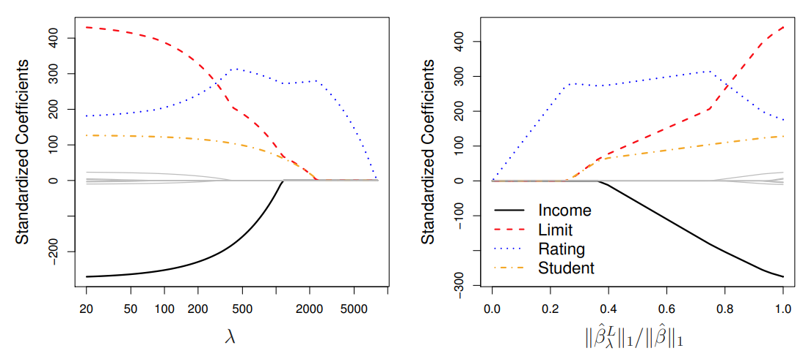

```{r setup, include=FALSE}
knitr::opts_chunk$set(echo = TRUE)
```

# Teoria

## Seleção de Modelo Linear e Regularização

O modelo de regressão linear, expresso pela equação $Y = β_0 + β_1X_1 + ··· + β_pX_p + \epsilon$ descreve a relação entre uma resposta (Y) e um conjunto de variáveis explicativas $(X_1, X_2,...,X_p)$. Esse modelo é comumente ajustado usando o método de mínimos quadrados. No entanto, para melhorar a precisão da previsão e a interpretabilidade do modelo, são exploradas outras abordagens de ajuste além dos mínimos quadrados.

Existem duas principais razões para utilizar procedimentos de ajuste diferentes dos mínimos quadrados:

-   **Precisão da Previsão:** Quando a relação entre a resposta e as variáveis é aproximadamente linear, os mínimos quadrados tendem a ter baixo viés. Se o número de observações ($n$) é muito maior que o número de variáveis ($p$), os mínimos quadrados também tendem a ter baixa variância, funcionando bem em observações de teste. Contudo, se $n$ não for muito maior que $p$, pode haver sobreajuste, resultando em previsões imprecisas em dados futuros não utilizados no treinamento do modelo. Se $p > n$, não existe mais uma solução única de mínimos quadrados, levando a muitas soluções com erro zero nos dados de treinamento, mas com desempenho ruim nos dados de teste.

-   **Interpretabilidade do Modelo:** Muitas vezes, algumas variáveis usadas no modelo de regressão múltipla não estão realmente relacionadas à resposta. Incluir tais variáveis irrelevantes resulta em complexidade desnecessária no modelo. Eliminando essas variáveis, ou seja, definindo os coeficientes correspondentes como zero, é possível obter um modelo mais facilmente interpretável.

Há três classes importantes de métodos alternativos aos mínimos quadrados para ajustar o modelo de regressão:

-   **Seleção de Subconjunto:** Identificação de um subconjunto das $p$ variáveis consideradas relevantes para a resposta e ajuste do modelo usando mínimos quadrados com esse subconjunto reduzido de variáveis.

-   **Encolhimento:** Ajuste de um modelo com todas as $p$ variáveis, mas com os coeficientes estimados encolhidos em direção a zero em relação aos estimados pelos mínimos quadrados. Esse encolhimento reduz a variância e pode levar a alguns coeficientes estimados como exatamente zero, realizando também seleção de variáveis.

-   **Redução de Dimensão:** Projeção das $p$ variáveis em um subespaço de dimensão $M$, onde $M < p$. Isso é feito calculando $M$ combinações lineares diferentes das variáveis e usando essas projeções como preditores para ajustar um modelo de regressão linear pelos mínimos quadrados.

Cada uma dessas abordagens possui vantagens e desvantagens, que serão discutidas.

## Seleção de Subconjunto

### Seleção do Melhor Subconjunto

Para realizar a seleção do melhor subconjunto, ajustamos uma regressão de mínimos quadrados separada para cada possível combinação dos $p$ preditores. Isso significa ajustar todos os modelos que contêm exatamente um preditor, todos os modelos que contêm exatamente dois preditores e assim por diante, até um máximo de $p$ modelos. O objetivo é identificar o modelo que melhor se ajusta aos dados.

O desafio de escolher o melhor modelo dentre as $2^p$ possibilidades consideradas pela seleção do melhor subconjunto não é trivial. Geralmente, esse processo é dividido em duas etapas, conforme descrito no Algoritmo 1 abaixo.

—————————————————————————————————————————————— **Algoritmo 1.** Seleção do Melhor Subconjunto ——————————————————————————————————————————————

-   Começamos com o modelo nulo $(M_0)$, que não possui preditores, apenas prevê a média amostral para cada observação.

-   Para cada tamanho de subconjunto $k = 1, 2,...p$:

(a) Ajustamos todos os modelos que contêm exatamente k preditores.

(b) Selecionamos o melhor modelo entre esses, chamado de $M_k$, baseado na métrica de menor soma dos quadrados residuais (RSS) ou maior coeficiente de determinação (R²).

-   Selecionamos um único melhor modelo entre $M_0$ até $M_p$ usando o erro de previsão em um conjunto de validação, Critério de Informação de Akaike (AIC), Critério de Informação Bayesiano (BIC), R² ajustado ou usando métodos de validação cruzada.

—————————————————————————————————————————————

O algoritmo identifica o melhor modelo para cada tamanho de subconjunto nos dados de treinamento, reduzindo o número de modelos considerados de $2^p$ para $p + 1$. Em seguida, escolhemos o melhor modelo dentre essas opções usando uma métrica de desempenho em um conjunto de validação.

**Aplicações e Limitações**

A seleção do melhor subconjunto é ilustrada na figura 1 em um exemplo com 10 preditores no conjunto de dados "Credit". Cada ponto no gráfico representa um modelo de regressão de mínimos quadrados usando um subconjunto diferente de preditores. As curvas vermelhas conectam os melhores modelos para cada tamanho de modelo, de acordo com o RSS ou R².

Embora a seleção do melhor subconjunto seja uma abordagem simples e conceitualmente atrativa, ela enfrenta limitações computacionais. O número de modelos a serem considerados aumenta rapidamente com o número de preditores ($2^p$ modelos para $p$ preditores), tornando-se impraticável para $p$ grande. Para $p = 10$, existem aproximadamente 1.000 modelos possíveis, e para $p = 20$, existem mais de um milhão de possibilidades. Essa abordagem se torna computacionalmente inviável para $p > 40$, mesmo com computadores modernos rápidos. Algumas técnicas de otimização computacional podem ajudar a reduzir as escolhas, mas têm limitações em $p$ grandes e só funcionam para regressão linear de mínimos quadrados.

Essa seleção de subconjunto é ilustrada graficamente, demonstrando como a RSS e o R² mudam conforme o número de preditores varia. É observado que essas métricas melhoram com a inclusão de mais preditores, mas a partir de um certo número de preditores adicionais, há pouca melhoria no ajuste do modelo.


### Seleção Stepwise

Por questões computacionais, a seleção do melhor subconjunto não pode ser aplicada com um $p$(número de preditores) muito grande. A seleção do melhor subconjunto também pode enfrentar problemas estatísticos quando $p$ é grande. Quanto maior o espaço de busca, maior a chance de encontrar modelos que parecem bons nos dados de treinamento, mesmo que possam não ter poder de previsão em dados futuros. Portanto, um espaço de busca enorme pode levar ao overfitting e alta variância das estimativas dos coeficientes.

Por esses motivos, os métodos stepwise, que exploram um conjunto de modelos muito mais restrito, são alternativas atraentes à seleção do melhor subconjunto.

**Forward Stepwise Selection**

A seleção stepwise progressiva é uma alternativa computacionalmente eficiente à melhor seleção de subconjuntos. Enquanto a melhor seleção de subconjuntos considera todos os $2^p$ modelos possíveis que contêm subconjuntos dos $p$ preditores, a seleção progressiva considera um conjunto muito menor de modelos. Ela começa com um modelo sem preditores e adiciona preditores ao modelo, um de cada vez, até que todos os preditores estejam no modelo. Em cada etapa, é adicionada ao modelo a variável que proporciona a maior melhoria adicional ao ajuste. Em termos mais formais, o procedimento de seleção progressiva passo a passo é definido no Algoritmo 2.

—————————————————————————————————————————————— **Algoritmo 2.** Forward stepwise selection ——————————————————————————————————————————————

-   Dado que $M_0$ represente o modelo nulo, que não contém preditores.

-   Para $k = 0,...,p − 1:$

(a) Considere todos os $p − k$ modelos que aumentam os preditores em $M_k$ com um preditor adicional.

(b) Escolha o melhor entre esses $p − k$ modelos e o chame de $M_{k+1}$. Aqui, "melhor" é definido como tendo o menor RSS ou o maior R².

-   Selecione um único melhor modelo dentre $M_0,...,M_p$ usando o erro de previsão em um conjunto de validação, Cp (AIC), BIC ou R² ajustado. Ou utilize o método de validação cruzada.

——————————————————————————————————————————————

Ao contrário da melhor seleção de subconjuntos, que envolve ajustar $2^p$ modelos, a seleção progressiva envolve o ajuste de um modelo nulo, juntamente com $p − k$ modelos na iteração $k$, para $k = 0,...,p − 1$. Isso totaliza $1 + ∑_{k=0}^{p-1} (p - k) = 1 + \frac{p(p + 1)}{2}$ modelos. Essa diferença é substancial: quando p = 20, a melhor seleção de subconjuntos requer o ajuste de 1.048.576 modelos, enquanto a seleção progressiva para a frente requer apenas 211 modelos.

No Passo 2(b) do Algoritmo 2, é necessário identificar o melhor modelo entre os $p−k$ que acrescentam um preditor adicional a $M_k$. Isso pode ser feito simplesmente escolhendo o modelo com o menor RSS ou o maior R². No entanto, no Passo 3, é necessário identificar o melhor modelo entre um conjunto de modelos com diferentes números de variáveis. Isso é mais desafiador e é discutido na próxima seção.

A vantagem computacional da seleção progressiva sobre a melhor seleção de subconjuntos é clara. Embora a seleção progressiva tenda a se sair bem na prática, não é garantido encontrar o melhor modelo possível entre todos os $2^p$ modelos que contêm subconjuntos dos $p$ preditores. Por exemplo, suponha que, em um determinado conjunto de dados com $p = 3$ preditores, o melhor modelo univariado possível contenha $X_1$, e o melhor modelo bivariado possível contenha $X_2$ e $X_3$. Nesse caso, a seleção progressiva falhará em selecionar o melhor modelo bivariado possível, porque $M_1$ conterá $X_1$, então $M_2$ também deve conter $X_1$ juntamente com um preditor adicional.

A seleção progressiva pode ser aplicada mesmo em cenários de alta dimensionalidade, onde $n<p$; no entanto, nesse caso, é possível construir submodelos $M_0,...,M_{n−1}$ apenas, já que cada submodelo é ajustado usando mínimos quadrados, o que não resultará em uma solução única se $p ≥ n$.

**Backward Stepwise Selection**

Assim como a seleção progressiva, a seleção regressiva fornece uma alternativa eficiente à melhor seleção de subconjuntos. No entanto, ao contrário da seleção progressiva, ela começa com o modelo completo de mínimos quadrados contendo todos os $p$ preditores e, em seguida, remove iterativamente o preditor menos útil, um de cada vez. Detalhes são fornecidos no Algoritmo 3.

—————————————————————————————————————————————— **Algoritmo 3.** Backward Stepwise Selection ——————————————————————————————————————————————

-   Dado que $M_p$ denote o modelo completo, que contém todos os p preditores.

-   Para $k = p, p − 1,..., 1$:

(a) Considere todos os $k$ modelos que contêm todos, exceto um dos preditores em $M_k$, totalizando $k − 1$ preditores.

(b) Escolha o melhor entre esses $k$ modelos e o chame de $M_{k−1}$. Aqui, "melhor" é definido como tendo o menor RSS ou o maior R².

-   Selecione um único melhor modelo dentre $M_0,...,M_p$ usando o erro de previsão em um conjunto de validação, Cp (AIC), BIC ou R² ajustado. Ou utilize o método de validação cruzada.

——————————————————————————————————————————————

A abordagem de seleção regressiva, assim como a seleção progressiva, examina apenas $1 + \frac{p(p + 1)}{2}$ modelos e, portanto, pode ser aplicada em configurações onde $p$ é muito grande para aplicar a melhor seleção de subconjuntos. Da mesma forma que a seleção progressiva, a seleção regressiva também não garante produzir o melhor modelo que contenha um subconjunto dos $p$ preditores.

A seleção regressiva requer que o número de amostras $n$ seja maior do que o número de variáveis $p$ (para que o modelo completo possa ser ajustado). Em contrapartida, a seleção progressiva pode ser usada mesmo quando $n<p$, sendo assim, é o único método de subconjunto viável quando $p$ é muito grande.

**Abordagens Híbridas**

As abordagens de melhor subconjunto, seleção progressiva e seleção regressiva geralmente fornecem modelos semelhantes, mas não idênticos. Como outra alternativa, versões híbridas da seleção progressiva e regressiva estão disponíveis, nas quais variáveis são adicionadas ao modelo sequencialmente, de forma análoga à seleção progressiva. No entanto, após adicionar cada nova variável, o método pode também remover quaisquer variáveis que não contribuam mais para a melhoria do ajuste do modelo. Essa abordagem tenta se assemelhar mais à melhor seleção de subconjuntos, ao mesmo tempo em que mantém as vantagens computacionais da seleção progressiva e regressiva.

### Escolhendo o melhor modelo

Os métodos de melhor seleção de subconjuntos, seleção progressiva e regressiva resultam na criação de um conjunto de modelos, cada um contendo um subconjunto dos $p$ preditores. Para aplicar esses métodos, precisamos determinar qual desses modelos é o melhor. Conforme discutido, o modelo que contém todos os preditores sempre terá o menor RSS e o maior R², pois essas quantidades estão relacionadas ao erro de treinamento. No entanto, desejamos escolher um modelo com um baixo erro de teste. Como fica evidente aqui, o erro de treinamento pode ser uma má estimativa do erro de teste. Portanto, RSS e R² não são adequados para selecionar o melhor modelo entre uma coleção de modelos com diferentes números de preditores.

Para escolher o melhor modelo em relação ao erro de teste, precisamos estimar esse erro de teste. Existem duas abordagens comuns:

-   Podemos estimar indiretamente o erro de teste fazendo um ajuste no erro de treinamento para considerar o viés devido ao overfitting.
-   Podemos estimar diretamente o erro de teste, usando uma abordagem de conjunto de validação ou uma abordagem de validação cruzada.

Vamos considerar ambas as abordagens a seguir.


$C_p$, AIC, BIC, e $R^2$ ajustado

O erro de treinamento MSE geralmente subestima o erro de teste MSE, isso ocorre porque, ao ajustar um modelo aos dados de treinamento usando mínimos quadrados, estimamos especificamente os coeficientes de regressão de forma que o RSS de treinamento (mas não o RSS de teste) seja o menor possível. O erro de treinamento diminui à medida que mais variáveis são incluídas no modelo, mas o erro de teste pode não diminuir na mesma proporção. Logo, o RSS e o $R^2$ de treinamento não podem ser usados para selecionar entre modelos com diferentes números de variáveis.

Para corrigir esse problema, há várias técnicas disponíveis que ajustam o erro de treinamento para o tamanho do modelo. Quatro dessas abordagens são $C_p$, Critério de Informação de Akaike (AIC), Critério de Informação Bayesiano (BIC) e $R^2$ ajustado. O $C_p$ estima o MSE de teste com base no RSS de treinamento e um termo de penalidade que aumenta com o número de preditores, ajustando o erro de treinamento para subestimar o erro de teste.

$C_p=\frac{1}{n}(RSS+2d\hat\sigma^2)$

$AIC = \frac{1}{n}(RSS+2d\hat{\sigma}^2)$

$BIC = \frac{1}{n}(RSS+log(n)d\hat{\sigma}^2)$

onde $σ^2$ é uma estimativa da variância do erro associado a cada medida de resposta.

O AIC e o BIC, embora derivados de perspectivas diferentes, também adicionam termos de penalidade ao RSS de treinamento, mas com diferentes ênfases no número de preditores e no tamanho da amostra.

O $R^2$ ajustado, por sua vez, é uma métrica que busca equilibrar a inclusão de variáveis corretas no modelo, penalizando a inclusão de variáveis desnecessárias. Enquanto o $R^2$ tradicional sempre aumenta com a inclusão de mais variáveis, o $R^2$ ajustado pode aumentar ou diminuir, dependendo da inclusão ou exclusão de variáveis relevantes.

$adj R^2 = 1-\frac{RSS/(n-d-1)}{TSS/(n-1)}$, onde $TSS=\sum(y_i-\bar{y})^2$ é a soma total dos quadrados.

No caso do conjunto de dados Credit, as métricas $C_p$, AIC e BIC selecionam modelos com um número variável de preditores, enquanto o $R_2$ ajustado opta por um modelo com sete variáveis, como observado na figura 2. Essas métricas são valiosas para a seleção de modelos, pois cada uma se concentra em diferentes aspectos do ajuste do modelo. Apesar de sua popularidade e utilidade, o $R_2$ ajustado não possui uma justificativa teórica tão robusta quanto o AIC, BIC e $C_p$, que têm fundamentações mais profundas em teoria estatística, baseadas em argumentos assintóticos.

**Validação e Validação Cruzada**

Além das abordagens anteriores discutidas, uma alternativa é estimar diretamente o erro de teste usando métodos de conjunto de validação e validação cruzada. Podemos calcular o erro do conjunto de validação ou o erro da validação cruzada para cada modelo considerado e selecionar o modelo para o qual o erro estimado de teste resultante é o menor. Isso é vantajoso em relação ao AIC, BIC, $C_p$ e $R_2$ ajustado, pois fornece uma estimativa direta do erro de teste e faz menos suposições sobre o verdadeiro modelo subjacente. Pode ser usado em uma variedade maior de tarefas de seleção de modelos, mesmo em casos onde é difícil determinar os graus de liberdade do modelo (por exemplo, o número de preditores no modelo) ou estimar a variância do erro $σ^2$. Quando a validação cruzada é usada, a sequência de modelos $M_k$ nos algoritmos é determinada separadamente para cada dobra de treinamento, e os erros de validação são médias sobre todas os 'folds' para cada tamanho de modelo $k$. Uma vez escolhido o melhor tamanho $k$, encontramos o melhor modelo desse tamanho no conjunto de dados completo.

Anteriormente, fazer validação cruzada era computacionalmente proibitivo para muitos problemas com grande $p$ e/ou grande $n$, então AIC, BIC, $C_p$ e $R^2$ ajustado eram abordagens mais atraentes para escolher entre um conjunto de modelos. No entanto, atualmente, com computadores rápidos, os cálculos necessários para realizar a validação cruzada raramente são um problema. Portanto, a validação cruzada é uma abordagem muito atraente para selecionar entre vários modelos considerados.

A Figura 3 exibe, como função de $d$, o BIC, erros do conjunto de validação e erros da validação cruzada no conjunto de dados Credit, para o melhor modelo de $d$ variáveis. Os erros de validação foram calculados selecionando aleatoriamente três quartos das observações como conjunto de treinamento e o restante como conjunto de validação. Os erros da validação cruzada foram calculados usando $k = 10$ 'folds'. Neste caso, os métodos de validação e validação cruzada resultam em um modelo de seis variáveis. No entanto, todas as três abordagens sugerem que os modelos de quatro, cinco e seis variáveis são aproximadamente equivalentes em termos de seus erros de teste.


Na verdade, as curvas de erro de teste estimado exibidas nos painéis central e direito da Figura 3 são bastante largas. Embora um modelo de três variáveis tenha claramente um erro de teste estimado mais baixo do que um modelo de duas variáveis, os erros de teste estimados dos modelos de 3 a 11 variáveis são bastante semelhantes. Além disso, se repetíssemos a abordagem do conjunto de validação usando uma divisão diferente dos dados em um conjunto de treinamento e um conjunto de validação, ou se repetíssemos a validação cruzada usando um conjunto diferente de 'folds' de validação cruzada, então o modelo preciso com o menor erro de teste estimado certamente mudaria. Nesse cenário, podemos selecionar um modelo usando a regra de um erro padrão. Primeiro, calculamos o erro padrão do erro de MSE estimado para cada tamanho de modelo e, em seguida, selecionamos o modelo menor para o qual o erro de teste estimado está dentro de um erro padrão do ponto mais baixo na curva. A ideia é que, se um conjunto de modelos parecer mais ou menos igualmente bom, é melhor escolher o modelo mais simples, ou seja, o modelo com o menor número de preditores. Neste caso, aplicar a regra de um erro padrão à abordagem de validação ou validação cruzada leva à seleção do modelo de três variáveis.

## Métodos de Redução

Vimos métodos de seleção de subconjuntos que buscam ajustar um modelo linear com apenas um grupo de variáveis. No entanto, existe uma abordagem alternativa que ajusta um modelo usando todas as variáveis, mas aplica técnicas que restringem ou regularizam as estimativas dos coeficientes, reduzindo-os em direção a zero. Isso pode parecer estranho à primeira vista, mas essa restrição pode realmente diminuir significativamente a variância das estimativas dos coeficientes. As duas técnicas mais conhecidas para isso são a regressão ridge e o lasso.

### Ridge Regression

Relembre que o procedimento de ajuste de mínimos quadrados estima $β_0, β_1,..., β_p$ usando os valores que minimizam

$RSS = \sum_{i=1}^{n} \left( y_i - \beta_0 - \sum_{j=1}^{p} \beta_j x_{ij} \right)^2$

Na regressão ridge, os coeficientes são estimados minimizando uma quantidade ligeiramente diferente em comparação com a mínima dos quadrados. Os estimadores dos coeficientes na regressão ridge, representados por $\hat{\beta^R}$, são obtidos minimizando:

$\sum_{i=1}^{n} \left( y_i - \beta_0 - \sum_{j=1}^{p} \beta_j x_{ij} \right)^2 + \lambda \sum_{j=1}^{p} \beta_j^2 = \text{RSS} + \lambda \sum_{j=1}^{p} \beta_j^2$, onde $\lambda ≥ 0$ é um hiperparâmetro que necissa ser otimizado separadamente.

Em comparação com método de mínimos quadrados, a regressão ridge procura estimativas de coeficientes que se ajustem bem aos dados, reduzindo o RSS. No entanto, ela introduz um termo adicional, $λ ∑ βj²$, conhecido como penalidade de contração, que é pequeno quando $β_1,..., β_p$ estão próximos de zero. Esse termo tem o efeito de reduzir as estimativas dos $β_j$ em direção a zero. O parâmetro de ajuste $λ$ controla o impacto relativo desses dois termos nas estimativas dos coeficientes de regressão. Quando $λ = 0$, o termo de penalidade não tem efeito e a regressão ridge produzirá as estimativas de mínimos quadrados. No entanto, à medida que $λ → ∞$, o impacto da penalidade de contração aumenta, e as estimativas dos coeficientes de regressão ridge se aproximam de zero. Diferentemente dos mínimos quadrados, que geram apenas um conjunto de estimativas de coeficientes, a regressão ridge produzirá um conjunto diferente de estimativas de coeficientes, $β^R_λ$, para cada valor de λ. Selecionar um bom valor para $λ$ é crucial. Vale ressaltar que a penalidade de contração é aplicada aos $β_1,..., β_p$, mas não ao intercepto $β_0$. Desejamos reduzir a associação estimada de cada variável com a resposta, mas não queremos diminuir o intercepto, que é simplesmente uma medida do valor médio da resposta quando $x_{i1} = x_{i2} = ... = x_{ip} = 0$. Se assumirmos que as variáveis, ou seja, as colunas da matriz de dados X, foram centralizadas para terem média zero antes da regressão ridge ser realizada, então o intercepto estimado terá a forma $\hat{β_0} = \hat{y} = ∑ y_i/n.$

**Por que a regressão Ridge melhora o métodos dos mínimos quadrados?**

A vantagem da regressão ridge sobre os mínimos quadrados está ligada ao trade-off viés-variância. Conforme $λ$ aumenta, a flexibilidade do ajuste de regressão ridge diminui, resultando em uma redução da variância, mas um aumento do viés. Isso é ilustrado no painel esquerdo da Figura 4, usando um conjunto de dados simulado com p = 45 preditores e n = 50 observações.


A curva verde no painel esquerdo exibe a variância das previsões da regressão ridge em função de $λ$. Para as estimativas de coeficientes de mínimos quadrados, que correspondem à regressão ridge com $λ = 0$, a variância é alta, mas não há viés. No entanto, à medida que $λ$ aumenta, a contração das estimativas dos coeficientes da regressão ridge leva a uma redução substancial na variância das previsões, às custas de um leve aumento no viés. Lembre-se de que o erro médio quadrático (MSE) de teste, plotado em roxo, está intimamente relacionado à variância mais o quadrado do viés. Para valores de $λ$ até cerca de 10, a variância diminui rapidamente, com muito pouco aumento no viés, plotado em preto. Consequentemente, o MSE cai consideravelmente à medida que $λ$ aumenta de 0 para 10. Além desse ponto, a diminuição na variância devido ao aumento de $λ$ desacelera, e a contração nos coeficientes faz com que sejam significativamente subestimados, resultando em um grande aumento no viés. O MSE mínimo é alcançado em aproximadamente $λ = 30$. Curiosamente, devido à sua alta variância, o MSE associado ao ajuste dos mínimos quadrados, quando $λ = 0$, é quase tão alto quanto o do modelo nulo para o qual todas as estimativas de coeficientes são zero, quando $λ = ∞$. No entanto, para um valor intermediário de $λ$, o MSE é consideravelmente menor.

O painel direito da Figura 4 exibe as mesmas curvas do painel esquerdo, desta vez plotadas em relação à norma $ℓ_2$ das estimativas de coeficientes da regressão ridge dividida pela norma $ℓ_2$ das estimativas de mínimos quadrados. Agora, à medida que avançamos da esquerda para a direita, os ajustes se tornam mais flexíveis, e assim o viés diminui e a variância aumenta.

Em situações em que a relação entre a resposta e os preditores é próxima à linear, as estimativas de mínimos quadrados terão baixo viés, mas podem ter alta variância. Isso significa que uma pequena mudança nos dados de treinamento pode causar uma grande mudança nas estimativas dos coeficientes de mínimos quadrados. Em particular, quando o número de variáveis $p$ é quase tão grande quanto o número de observações $n$, como no exemplo na Figura 4, as estimativas de mínimos quadrados serão extremamente variáveis. E se $p > n$, então as estimativas de mínimos quadrados nem mesmo têm uma solução única, enquanto a regressão ridge ainda pode funcionar bem ao trocar um pequeno aumento no viés por uma grande redução na variância. Portanto, a regressão ridge funciona melhor em situações onde as estimativas de mínimos quadrados têm alta variância.

A regressão ridge também tem substanciais vantagens computacionais sobre a melhor seleção de subconjuntos, que requer a busca por $2^p$ modelos. Como discutido anteriormente, mesmo para valores moderados de $p$, essa busca pode ser computacionalmente inviável. Em contraste, para qualquer valor fixo de $λ$, a regressão ridge ajusta apenas um modelo e o procedimento de ajuste do modelo pode ser realizado rapidamente.

### Lasso Regression

A regressão Ridge possui uma desvantagem evidente. Ao contrário da seleção de subconjuntos, forward stepwise e backward stepwise, que geralmente escolhem modelos que envolvem apenas um subconjunto das variáveis, a regressão Ridge incluirá todos os $p$ preditores no modelo final. A penalidade $λ\sumβ^2_j$ diminuirá todos os coeficientes em direção a zero, mas não os definirá como exatamente zero (a menos que $λ = ∞$). Isso pode não afetar a precisão da previsão, mas pode criar um desafio na interpretação do modelo em configurações com um número considerável de variáveis. Por exemplo, no conjunto de dados Credit, parece que as variáveis mais importantes são income, limit, rating e student. Portanto, poderíamos desejar construir um modelo incluindo apenas esses preditores. No entanto, a regressão Ridge sempre gerará um modelo envolvendo todos os dez preditores. Aumentar o valor de $λ$ tenderá a reduzir as magnitudes dos coeficientes, mas não resultará na exclusão de nenhuma das variáveis.

O Lasso é uma alternativa relativamente recente à regressão Ridge que supera essa desvantagem. Os coeficientes do Lasso, $\hat{β}^L_\lambda$, minimizam:

$\sum_{i=1}^{n} \left(y_i - \beta_0 - \sum_{j=1}^{p} \beta_j x_{ij} \right)^2 + \lambda \sum_{j=1}^{p} \lvert \beta_j \rvert = \text{RSS} + \lambda \sum_{j=1}^{p} \lvert \beta_j \rvert.$

Comparando as equações, vemos que o Lasso e a regressão Ridge têm formulações semelhantes, com a diferença de que o termo $β^2_j$ na penalidade da regressão Ridge foi substituído por $|β_j|$ na penalidade do Lasso. Em termos estatísticos, o Lasso usa uma penalidade $ℓ_1$ em vez de uma penalidade $ℓ_2$. A norma $ℓ_1$ de um vetor de coeficientes $β$ é dada por $||β||_1 = \sum|β_j|$. Assim como na regressão Ridge, o Lasso reduz as estimativas dos coeficientes em direção a zero. No entanto, no caso do Lasso, a penalidade $ℓ_1$ tem o efeito de forçar algumas das estimativas dos coeficientes a serem exatamente iguais a zero quando o parâmetro de ajuste $λ$ é suficientemente grande. Portanto, assim como na melhor seleção de subconjuntos, o Lasso realiza a seleção de variáveis. Como resultado, os modelos gerados pelo Lasso são geralmente muito mais fáceis de interpretar do que os produzidos pela regressão Ridge. Dizemos que o Lasso gera modelos esparsos, ou seja, modelos que envolvem apenas um subconjunto das variáveis. Assim como na regressão Ridge, a seleção de um bom valor de $λ$ para o Lasso é crucial.

Um exemplo são os gráficos de coeficientes na Figura 5, gerados aplicando o Lasso ao conjunto de dados Credit. Quando $λ = 0$, o Lasso simplesmente dá o ajuste de mínimos quadrados e, quando $λ$ se torna suficientemente grande, o Lasso fornece o modelo nulo no qual todas as estimativas dos coeficientes são iguais a zero. No entanto, entre esses dois extremos, os modelos de regressão Ridge e Lasso são bastante diferentes um do outro. Movendo da esquerda para a direita no painel direito da Figura 5, observamos que inicialmente o Lasso resulta em um modelo que contém apenas o preditor rating. Então student e limit entram no modelo quase simultaneamente, seguidos logo por income. Eventualmente, as variáveis restantes entram no modelo. Portanto, dependendo do valor de $λ$, o Lasso pode produzir um modelo envolvendo qualquer número de variáveis. Em contraste, a regressão Ridge sempre incluirá todas as variáveis no modelo, embora a magnitude das estimativas dos coeficientes dependerá de $λ$.



# Prática

UFA!!! Chega de teoria, vamos por o que aprendemos em prática usando dados sobre o famoso seriado The Office. Nosso objetivo final será construir um modelo que prevê a nota IMBD para cada episódio, de acordo com algumas variáveis.

## Análise Exploratória

Temos dois conjuntos de dados, um com as avaliações e outro com informações como diretor, escritor e qual personagem falou cada linha. Os números e títulos dos episódios não são consistentes entre eles, então podemos usar expressões regulares para fazer um trabalho melhor ao unir os conjuntos de dados para juntá-los.

```{r}
library(tidyverse)

ratings_raw <- readr::read_csv("https://raw.githubusercontent.com/rfordatascience/tidytuesday/master/data/2020/2020-03-17/office_ratings.csv")

schrute::theoffice
ratings_raw
```

Podemos ver que as colunas 'season' e 'episode' não estão no mesmo formato nos dois conjuntos de dados. Vamos fazer algumas modificações para juntá-los.

```{r}
#Criar conjunto de strings para remover
remove_regex <- "[:punct:] | [:digit:] |parts |part |the |and"

#Criar coluna 'episode_name' <- transformar todas as srt para minúsculo, remover todas os padrões que criamos em 'remove_regex', e retirar todos os espaços no começo e final com 'str_trim'

office_ratings <- ratings_raw %>%
  mutate(
    episode_name = str_to_lower(title),
    episode_name = str_remove_all(episode_name, remove_regex),
    episode_name = str_trim(episode_name)
  ) %>%
  select(episode_name, imdb_rating)

#mudar season e episode para numerico e fazer as mesmas mudanças no 'episode_name'
office_info <-schrute::theoffice %>%
  mutate(
    season = as.numeric(season),
    episode = as.numeric(episode),
    episode_name = str_to_lower(episode_name),
    episode_name = str_remove_all(episode_name, remove_regex),
    episode_name = str_trim(episode_name)
  ) %>%
  select(season, episode, episode_name, director, writer, character)

#vamos ver como os dois datasets ficaram
office_ratings
office_info
```

Vamos usar vários tipos diferentes de características para modelagem. Primeiro, vamos descobrir quantas vezes os personagens falam por episódio.

```{r}
# Vamos criar um df que contenha o nome do episódio e cada personagem nas colunas.
# Primeiro vamos contar por episode_name e character,
# Depois adicionar uma contagem somente por character, para depois
# Filtrar somente os com mais fala.
characters <- office_info %>%
  count(episode_name, character) %>%
  add_count(character, wt = n, name = "character_count") %>%
  filter(character_count > 800) %>%
  select(-character_count) %>%
  pivot_wider(
    names_from = character,
    values_from = n,
    values_fill = list(n = 0)
  )

characters
```

Em seguida, vamos descobrir quais diretores e escritores estão envolvidos em cada episódio. Estou optando por combinar isso em uma única categoria na modelagem, para um modelo mais simples, já que frequentemente são as mesmas pessoas.

```{r}
# Primeiro vamos achar as combinações únicas entre episode_name, director, writer
# Voltar as colunas episode_name e writer para um formato tidy
# separar ass observações da coluna 'person' que sao separadas por ";"
# Adicionar uma coluna que conta o número de vezes que a pessoa aparece
# Filtrar para n>10
# Achar as combinações únicas de episode_name, person
# Adicionar o valor 1 para cada combinação e 
# Voltar para o formato wider ("dummy')
creators <- office_info %>%
  distinct(episode_name, director, writer) %>%
  pivot_longer(director:writer, names_to = "role", values_to = "person") %>%
  separate_rows(person, sep = ";") %>%
  add_count(person) %>%
  filter(n > 10) %>%
  distinct(episode_name, person) %>%
  mutate(person_value = 1) %>%
  pivot_wider(
    names_from = person,
    values_from = person_value,
    values_fill = list(person_value = 0)
  )

creators
```

Agora, vamos encontrar a temporada e o número do episódio para cada episódio e, finalmente, vamos reunir tudo em um único conjunto de dados para a modelagem.

```{r}
office <- office_info %>%
  distinct(season, episode, episode_name) %>%
  inner_join(characters) %>%
  inner_join(creators) %>%
  inner_join(office_ratings) %>%
  janitor::clean_names()

office
```

Vemos que é um dataset com muitas variáveis (32), o que justifica usar uma regressão de Lasso ou Ridge. Vamo dar uma olhada na distribuição das notas por episódio

```{r}
ggplot(office, aes(x = episode, y = imdb_rating, fill = as.factor(episode))) +
  geom_boxplot(show.legend = F)
```
As avaliações são mais altas para episódios mais tarde na temporada. O que mais está associado a avaliações mais altas? Vamos usar regressão Ridge e Lasso para descobrir! 🚀

## Modelagem

Podemos começar carregando o metapacote tidymodels e dividindo nossos dados em conjuntos de treinamento e teste.

```{r}
set.seed(2020)
library(tidymodels)
office_split <- initial_split(office, strata = season)
office_train <- training(office_split)
office_test <- testing(office_split)
```

Então, construímos um conjunto de instruções para pré-processamento dos dados.

-   Primeiro, precisamos informar à função recipe() qual será o nosso modelo (usando uma fórmula) e qual é o nosso conjunto de dados de treinamento.
-   Em seguida, atualizamos o papel da variável episode_name, já que é uma variável que talvez queiramos manter como identificador das linhas por conveniência, mas que não é um preditor ou resultado.
-   Depois, removemos quaisquer variáveis numéricas que não tenham variação.
-   Como último passo, normalizamos (centralizamos e escalamos) as variáveis numéricas. Precisamos fazer isso porque é importante para a regularização Lasso.

O objeto office_rec é um conjunto de instruções (receita) que ainda não foi treinado nos dados (por exemplo, as etapas de centralização e escala ainda não foram calculadas).

```{r}
office_rec <- recipe(imdb_rating ~ ., data = office_train) %>%
  update_role(episode_name, new_role = "ID") %>%
  step_zv(all_numeric(), -all_outcomes()) %>%
  step_normalize(all_numeric(), -all_outcomes())

```

Agora é hora de especificar nossos modelos e criar um workflow. Aqui, configuro uma especificação de modelo para regressão Ridge (mixture = 0) e Lasso (mixture = 1). O hiperparâmetro penalty() é o $λ$ que vimos na teoria e que precisamos otimizar.

```{r}
ridge_spec <- linear_reg(penalty = tune(), mixture = 0) %>%
  set_engine("glmnet")

lasso_spec <- linear_reg(penalty = tune(), mixture = 1) %>%
  set_engine("glmnet")
```

Com a receita e as duas especificações criadas, vamos criar um workflow para cada modelo e comparar os dois modelos. Para isso, precisamos criar os dados de validação para otimizar os parâmetros e um 'grid' de possíveis parâmetros para testar. Para isso, vamos usar a técnica de bootstrap e grid_regular

```{r}
#Criação dos workflows
workflow_ridge <- workflow() %>%
  add_recipe(office_rec) %>%
  add_model(ridge_spec)

workflow_lasso <- workflow() %>%
  add_recipe(office_rec) %>%
  add_model(lasso_spec)

#dados de validação
set.seed(1234)
office_boot <- bootstraps(office_train, strata = season)

#grid de parâmetros
lambda_grid <- grid_regular(penalty(), levels = 5000)
```

Agora é hora de otimizar os parâmetros, usando nosso workflow

```{r}
#biblioteca para processamento em paralelo
library(doParallel)

cores <- parallel::detectCores()
cl <- makePSOCKcluster(cores)
registerDoParallel(cl)

#Otimização do parâmetro
set.seed(2020)
ridge_results <- tune_grid(object = workflow_ridge,
                           resamples = office_boot, 
                           grid = lambda_grid)

lasso_results <- tune_grid(object = workflow_lasso,
                           resamples = office_boot, 
                           grid = lambda_grid)

#parando o cluster em paralelo
stopCluster(cl)
```
Vamos visualizar os resultados:

```{r}
#coltar as métricas de cada modelo
ridge_metrics <- ridge_results %>% 
  collect_metrics() %>%
  mutate(modelo = "Ridge")

lasso_metrics <- lasso_results %>% 
  collect_metrics() %>%
  mutate(modelo = "Lasso")

#juntar os 2 datasets e plotar
ridge_metrics %>%
  full_join(lasso_metrics) %>%
  ggplot(aes(penalty, mean, color = modelo)) +
  geom_errorbar(aes(
    ymin = mean - std_err,
    ymax = mean + std_err
  ),
  alpha = 0.5
  ) +
  geom_line(size = 1.5) +
  facet_wrap(~.metric, scales = "free", nrow = 2)+
  theme_minimal()
```

Podemos ver que os dois modelos são bem parecidos, com alternâncias em performance de acordo com a penalidade. Mas para penalidades menores, o Lasso performa melhor. Vamos ver como o melhor modelo de cada performa nos dados de teste.

```{r}
#finalizar os 2 workflows
workflow_ridge_final <- finalize_workflow(workflow_ridge, select_best(ridge_results))
workflow_lasso_final <- finalize_workflow(workflow_lasso, select_best(lasso_results))

#fazer ulimo ajuste
final_ridge <- workflow_ridge_final %>% last_fit(office_split)
final_lasso <- workflow_lasso_final %>% last_fit(office_split)

#métricas nos dados de teste
final_ridge %>% collect_metrics()
final_lasso %>% collect_metrics()
```

Analisando as métricas, a regressão de Ridge se saiu um pouco melhor.

Podemos ver também quais as variáveis mais importantes para a construção do modelo:

```{r}
library(vip)

final_ridge %>% 
  extract_fit_parsnip() %>%
  vip(num_features = 30, mapping = aes(fill = Sign)) + 
  theme_minimal()
```

Olha q interessante como o diretor do episódio influencia a sua nota. Além disso, alguns personagens que influenciam positivamente: Andy, Jan, Jim, Michael etc. E os que influenciam negativamente na nota: Kevin, Dwight (infelizmente) e Kelly (kkkkkkk)

