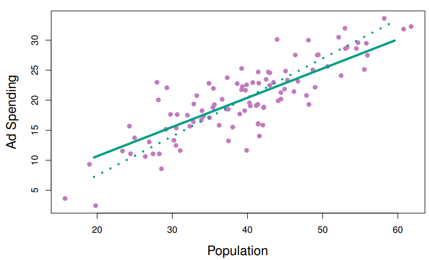

```{r setup, include=FALSE}
knitr::opts_chunk$set(echo = TRUE)
```

# Teoria

Enquanto os métodos que vimos eu outro post manipulavam a variância utilizando um subconjunto das variáveis originais ou reduzindo seus coeficientes, os métodos que veremos agora transformam os preditores antes de ajustar um modelo de mínimos quadrados. Essas técnicas são chamadas de métodos de redução de dimensionalidade.

Utilizando combinações lineares das variáveis originais, representadas por $Z_1, Z_2,...,Z_M$ (onde $M < p$), isto é, $$Z_{m} = \sum_{j=1}^{p} \phi_{jm}X_{j}$$ é possível ajustar um modelo de regressão linear reduzida utilizando mínimos quadrados. $$y_i = \theta_0 + \sum_{m=1}^{M} \theta_m z_{im} + \epsilon_i, \quad i = 1, \ldots, n$$ Isso simplifica a estimativa dos coeficientes de regressão de $p+1$ para $M+1$. A escolha das constantes $\theta_{1m}, \theta_{2m},..., \theta_{pm}$ pode resultar em desempenho superior ao da regressão com mínimos quadrados.

A redução de dimensionalidade limita a forma dos coeficientes estimados, o que pode enviesar as estimativas, porém, em conjuntos de dados com $p$grande em relação a $n$ ($p$ sendo o número de variáveis e $n$ o número de observações), escolher um valor de $M<p$ pode reduzir significativamente a variância dos coeficientes ajustados. Se $M = p$ e todas as $Z_m$ forem linearmente independentes, então o ajuste é equivalente à regressão com mínimos quadrados nos p preditores originais.

Todos os métodos de redução de dimensionalidade seguem duas etapas: obtenção dos preditores transformados $Z_1, Z_2,...,Z_M$ e ajuste do modelo usando esses $M$ preditores. A escolha desses preditores, ou seja, a seleção dos $\theta_{jm}$, pode ser feita de diferentes maneiras.

## Análise de Componentes Principais (PCA)

o PCA (Principal Component Analysis) é uma técnica de redução de dimensionalidade que busca encontrar uma representação mais compacta dos dados, preservando o máximo de informação possível. Ela é amplamente utilizada em análise exploratória de dados e pré-processamento antes de aplicar outros algoritmos de aprendizado de máquina.

A ideia principal do PCA é encontrar uma projeção dos dados originais em um novo conjunto de variáveis ortogonais, conhecidas como componentes principais. Esses componentes capturam a maior parte da variabilidade presente nos dados originais.

Matematicamente, o PCA começa centrando os dados para que cada variável tenha média zero. Em seguida, ele calcula a matriz de covariância ou de correlação dos dados. A matriz de covariância captura as relações lineares entre as variáveis, enquanto a matriz de correlação padroniza as variáveis para terem variâncias unitárias.

Os autovetores e autovalores da matriz resultante são então computados. Os autovetores representam os eixos ortogonais (ou direções) dos novos componentes, enquanto os autovalores indicam a variância ao longo desses eixos. Os autovetores correspondentes aos maiores autovalores são os primeiros componentes principais e retêm a maior quantidade de informação.

Os componentes principais subsequentes são encontrados iterativamente, garantindo que sejam ortogonais aos anteriores e maximizando a variância remanescente. Uma vez obtidos os componentes principais, é possível reduzir a dimensionalidade dos dados projetando-os nesses novos eixos. Isso permite representar os dados originais com menos variáveis, mantendo a maior parte da informação.

Em resumo, o PCA é uma técnica poderosa para redução de dimensionalidade que preserva informações importantes dos dados originais, facilitando a visualização e análise, além de ser útil na preparação de dados para algoritmos de aprendizado de máquina.

## t-Distributed Stochastic Neighbor Embedding (t-SNE)

O t-SNE (t-Distributed Stochastic Neighbor Embedding) é uma técnica de redução de dimensionalidade usada principalmente para visualização de dados de alta dimensionalidade em espaços de menor dimensão, mantendo as relações de proximidade entre os pontos originais. Ele se destaca por sua capacidade de preservar a estrutura local dos dados, o que significa que ele tende a preservar os vizinhos próximos em espaços de alta dimensão na projeção de baixa dimensão. Isso é particularmente útil para revelar agrupamentos ou clusters nos dados.

O método começa calculando probabilidades condicionais que representam as semelhanças entre pares de pontos no espaço original. Essas probabilidades são representadas em uma distribuição de probabilidade gaussiana em um espaço de baixa dimensão. Em seguida, ele ajusta um segundo conjunto de probabilidades em um espaço de baixa dimensão, tentando minimizar a divergência de Kullback-Leibler entre as duas distribuições de probabilidade.

O objetivo do t-SNE é encontrar uma projeção dos dados de alta dimensão em um espaço de menor dimensão (geralmente 2D ou 3D) de forma que pontos semelhantes (ou próximos) nos dados originais permaneçam próximos na projeção, enquanto pontos menos semelhantes se afastam.

É importante notar que o t-SNE pode não preservar as distâncias entre pontos de forma linear, já que ele se concentra na estrutura local dos dados. Isso significa que distâncias entre pontos em espaços de alta dimensão podem não ser preservadas de maneira exata na projeção de baixa dimensão.

Em resumo, o t-SNE é uma técnica popular e eficaz para visualização de dados de alta dimensionalidade em espaços de menor dimensão, especialmente quando se busca preservar a estrutura local e revelar padrões de agrupamento nos dados. É amplamente utilizado em diversas áreas, como visualização de dados, análise exploratória e pré-processamento em aprendizado de máquina.

## Uniform Manifold Approximation and Projection (UMAP)

O UMAP (Uniform Manifold Approximation and Projection) é um algoritmo de redução de dimensionalidade não linear que preserva a estrutura topológica dos dados. Ele é baseado em técnicas de aprendizado de máquina, incluindo redes neurais artificiais e aprendizado por reforço.

O UMAP funciona da seguinte forma:

-   Construção de um simplicial complexo: O primeiro passo é construir um simplicial complexo dos dados. Um simplicial complexo é uma estrutura matemática que representa a conectividade dos dados.
-   Aproximação da distância: Em seguida, o UMAP aproxima a distância entre os simplices do simplicial complexo. Essa aproximação é feita usando uma rede neural artificial.
-   Projeção dos dados: Por fim, os dados são projetados em um espaço de baixa dimensionalidade. Essa projeção é feita usando um algoritmo de aprendizado por reforço. Construção de um simplicial complexo

O simplicial complexo é construído a partir dos dados usando um algoritmo de aproximação de k vizinhos mais próximos (KNN). O algoritmo começa selecionando um ponto aleatório como inicial. Em seguida, ele adiciona os vizinhos mais próximos do ponto inicial ao simplicial complexo. O processo é repetido até que todos os pontos estejam no simplicial complexo.

**Aproximação da distância**

A distância entre dois simplices é aproximada usando uma rede neural artificial. A rede neural é treinada para prever a distância entre dois simplices a partir de suas representações.

**Projeção dos dados**

Os dados são projetados em um espaço de baixa dimensionalidade usando um algoritmo de aprendizado por reforço. O algoritmo começa com uma configuração inicial aleatória. Em seguida, ele faz pequenas alterações na configuração e avalia o resultado. O algoritmo repete esse processo até encontrar uma configuração que satisfaça alguns critérios.

**Vantagens do UMAP**

O UMAP tem várias vantagens em relação a outros algoritmos de redução de dimensionalidade:

-   Ele preserva a estrutura topológica dos dados. Isso significa que os grupos de dados semelhantes no espaço original permanecerão semelhantes no espaço reduzido.
-   Ele é robusto a ruído. O UMAP é menos sensível ao ruído do que outros algoritmos, como a PCA.
-   Ele é eficiente computacionalmente. O UMAP é mais eficiente computacionalmente do que outros algoritmos, como a t-SNE.

**Desvantagens do UMAP**

O UMAP também tem algumas desvantagens:

-   Ele pode ser lento para grandes conjuntos de dados. O UMAP pode ser lento para grandes conjuntos de dados, especialmente se o simplicial complexo for denso.
-   Ele pode ser difícil de interpretar. O UMAP pode ser difícil de interpretar, pois não fornece uma representação visual dos dados.

**Aplicações do UMAP**

O UMAP pode ser usado em uma variedade de aplicações, incluindo:

-   Visualização de dados: O UMAP pode ser usado para visualizar dados multivariados em um espaço de baixa dimensionalidade. Isso pode ser útil para identificar padrões e tendências nos dados.
-   Classificação: O UMAP pode ser usado para melhorar a performance de algoritmos de classificação. Isso ocorre porque o UMAP pode ajudar a separar os dados em grupos distintos.
-   Outlier detection: O UMAP pode ser usado para detectar outliers nos dados. Isso ocorre porque o UMAP pode identificar pontos que estão longe de seus vizinhos.

## Partial Least Squares (PLS)

O método de regressão de componentes parciais (PCR) envolve identificar combinações lineares, ou direções, que melhor representam os preditores $X_1,...,X_p$. Essas direções são identificadas de forma não supervisionada, pois a resposta Y não é usada para determinar as direções dos componentes principais. Ou seja, a resposta não supervisiona a identificação das direções principais. Como resultado, o PCR sofre de uma desvantagem: não há garantia de que as direções que melhor explicam os preditores também serão as melhores direções para prever a resposta.

Agora, o método de mínimos quadrados parciais (PLS) é uma alternativa supervisionada ao PCR. Assim como o PCR, o PLS é um método de redução de dimensionalidade, que primeiro identifica um novo conjunto de características $Z_1,...,Z_M$ que são combinações lineares das características originais e, em seguida, ajusta um modelo linear por mínimos quadrados usando essas M novas características. Mas ao contrário do PCR, o PLS identifica essas novas características de forma supervisionada, ou seja, faz uso da resposta Y para identificar novas características que não apenas aproximam bem as características antigas, mas também estão relacionadas à resposta. Em termos gerais, a abordagem do PLS tenta encontrar direções que ajudem a explicar tanto a resposta quanto os preditores.

A primeira direção do PLS é computada da seguinte forma: após padronizar os p preditores, o PLS calcula a primeira direção $Z_1$ definindo cada $\phi_{j1}$ igual ao coeficiente da regressão linear simples de Y sobre $X_j$. Pode-se demonstrar que esse coeficiente é proporcional à correlação entre Y e $X_j$. Portanto, ao calcular $Z_1 = ∑_{j=1}^p X_j\phi_{j1}$, o PLS atribui o peso mais alto às variáveis que estão mais fortemente relacionadas à resposta.

A Figura abaixo mostra um exemplo de PLS em um conjunto de dados sintético com Vendas em cada uma de 100 regiões como resposta e dois preditores: Tamanho da População e Gastos com Publicidade.



A linha verde sólida indica a primeira direção do PLS, enquanto a linha pontilhada mostra a direção do primeiro componente principal. O PLS escolheu uma direção que tem menos mudança na dimensão de propaganda por mudança unitária na dimensão de população, em relação à PCA. Isso sugere que a população está mais correlacionada com a resposta do que a propaganda. A direção do PLS não se ajusta tão bem aos preditores quanto a PCA, mas explica melhor a resposta.

Para identificar a segunda direção do PLS, ajustamos cada uma das variáveis para $Z_1$, regredindo cada variável em $Z_1$ e pegando os resíduos. Esses resíduos podem ser interpretados como a informação restante que não foi explicada pela primeira direção do PLS. Em seguida, calculamos $Z_2$ usando esses dados ortogonalizados da mesma forma que $Z_1$ foi calculado com base nos dados originais. Esse processo iterativo pode ser repetido $M$ vezes para identificar vários componentes do PLS $Z_1,...,Z_M$. Por fim, no final desse procedimento, usamos mínimos quadrados para ajustar um modelo linear para prever Y usando $Z_1,...,Z_M$ da mesma forma que no PCR.

Assim como no PCR, o número M de direções de mínimos quadrados parciais usadas no PLS é um parâmetro de ajuste que é tipicamente escolhido por validação cruzada. Geralmente, padronizamos os preditores e a resposta antes de realizar o PLS.

O PLS é popular no campo da quimiometria, onde muitas variáveis surgem de sinais de espectrometria digitalizada. Na prática, muitas vezes ele não apresenta um desempenho melhor do que a regressão ridge ou o PCR. Enquanto a redução de dimensionalidade supervisionada do PLS pode reduzir o viés, também tem o potencial de aumentar a variância, de modo que o benefício geral do PLS em relação ao PCR pode ser neutro.

## Conclusões:

A redução de dimensionalidade é uma técnica que visa reduzir o número de dimensões de um conjunto de dados, preservando as informações mais importantes. Essa técnica pode ser útil em diversas aplicações, como visualização de dados, aprendizado de máquina e processamento de sinais.

**Vantagens e desvantagens**

Os métodos de redução de dimensionalidade podem ser divididos em dois grupos principais: lineares e não lineares.

Os métodos lineares, como a análise de componentes principais (PCA), preservam a variância dos dados. Esse tipo de método é frequentemente utilizado para visualização de dados, pois permite visualizar padrões e tendências nos dados. No entanto, os métodos lineares podem não ser adequados para preservar a estrutura topológica dos dados.

Os métodos não lineares, como o t-distributed stochastic neighbor embedding (t-SNE), preservam a estrutura local dos dados. Esse tipo de método é frequentemente utilizado para identificar clusters nos dados. No entanto, os métodos não lineares podem ser mais complexos e menos eficientes computacionalmente do que os métodos lineares.

**Escolha do número de dimensões a serem reduzidas**

O número de dimensões a serem reduzidas é uma escolha importante que deve ser feita com base no objetivo da redução de dimensionalidade. Em geral, é recomendado reduzir o número de dimensões para um nível que permita visualizar ou analisar os dados de forma eficaz.

**Técnicas de regularização para reduzir o overfitting**

A redução de dimensionalidade pode causar overfitting, ou seja, o modelo pode aprender as características aleatórias dos dados e não as características essenciais. Para reduzir o overfitting, podem ser utilizadas técnicas de regularização, como a penalização da complexidade do modelo ou a seleção de características.

**Aplicações de redução de dimensionalidade**

A redução de dimensionalidade tem diversas aplicações, incluindo:

-   Visualização de dados: A redução de dimensionalidade pode ser utilizada para visualizar dados multivariados em um espaço de baixa dimensionalidade. Isso pode ser útil para identificar padrões e tendências nos dados.
-   Aprendizado de máquina: A redução de dimensionalidade pode melhorar a performance de algoritmos de aprendizado de máquina. Isso ocorre porque a redução de dimensionalidade pode simplificar os dados e facilitar a aprendizagem do modelo.
-   Processamento de sinais: A redução de dimensionalidade pode ser utilizada para reduzir o tamanho de conjuntos de dados de sinais. Isso pode ser útil para armazenamento e processamento de sinais.

# Prática

## Introdução

Vamos utilizar um conjunto de dados sobre variedades de feijões em imagens. O estudo original visa obter uniformidade nas variedades de sementes em produção agrícola, desenvolvendo um sistema de visão computacional para distinguir sete variedades de feijões secos por meio de características como cor e forma.

O conjunto de dados consiste em imagens de 13.611 grãos de sete variedades de feijões secos, onde cada imagem contém múltiplos feijões. O processo de determinar os pixels correspondentes a cada feijão na imagem é chamado de segmentação de imagem. Esses pixels são analisados para extrair características como área, perímetro, comprimento dos eixos, excentricidade, entre outros, que são utilizadas para classificar as variedades de feijões.

O estudo menciona várias características de forma e como elas são medidas, como área, perímetro, eixos principais e menores, compacidade, entre outros. Essas características são úteis na diferenciação de variedades, pois diferentes tipos de feijões têm formas e cores distintas.

O objetivo é criar um modelo preditivo usando dados de treinamento rotulados manualmente para distinguir entre as sete variedades de feijões. O estudo destaca que muitas características de imagem estão correlacionadas, e a redução de dimensionalidade pode ajudar a simplificar o modelo, mantendo as informações essenciais.

No conjunto de dados analisado, foram calculadas 16 características morfológicas para cada feijão. Os dados incluem informações como área, perímetro, comprimento dos eixos, compacidade, entre outros fatores descritos em detalhes.

O estudo ressalta a importância de reduzir a dimensionalidade dos dados para simplificar modelos complexos, especialmente quando várias características estão altamente correlacionadas. Esse trabalho pode ajudar fabricantes a avaliar a homogeneidade de lotes de feijões, contribuindo para a classificação eficaz e uniforme das sementes.

## Carregar e separar dados

Vamos começar carregando os dados

```{r}
# Pacote tidymodels para a modelagem
library(tidymodels)

#Função para dar preferência a funções que contem o mesmo nome
tidymodels_prefer()

#Biblioteca que contém os dados
library(beans)
```

O objetivo desse post não é fazer uma análise exploratória. Os dados já estão sem erros e pronto para a modelagem. Portanto, vamos separar em dados de teste e treinamento:

```{r}
#Semente para reprodutibilidade
set.seed(1601)

#Separação inicial com dados de teste, treinamento e validação
bean_split <- initial_validation_split(beans, strata = class, prop = c(0.75, 0.125))
bean_split

#Transformar essa separação inicial em df
bean_train <- training(bean_split)
bean_test <- testing(bean_split)
bean_validation <- validation(bean_split)

set.seed(1602)
# Retorne um objeto 'rset' para usar com as funções de ajuste (tune functions).
bean_val <- validation_set(bean_split)
```

## Correlação

Para avaliar visualmente o desempenho de diferentes métodos, podemos estimar os métodos no conjunto de treinamento (n = 10.206 feijões) e exibir os resultados usando o conjunto de validação (n = 1.702).

Antes de iniciar qualquer redução de dimensionalidade, podemos dedicar algum tempo investigando nossos dados. Como sabemos que muitas dessas características de forma provavelmente estão medindo conceitos semelhantes, vamos dar uma olhada na estrutura de correlação dos dados.

```{r, fig.height=7}
# Carregar a biblioteca para plotagem de matrizes de correlação
library(corrplot)

# Definir uma paleta de cores para a matriz de correlação
tmwr_cols <- colorRampPalette(c("#91CBD765", "#CA225E"))

# Criar a matriz de correlação para os dados de treino dos feijões, excluindo a coluna 'class'
bean_train %>% 
  select(-class) %>% 
  cor() %>% 
  corrplot(col = tmwr_cols(200), tl.col = "black", method = "ellipse",  type = "upper", tl.srt = 45)

```

Muitos desses preditores estão altamente correlacionados, como área e perímetro ou fatores de forma 2 e 3. Embora não dediquemos tempo a isso aqui, também é importante verificar se essa estrutura de correlação muda significativamente entre as categorias de resultados. Isso pode ajudar a criar modelos melhores.

## Receita

É hora de analisar os dados dos feijões em um espaço menor. Podemos começar com uma receita básica para pré-processar os dados antes de qualquer etapa de redução de dimensionalidade. Vários preditores são razões e, portanto, provavelmente têm distribuições distorcidas. Tais distribuições podem causar problemas nos cálculos de variância (como os usados no PCA). O pacote *bestNormalize* possui uma etapa que pode impor uma distribuição simétrica para os preditores. Vamos usar isso para mitigar o problema das distribuições distorcidas:  

```{r}
library(bestNormalize)
bean_rec <-
  # receita com dados de treinamento
  recipe(class ~ ., data = bean_train) %>%
  step_zv(all_numeric_predictors()) %>%
  step_orderNorm(all_numeric_predictors()) %>% 
  step_normalize(all_numeric_predictors())
```


Essa receita será ampliada com etapas adicionais para as análises de redução de dimensionalidade. Vamos analisar o que essa receita fez com nossos dados 

```{r}
# Preprocessamento dos dados de validação usando uma receita previamente definida
bean_val_processed <- prep(bean_rec, new_data = bean_validation) %>% juice()

# Carregar a biblioteca para criar visualizações combinadas
library(patchwork)

# Criar o primeiro histograma com os dados originais do conjunto de validação
p1 <- 
  bean_validation %>% 
  ggplot(aes(x = area)) + 
  geom_histogram(bins = 30, color = "white", fill = "blue", alpha = 1/3) + 
  ggtitle("Original validation set data") +
  theme_minimal()

# Criar o segundo histograma com os dados processados do conjunto de validação
p2 <- 
  bean_val_processed %>% 
  ggplot(aes(x = area)) + 
  geom_histogram(bins = 30, color = "white", fill = "red", alpha = 1/3) + 
  ggtitle("Processed validation set data") +
  theme_minimal()

# Combinar os dois histogramas em uma visualização lado a lado
p1 + p2
```

Podemos ver que a antes, a distribuição da área era assimétrica e com valores altos. Depois de normalizar, a distribuiição está simétrica e ao redor da média = 0.

## Extração das variáveis

Como as receitas são a opção principal no tidymodels para redução de dimensionalidade, vamos escrever uma função que irá estimar a transformação e plotar os dados resultantes em uma matriz de dispersão usando o pacote ggforce.

```{r}
library(ggforce)
plot_validation_results <- function(recipe, dat = bean_validation) {
  recipe %>%
    # Estimar quaisquer passos adicionais
    prep() %>%
    # Processar os dados (o conjunto de validação por padrão)
    bake(new_data = dat) %>%
    # Criar a matriz de dispersão
    ggplot(aes(x = .panel_x, y = .panel_y, color = class, fill = class)) +
    geom_point(alpha = 0.4, size = 0.5) +
    geom_autodensity(alpha = .3) +
    facet_matrix(vars(-class), layer.diag = 2) + 
    scale_color_brewer(palette = "Dark2") + 
    scale_fill_brewer(palette = "Dark2") +
    theme_bw()
}
```

## PCA

Mencionei o PCA várias vezes, e é hora de entrar em mais detalhes. O PCA é um método não supervisionado que utiliza combinações lineares dos preditores para definir novas características. Essas características tentam explicar o máximo de variação possível nos dados originais. Adicionamos o passo step_pca() à receita original e usamos nossa função para visualizar os resultados no conjunto de validação:

```{r}
bean_rec %>%
  step_pca(all_numeric_predictors(), num_comp = 4) %>%
  plot_validation_results() + 
  ggtitle("Principal Component Analysis")
```
emos que os dois primeiros componentes, PC1 e PC2, especialmente quando usados juntos, conseguem distinguir ou separar efetivamente as classes. Isso nos faz esperar que o problema geral de classificar esses feijões não seja especialmente difícil.

Lembre-se de que o PCA é não supervisionado. Para esses dados, acontece que os componentes do PCA que explicam a maior variação nos preditores também são preditivos das classes. Quais características estão impulsionando o desempenho? O pacote *learntidymodels* tem funções que podem ajudar a visualizar as principais características de cada componente. Vamos precisar da receita preparada; a etapa do PCA é adicionada no código a seguir junto com uma chamada para prep():

```{r}
library(learntidymodels)
bean_rec %>%
  step_pca(all_numeric_predictors(), num_comp = 4) %>% 
  prep() %>% 
  plot_top_loadings(component_number <= 4, n = 5) + 
  scale_fill_brewer(palette = "Paired") +
  ggtitle("Principal Component Analysis") +
  theme_bw()
```
As principais variáveis estão principalmente relacionadas ao conjunto de preditores correlacionados mostrados na parte superior esquerda do gráfico de correlação anterior: perímetro, área, comprimento do eixo maior e área convexa. Todos esses estão relacionados ao tamanho do feijão. O fator de forma 2  é a área sobre o cubo do comprimento do eixo maior e, portanto, também está relacionado ao tamanho do feijão. Medidas de alongamento parecem dominar o segundo componente do PCA.

Podemos ver também o quanto cada PCA explica da variabilidade dos dados:

```{r}
bean_rec %>%
  step_pca(all_numeric_predictors(), num_comp = 4, id = "pca") %>% 
  prep() %>%
  tidy(id = "pca", type = "variance") %>%
  filter(terms == "cumulative percent variance", component <= 4) %>%
  ggplot(aes(component, value)) +
  geom_col(fill="#372F60") +
  labs(x = "Principal Components", y = "Cumulative variance explained (%)") +
  scale_y_continuous(limits = c(0, 100), breaks = seq(0, 100, by = 20)) +
  theme_bw()
```
Podemos ver que mais de 90% da variância é explicada pelos 3 primeiros componentes principais, tornando-os importantes para entender a estrutura e a variação dos dados.

## PLS

PLS é uma versão supervisionada do PCA. Ele tenta encontrar componentes que maximizem simultaneamente a variação nos preditores e também maximizem a relação entre esses componentes e o resultado.

```{r}
bean_rec %>%
  step_pls(all_numeric_predictors(), outcome = "class", num_comp = 4) %>%
  plot_validation_results() + 
  ggtitle("Partial Least Squares")
```
Os dois primeiros componentes PLS plotados são quase idênticos aos dois primeiros componentes do PCA! Encontramos esse resultado porque esses componentes do PCA são muito eficazes na separação das variedades de feijões. Os componentes restantes são diferentes. A Figura acima visualiza os pesos, ou seja, as principais características para cada componente.

```{r}
bean_rec %>%
  step_pls(all_numeric_predictors(), outcome = "class", num_comp = 4) %>%
  prep() %>% 
  plot_top_loadings(component_number <= 4, n = 5, type = "pls") + 
  scale_fill_brewer(palette = "Paired") +
  ggtitle("Partial Least Squares") +
  theme_bw()
```
A solidez (ou seja, a densidade do feijão) impulsiona o terceiro componente do PLS, juntamente com a circularidade. A solidez pode estar capturando características do feijão relacionadas à "irregularidade" da superfície do feijão, já que pode medir a irregularidade das bordas do feijão.

## UMAP

Uma das vantagens do ecossistema tidymodels é a flexibilidade e facilidade de experimentar abordagens diferentes para o mesmo tipo de tarefa. Por exemplo, podemos substituir o PCA por UMAP, um algoritmo completamente diferente de redução de dimensionalidade baseado em ideias da análise de dados topológicos. UMAP é semelhante ao popular método t-SNE para redução de dimensionalidade não linear. No espaço original de alta dimensão, o UMAP usa um método de vizinhos mais próximos baseado em distâncias para encontrar áreas locais dos dados onde os pontos de dados têm maior probabilidade de estar relacionados. A relação entre os pontos de dados é salva como um modelo de grafo direcionado no qual a maioria dos pontos não está conectada.

A partir daí, o UMAP traduz pontos no grafo para o espaço dimensional reduzido. Para fazer isso, o algoritmo possui um processo de otimização que utiliza a entropia cruzada para mapear os pontos de dados para o conjunto menor de características de forma que o grafo seja bem aproximado.O pacote *embed* fornece etapas de receita para criar incorporações, incluindo UMAP. Vamos substituir a etapa de PCA pela etapa de UMAP.

```{r}
library(embed)
bean_rec %>%
  step_umap(all_numeric_predictors(), num_comp = 4) %>%
  plot_validation_results() +
  ggtitle("UMAP")
```

Embora o espaço entre clusters seja evidente, os clusters podem conter uma mistura heterogênea de classes.

Também existe uma versão supervisionada do UMAP:

```{r}
bean_rec %>%
  step_umap(all_numeric_predictors(), outcome = "class", num_comp = 4) %>%
  plot_validation_results() +
  ggtitle("UMAP (supervised)")
```

O método supervisionado mostrado acima parece promissor para modelar os dados.

O UMAP é um método poderoso para reduzir o espaço de variáveis. No entanto, pode ser muito sensível aos parâmetros de ajuste (por exemplo, o número de vizinhos e assim por diante). Por esse motivo, seria útil experimentar alguns dos parâmetros para avaliar quão robustos são os resultados para esses dados.

## Modelagem

Ambos os métodos PLS e UMAP valem a pena investigar em conjunto com diferentes modelos. Vamos explorar uma variedade de modelos diferentes com essas técnicas de redução de dimensionalidade (juntamente com nenhuma transformação): uma rede neural de camada única, bagged trees, análise discriminante flexível (FDA), naive Bayes e análise discriminante regularizada (RDA).

Agora que estamos de volta ao "modo de modelagem", vamos criar uma série de especificações de modelos e, em seguida, usar um fluxo de trabalho (Workflow) para ajustar os modelos no código a seguir. Observe que os parâmetros do modelo são ajustados em conjunto com os parâmetros da receita (por exemplo, tamanho da dimensão reduzida, parâmetros do UMAP).

```{r}
#Pacote para bagged trees e para análise discriminante
library(baguette)
library(discrim)

# Especificação do modelo de rede neural de camada única
mlp_spec <-
  mlp(hidden_units = tune(), penalty = tune(), epochs = tune()) %>%
  set_engine('nnet') %>%
  set_mode('classification')

# Especificação do modelo de bagged trees
bagging_spec <-
  bag_tree() %>%
  set_engine('rpart') %>%
  set_mode('classification')

# Especificação do modelo de análise discriminante flexível (FDA)
fda_spec <-
  discrim_flexible(
    prod_degree = tune()
  ) %>%
  set_engine('earth')

# Especificação do modelo de análise discriminante regularizada (RDA)
rda_spec <-
  discrim_regularized(frac_common_cov = tune(), frac_identity = tune()) %>%
  set_engine('klaR')

# Especificação do modelo de naive Bayes
bayes_spec <-
  naive_Bayes() %>%
  set_engine('klaR')

```

Também precisamos de receitas para os métodos de redução de dimensionalidade que iremos experimentar. Vamos começar com uma receita base chamada bean_rec e então estendê-la com diferentes etapas de redução de dimensionalidade:

```{r}
# Criando uma receita base para preparação dos dados
bean_rec <- 
  recipe(class ~ ., data = bean_train) %>%
  step_zv(all_numeric_predictors()) %>%
  step_orderNorm(all_numeric_predictors()) %>%
  step_normalize(all_numeric_predictors())

# Definindo a receita para PCA (Principal Component Analysis)
pca_rec <- 
  bean_rec %>%
  step_pca(all_numeric_predictors(), num_comp = tune(), threshold = tune())

# Definindo a receita para PLS (Partial Least Squares)
pls_rec <- 
  bean_rec %>% 
  step_pls(all_numeric_predictors(), outcome = "class", num_comp = tune())

# Definindo a receita para UMAP (Uniform Manifold Approximation and Projection)
umap_rec <- 
  bean_rec %>%
  step_umap(
    all_numeric_predictors(),
    outcome = "class",
    num_comp = tune(),
    neighbors = tune(),
    min_dist = tune()
  )
```

Mais uma vez, o pacote workflowsets utiliza os pré-processadores e os modelos e os combina. A opção de controle parallel_over é definida para que o processamento paralelo possa funcionar simultaneamente em combinações de parâmetros de ajuste. A função workflow_map() aplica uma busca em grade para otimizar os parâmetros do modelo/pré-processamento (se houver) em 10 combinações de parâmetros. A área sob a curva ROC multiclasse é estimada no conjunto de validação.

```{r eval=FALSE, include=TRUE}
# Definindo as configurações para controle de grade
ctrl <- control_grid(parallel_over = "everything")

#biblioteca para processamento em paralelo
library(doParallel)
cores <- parallel::detectCores()
cl <- makePSOCKcluster(cores)
registerDoParallel(cl)

# Criando um conjunto de fluxo de trabalho (workflow) para pré-processamento e modelos
bean_res <- 
  workflow_set(
    preproc = list(basic = class ~., 
                   pca = pca_rec,
                   pls = pls_rec, 
                   umap = umap_rec), 
    models = list(bayes = bayes_spec, fda = fda_spec,
                  rda = rda_spec, bag = bagging_spec,
                  mlp = mlp_spec)
  ) %>% 
  workflow_map(
    verbose = TRUE,                # Ativar o modo verbose para saída detalhada
    seed = 1603,                   # Definir a semente para replicabilidade
    resamples = bean_val,          # Utilizar os dados de validação para resample
    grid = 10,                     # Realizar a busca em grade em 10 combinações
    metrics = metric_set(roc_auc), # Avaliar a métrica da área sob a curva ROC
    control = ctrl                 # Utilizar as configurações de controle definidas anteriormente
  )

#Parar cluster paralelo
stopCluster(cl)
```

```{r include=FALSE}
bean_res <- readRDS("bean_res.rds")
```

Podemos classificar os modelos pelas estimativas da área sob a curva ROC nos conjuntos de validação.

```{r}
# Visualização interativa do desempenho dos modelos com a melhor métrica ROC AUC
autoplot(bean_res, select_best = TRUE, metric = "roc_auc")  +
  theme_bw()  # Ajustando o tamanho dos pontos
  

# Classificação dos resultados dos modelos com a melhor métrica
rank_results(bean_res, select_best = TRUE) %>%
  select(wflow_id, .metric, mean)

```

## Resultados

É evidente a partir desses resultados que a maioria dos modelos apresenta desempenho muito bom; há poucas escolhas ruins aqui. Para demonstração, usaremos o modelo RDA com características de PLS como o modelo final. Vamos finalizar o fluxo de trabalho com os melhores parâmetros numericamente, ajustá-lo ao conjunto de treinamento e, em seguida, avaliar com o conjunto de teste.

```{r}
# Criando um objeto 'rda_res' para armazenar o resultado final do modelo RDA com PLS features
rda_res <- 
  bean_res %>% 
  extract_workflow("pls_rda") %>%  # Extraindo o workflow específico 'pls_rda'
  finalize_workflow(  # Finalizando o workflow com os melhores parâmetros encontrados
    bean_res %>% 
      extract_workflow_set_result("pls_rda") %>% 
      select_best(metric = "roc_auc")
  ) %>% 
  last_fit(split = bean_split, metrics = metric_set(roc_auc, accuracy))  # Ajustando ao conjunto de treinamento e avaliando métricas

# Extraindo o modelo ajustado do workflow do RDA
rda_wflow_fit <- extract_workflow(rda_res)
rda_wflow_fit

#Coletando métricas
rda_res %>% collect_metrics()
```

Podemos também comparar as curvas ROC para cada classe

```{r}
# Coletando as previsões do modelo RDA
rda_res %>%
  collect_predictions() %>%
  # Gerando a curva ROC
  roc_curve(class, .pred_barbunya:.pred_sira) %>%
  ggplot(aes(1 - specificity, sensitivity, color = .level)) +  # Plotando a curva ROC
  geom_abline(slope = 1, color = "gray50", lty = 2, alpha = 0.8) +  # Adicionando linha de referência
  geom_path(size = 1.5, alpha = 0.7) +  # Adicionando a curva ROC
  labs(color = NULL) +  # Definindo rótulo de cor como nulo
  coord_fixed() +  # Mantendo proporções fixas nos eixos
  theme_bw() # Definindo tema do gráfico como branco e preto


```
Parece que todos foram muito bem classificados, entretanto o modelo teve mais dificuldades de identificar sementes da classe Sira e Dermason corretamente. A matriz de confusão ficaria muito difícil de interpretar, devido ao número de classes.

# Referências

-   James, G., Witten, D., Hastie, T., & Tibshirani, R. (2021). An introduction to statistical learning: with applications in R (2nd ed.). Springer.
-   Kuhn, M., & Silge, J. (2023). Tidy modeling with R. Springer.
