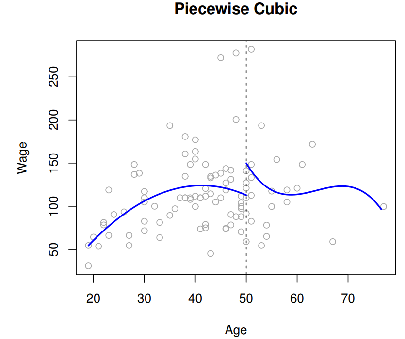
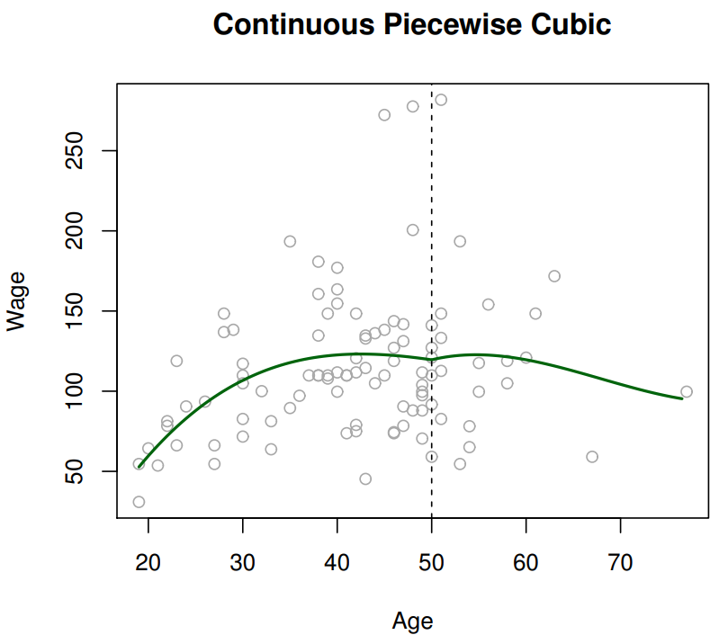
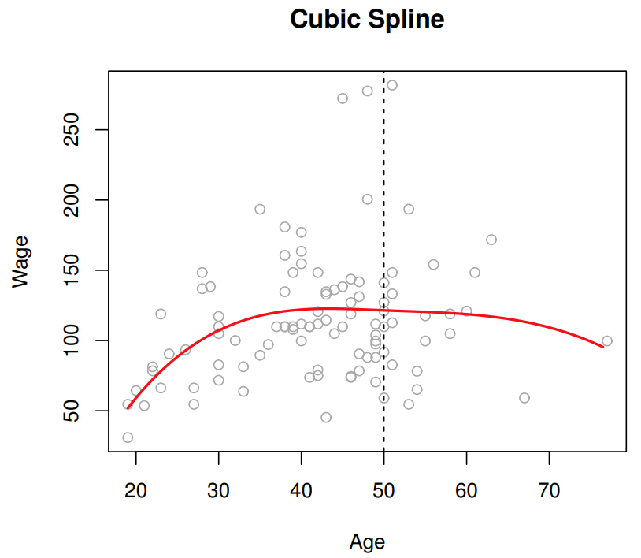
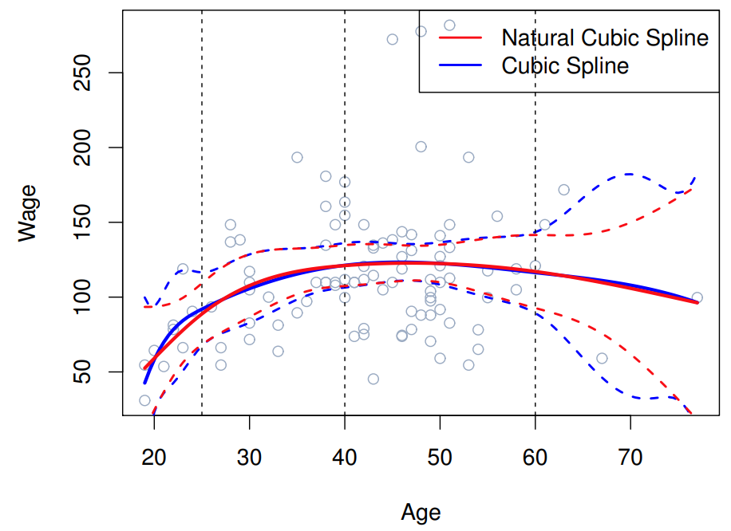

```{r setup, include=FALSE}
knitr::opts_chunk$set(echo = TRUE)
```

# Teoria

Vimos sobre como dar mais flexibilidade à nossa modelagem usando KNN e modelos de árvores de decisão. Nesse artigo, veremos como a regressão linear que já conhecemos pode ser extendida para modelar tendências não lineares.

```{r echo=FALSE}
# Definir o tamanho do conjunto de dados
n <- 100

# Criar variável x aleatória
x <- seq(1, 10, length.out = n)

# Criar variável y com relação polinomial
y <- 2 * x^2 - 3 * x + 5 + rnorm(n, mean = 0, sd = 3)

# Colocar os dados em um data frame
dados <- data.frame(x, y)

# Visualizar os dados
plot(dados$x, dados$y, pch = 19, col = "blue", main = "Motivação", xlab = "X", ylab = "Y")
```

Como os dados acima mostram, é útil para nós contruir modelos de Machile Learning que sejam capazes de capturar relações não lineares.

## Polynomial Regression

Uma técnica que se encaixa exatamente no framework da regressão linear é a regressão polinomial. Nela, usamos termos polinomiais para um preditor em um modelo de regressão linear. Por exemplo, em vez de um modelo linear do tipo: $$y_i=\beta_0+\beta_1x_i+\epsilon_i$$, usamos: $$y_i=\beta_0+\beta_1x_i+\beta_2x_i^2 + \beta_3x_i^3+\epsilon_i$$

Computacionalmente, isso requer adicionarmos transformações nos valores originais como novos preditores no modelo. Nós criamos essas transformações elevando ao quadrado e ao cubo o preditor $x$. Esses novos preditores são então tratados como uma variável qualquer em uma regressão linear por mínimos quadrados.

Uma desvantagem da regressão polinomial é que ela impõe uma estrutura polinomial global entre a relação de $x$ e $y$. Isso pode ser limitante se, por exemplo, a relação for cúbica em um intervalo e linear em outro. Então, será que é possível fazer polinomios em partes?

## Piecewise Polynomials

Sim, podemos! Em vez de ajustar um polinomio globalmente sobre todo o intervalo de $x$, podemos ajutar múltiplos polinomios localmente em diferentes regiões de $x$.



No exemplo acima, o salário é modelado como uma função não linear da idade com 2 polinomios, a depender se idade é maior ou menor que 50 anos:

$y_1=\beta_{01}+\beta_{11}Age_i+\beta_{21}Age_i^2+\beta_{31}Age_i^3+\epsilon_i$, se $Age_i < 50$ $y_1=\beta_{02}+\beta_{12}Age_i+\beta_{22}Age_i^2+\beta_{32}Age_i^3+\epsilon_i$, se $Age_i > 50$

O ponto em que ocorre a troca de função (50 anos) é chamado de nó. Um problema que podemos notas de imediato é a descontinuidade no nó, indicando que provavelmente não é um bom modelo para esse contexto. Essas descontinuidades fazem com que polinomio por partes não sejam muito apropriados para modelagem. Entretanto, eles podem ser melhorados com a ajuda de propriedades matemáticas que a suavidade nesses nós.

Essas propriedades conseguem forçar um polinomio por partes a serem contínuos e terem primeira e segunda derivadas contínuas nos nós. Essas funções resultantes são chamadas de *Splines Cúbicas.*



Esse segundo gráfico busca corrigir a descontinuidade do outro modelo. Porém, ele só forçou a função a ser contínua no nó - não necessariamente a ter primeira e segunda derivadas contínuas. Ele parece melhor que o primeiro gráfico, porque é contínuo, mas ainda está estranho, visto que a tendencia muda abruscamente.



Esse último gráfico mostra uma função que foi forçada a ser contínua no nó e a ter derivadas contínuas também. Ele parece suave e também parece se ajustar bem aos dados. Essa função é a Spline Cúbica.

Um problema com as splines cúbicas é que nas regiões de limite (regiões menores que o menor nó e maiores que o maior nó) elas podem ter muita variabilidade, resultando em predições menos acuradas.



Na figura, a linha sólida azul é um modelo spline cúbico. As linhas tracejadas em azul nos dão o intervalo de confiança para os valores previstos pelo modelo. Podemos ver que nas regiões limítrofes, as bandas são mais alargadas, indicando que a incerteza do modelo nessa região.

Uma pequena modificação no spline cúbico é chamada de spline cúbico natural. Com essa alteração, o modelo impõe que os polinomios são lineares nas regiões de limites. Podemos observar na figura que a função spline cúbica natural (em vermelho), tem uma variabilidade muito menor nos limites. Isso torna esse modelo muito popular para modelar relações não lineares, devido a sua flexibilidade ao lidar com vários tipos de não-linearidade.

## Representação Matemática

Lembre-se que na regressão polinomial, nós modelamos uma tendência não linear global para um variável qualquer incluindo novas versões transformadas da variável original. Essas transformações são as diferentes potências dos preditores.$$y_i=\beta_0+\beta_1x_i+\beta_2x_i^2 + \beta_3x_i^3+\epsilon_i$$
De forma similar, nós usamos um conjunto de variáveis transformadas quando modelamos *splines* em modelos de regressão. Porém, em vez de uma simples transformação na potência, são usadas funções polinomiais mais complexas para transformar os preditores: $$y_i=\beta_0+\beta_1f_1(x_i)+...+\beta_pf_p(x_i)+\epsilon_i$$
A ideia é que a combinação dessas complexas transformações polinomiais tem sucesso ao criar uma função spline natural do preditor $x$, com as seguintes propriedades:

-   **Piecewise Polynomials**: modela localmente
-   **Continuidade**: função suave
-   **Linear nos limites**: reduz variabilidade

# Prática

## Introdução

Para construir modelos com splines no tidymodels, seguimos a mesma estrutura que usamos para modelos de regressão linear comuns, mas acrescentamos alguns passos de pré-processamento à nossa receita.

Para trabalhar com splines, usamos ferramentas do pacote splines. A função step_ns(), baseada em ns() desse pacote, cria as transformações necessárias para gerar uma função de spline cúbica natural para um preditor quantitativo. A função step_bs(), baseada em bs() desse pacote, cria as transformações necessárias para criar uma função de spline de base (tipicamente chamada de B-splines) para um preditor quantitativo.

O argumento deg_free em step_ns() representa os graus de liberdade: 
-   deg_free = # nós + 1. 
-   Os graus de liberdade são o número de coeficientes nas funções de transformação que são livres para variar (basicamente, o número de parâmetros subjacentes por trás das transformações).
-   Os nós são escolhidos usando percentis dos valores observados.

O argumento options em step_bs() permite especificar nós específicos:
-   options = list(knots = c(2, 4)) define um nó em 2 e um nó em 4 (a escolha dos nós deve depender do intervalo observado do preditor quantitativo e onde você vê uma mudança na relação).

**Qual é a diferença entre splines naturais (ns) e B-splines (bs)?**

-   B-spline é uma ferramenta para incorporar splines em um ambiente de regressão linear.
-   Você precisa escolher os nós (o que às vezes pode ser complicado).
-   Essas funções podem ser instáveis (alta variância) perto das extremidades, especialmente com graus polinomiais mais altos.

Spline natural é uma variante do B-spline com restrições adicionais (o grau do polinômio perto das extremidades é menor).
-   Splines cúbicos naturais são os mais comuns.
-   Tipicamente, os nós são escolhidos com base nos quantis do preditor (por exemplo, 1 nó será colocado na mediana, 2 nós serão colocados no 33º e 66º percentis, etc.).

## Modelagem

Vamos usar o banco de dados College do pacote ISLR

```{r}
# Carregar pacotes necessários
library(tidymodels)
library(ISLR)

# Configurar preferências do tidymodels
tidymodels_prefer()

# Carregar conjunto de dados College do pacote ISLR
data(College)

# Criar uma cópia do conjunto de dados College e adicionar uma coluna "school" com os nomes das escolas
college <- College %>%
  mutate(school = rownames(College)) %>%
  filter(Grad.Rate <= 100)  # Filtrar os dados para garantir que Grad.Rate seja menor ou igual a 100

# Resetar os nomes das linhas para evitar conflitos
rownames(college) <- NULL

```

### Modelo linear

Vamos modelar a taxa de graduação ('Grad.Rate') como uma função de 4 preditores: Private, Terminal, Expend e S.F.Ratio.

Vamos fazer gráficos de dispersão dos preditores quantitativos e do resultado com 2 diferentes linhas de suavização para explorar possíveis não linearidades. 

```{r, fig.height=7}
terminal_plot <- ggplot(college, aes(x = Terminal, y = Grad.Rate)) +
    geom_point() +
  geom_smooth(color = "blue", se = FALSE) + 
  geom_smooth(method = "lm", color = "red", se = FALSE) + 
  theme_bw() +
  labs(color = NULL)

expend_plot <- ggplot(college, aes(x = Expend, y = Grad.Rate)) +
    geom_point() +
  geom_smooth(aes(color = "Spline"), se = FALSE) +  # Definindo o rótulo para a linha azul
  geom_smooth(method = "lm", aes(color = "Linear"), se = FALSE) +  # Definindo o rótulo para a linha vermelha
  scale_color_manual(values = c("Spline" = "blue", "Linear" = "red")) +  # Definindo as cores e rótulos
  theme_bw() +
  labs(color = "Modelo")  # Adicionando rótulo da legenda

ratio_plot <- ggplot(college, aes(x = S.F.Ratio, y = Grad.Rate)) +
  geom_point() +
  geom_smooth(color = "blue", se = FALSE) + 
  geom_smooth(method = "lm", color = "red", se = FALSE) + 
  theme_bw() +
  labs(color = NULL)

library(patchwork)
terminal_plot / expend_plot / ratio_plot
```

Agora, vamos utilizar o tidymodels para ajustar um modelo de regressão linear (ainda sem splines) com as seguintes especificações:

-   Utilize validação cruzada com 8 dobras (8-fold CV).
-   Empregar o erro médio absoluto (MAE) da validação cruzada para avaliar os modelos.
-   Utilizar a técnica LASSO para seleção de variáveis, escolhendo o modelo mais simples no qual a métrica esteja dentro de um erro padrão da melhor métrica.
-   Ajustar o "melhor" modelo e examine os coeficientes desse modelo final.

```{r}
set.seed(123)

# Criar dobras para validação cruzada
data_cv8 <- vfold_cv(college, v = 8)

# Especificação do modelo Lasso com ajuste
lm_lasso_spec_tune <- 
  linear_reg() %>%
  set_args(mixture = 1, penalty = tune()) %>% ## mixture = 1 indica Lasso
  set_engine(engine = 'glmnet') %>% 
  set_mode('regression') 

# Receita (recipe)
full_rec <- recipe(Grad.Rate ~ Private + Terminal + Expend + S.F.Ratio, data = college) %>%
  step_normalize(all_numeric_predictors()) %>%
  step_dummy(all_nominal_predictors())

# Fluxo de trabalho (Workflow)
lasso_wf_tune <- workflow() %>% 
  add_recipe(full_rec) %>%
  add_model(lm_lasso_spec_tune) 

# Ajuste do modelo (testando uma variedade de valores de penalidade Lambda)
penalty_grid <- grid_regular(
  penalty(range = c(-3, 1)), # transformado para log10 
  levels = 30)

tune_output <- tune_grid( 
  lasso_wf_tune, # fluxo de trabalho
  resamples = data_cv8, # dobras de validação cruzada
  metrics = metric_set(metrics = mae),
  grid = penalty_grid # grade de penalidade definida acima
)

# Selecionar o melhor modelo e ajustar
best_penalty <- tune_output %>% 
  select_by_one_std_err(metric = 'mae', desc(penalty))

ls_mod <-  best_penalty  %>% 
  finalize_workflow(lasso_wf_tune,.) %>%
  fit(data = college) 
    
# Observar qual variável é a "menos" importante    
ls_mod %>% tidy()  
```

Gráficos dos resíduos em relação aos 3 preditores quantitativos para avaliar a adequação dos termos lineares

```{r}
# Calcular as previsões e os resíduos do modelo ls_mod para o conjunto de dados 'college'
ls_mod_output <- college %>%
  bind_cols(predict(ls_mod, new_data = college)) %>%
  mutate(resid = Grad.Rate - .pred)

# Criar um gráfico de dispersão dos resíduos em relação às previsões
# Adicionar uma linha de tendência linear e uma linha horizontal representando a linha de base (resíduos iguais a zero)
ggplot(ls_mod_output, aes(x = .pred, y = resid)) +
    geom_point() +
    geom_smooth(method = "lm", se = FALSE) + 
    geom_hline(yintercept = 0, color = "red") + 
    theme_classic()

```


### Modelo Spline

Vamos estender nosso melhor modelo de regressão linear com funções de spline dos preditores quantitativos (mantendo Private como está).

Vamos atualize a receita do para ajustar um modelo linear (com a 'engine' lm em vez de lasso) com os 2 melhores preditores quantitativos usando splines naturais que têm 2 nós (= 3 graus de liberdade) e incluir Private. Ajustar este modelo com validação cruzada (CV), utilizando fit_resamples (com as mesmas dobras de antes) para comparar o MAE e, em seguida, ajustar o modelo com todos os dados de treinamento. Chamaremos este modelo ajustado de ns_mod.

```{r}
# Model Spec
lm_spec <-
  linear_reg() %>%
  set_engine(engine = 'lm') %>%
  set_mode('regression')

# New Recipe (remove steps needed for LASSO, add splines)
ns_rec <- recipe(Grad.Rate ~ Private + Terminal + Expend, data = college) %>%
  step_ns(all_numeric_predictors(), deg_free = 3) %>%
  step_dummy(all_nominal_predictors())
  
# Workflow (Recipe + Model)
ns_wflow <- workflow() %>%
  add_model(lm_spec) %>%
  add_recipe(ns_rec)

# CV to Evaluate
cv_output <- fit_resamples(
  ns_wflow, # workflow
  resamples = data_cv8, # cv folds
  metrics = metric_set(metrics = mae)
)

cv_output %>% collect_metrics()

# Fit with all data
ns_mod <- fit(
  ns_wflow, #workflow
  data = college
)
```

Gráficos dos resíduos em relação aos 3 preditores quantitativos para avaliar se as splines melhoraram o modelo

```{r}
# Calcular as previsões e os resíduos do modelo ns_mod para o conjunto de dados 'college'
ns_mod_output <- college %>%
  bind_cols(predict(ns_mod, new_data = college)) %>%
  mutate(resid = Grad.Rate - .pred)

# Criar um gráfico de dispersão dos resíduos em relação às previsões
# Adicionar uma linha de tendência linear e uma linha horizontal representando a linha de base (resíduos iguais a zero)
ggplot(ns_mod_output, aes(x = .pred, y = resid)) +
    geom_point() +
    geom_smooth(method = "lm", se = FALSE) + 
    geom_hline(yintercept = 0, color = "red") + 
    theme_classic()
```
Comparando os 2 gráficos de resíduos, fica claro que o modelo splines se ajusta melhor aos dados. Vamos agora comparar as métricas

```{r}
# Coletar métricas do ajuste do modelo com hiperparâmetros variados e filtrar para o melhor parâmetro encontrado
tune_output %>% collect_metrics() %>% filter(penalty == (best_penalty %>% pull(penalty)))

# Coletar métricas do ajuste do modelo com validação cruzada
cv_output %>% collect_metrics()

```

O erro absoluto médio também está menor, indicando melhor performance.

# Referências:

-   James, G., Witten, D., Hastie, T., & Tibshirani, R. (2021). An introduction to statistical learning: with applications in R (2nd ed.). Springer.
-   Kuhn, M., & Silge, J. (2023). Tidy modeling with R. Springer