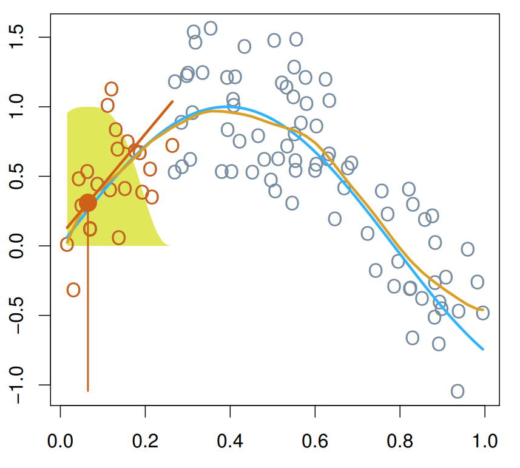
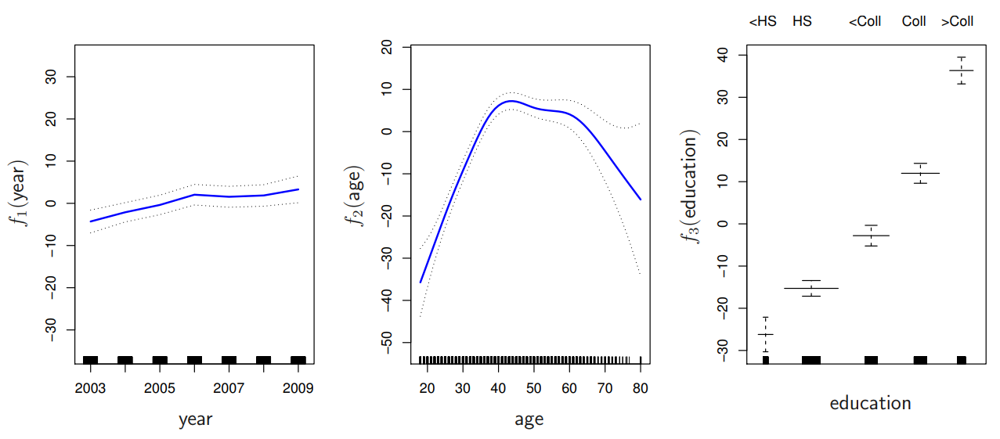

```{r setup, include=FALSE}
knitr::opts_chunk$set(echo = TRUE)
```

# Teoria

Dando continuidade, vamos ver mais 2 modos de modelar tendências não lineares.

## Local Regression

A ideia por trás da regressão local é ajustar modelos de regressão em pequenas regiões localizadas do preditor, usando apenas uma parte dos dados que estão ao redor.

{width="50%"}

Na figura acima, o método da regressão local está tentando fazer uma predição para x = 0.05. Podemos observar que os pontos em laranja estão contribuindo para o ajuste do modelo nessa posição. Esses pontos são usados para encontrar a linha que melhor se ajusta aos dados nessa região. Geralmente, esse linha é encontrada usando mínimos quadrados com pesos, ao contrário da regressão linear comum, que não usa pesos.

No método de mínimos quadrados com pesos, os pontos mais próximos á referência (x = 0.05) contribuem mais, logo seu peso deve ser maior ao determinar à inclinação da reta. Uma vez que a reta que melhor se encaixa no local é determinada, usamos ela para prever o intercepto desse ponto. Repetimos o processo ao longo do eixo x, o que nos dá a função estimada em laranja, que é muito próxima à função verdadeira, representada em azul. Essa técnica também é chamada de LOESS, que significa *locally estimated scatterplots smoothing*, ou algo como suavização de gráficos de dispersão estimada localmente.

Há várias escolhas que podem ser feitas para construir uma regressão local.

-   A primeira escolha é o tipo de modelo, como regressão linear, polinômio de grau 2 etc.
-   Outra escolha é sobre como atribuir os pesos. O método mais comum é usar um distribuição normal, mas há várias outras alternativas que dão mais peso aos valores mais próximos. Esses métodos são chamados de *Kernels*.
-   A terceira escolha, e a mais importante é o tamanho da área que determina os pontos que serão utilizados para estimar a função. Quanto maior o span, mais suave a função.

## Generalized additive models (GAM's)

Até agora, focamos em usar técnicas não-lineares para modelar um predior por vez. Porém, muitas vezes, queremos modelar em vários preditores. Modelos aditivos generalizados nos permitem fazer exatamente isso.

O modo como um GAM é expresso deriva de como uma regressão linear múltipla é expressa. Uma regressão linear múltipla é expressa como a soma dos termos lineares de cada preditor:$$y_i=\beta_0+\beta_1x_{i1}+...+\beta_px_{ip}+\epsilon_i$$ Um GAM é expresso com a sendo a soma das funções arbitrárias $f_1$ de cada preditor:$$y_1=\beta_0+f_i(x_{i1})+f_2(x_{i2})+...+f_p(x_{ip})+\epsilon_i$$ Um analista deseja analisar um modelo com um GAM, em vez de uma regressão linear, quando quer considerar uma possível não relação não-linear entre os preditores e a variável resposta. Note que a regressão linear é apenas um caso especial de um GAM, em que as funções arbitrárias são somente retas.

Agora uma pergunta que surge é: como determinamos qual função usar, uma log, raiz quadrada etc? Um recurso muito útil do algoritmo GAM é que não precisamos especificar qual função não-linear queremos usar. Um exemplo de uma especificação menos rígida para as funções é de que as funções sejam simplesmente polinômios cúbicos locais conectados suavemente. Isso é um pouco mais flexível do que dizer que uma variável possui uma relação global logarítmica ou de raiz quadrada com o resultado. E se esta for nossa intenção, sabemos que podemos especificar $f_1$ até $f_p$ como relações naturais de spline cúbico (se todos os x's forem quantitativos). Neste caso, ainda podemos utilizar o framework de mínimos quadrados para estimar os coeficientes do modelo, pois estamos apenas substituindo os preditores quantitativos por um conjunto de versões transformadas desses preditores.

Outra maneira de especificar de forma menos rígida as funções em um GAM (Generalized Additive Model) é indicar o processo utilizado para construí-las. Por exemplo, poderíamos dizer que queremos que essas funções suaves sejam construídas por meio de um processo de estimação de regressão local. Como vimos anteriormente, a regressão local percorre iterativamente a extensão dos dados para construir uma estimativa suave de uma tendência subjacente. Portanto, ao contrário das especificações de GAM que acabamos de analisar (transformações globais específicas de variáveis, splines), um GAM especificado como proveniente de uma regressão local não pode ser ajustado com mínimos quadrados padrão. Em vez disso, um procedimento iterativo chamado "backfitting" é utilizado para estimar $f_1$ até $f_p$. A ideia por trás do *backfitting* é fazer suposições iniciais para cada uma das funções e usar essas suposições para atualizar iterativamente a estimativa de cada função usando o processo desejado de ajuste (regressão local). $$r_i=y_i-\hat{f}_2(x_{i2})-...-\hat{f}_p(x_{ip})$$ Por exemplo, para estimar a forma de $f_1$, "levamos em consideração" as suposições de $f_2$ até $f_p$ formando o que é chamado de residual parcial: subtrai-se parte do valor previsto para cada caso (apenas a parte de $f_2$ até $f_p$) do resultado observado. Em seguida, utilizamos uma regressão local desses resíduos parciais em relação a $x_1$ como a estimativa para $f_1$. Esse processo é repetido para estimar as outras funções e é repetido por várias vezes até que as estimativas das funções efetivamente não mudem mais (até que o algoritmo de ajuste convirja).

Em resumo, a formulação do GAM como uma soma de funções arbitrárias dos preditores oferece grande flexibilidade na modelagem da não linearidade. As funções $f_1$ até $f_p$ podem ser transformações não lineares predefinidas, representações de splines cúbicos naturais ou representações de regressão local. Com transformações não lineares predefinidas (como logaritmo, raiz quadrada) e splines cúbicos naturais, a estimativa de mínimos quadrados pode ser utilizada. Com uma representação de regressão local, o algoritmo de backfitting é empregado. No final, a saída de um procedimento de ajuste do GAM consiste em um conjunto de estimativas para o intercepto e para cada uma das funções $f_1$ até $f_p$.

Exemplo: $$salário=\beta_0+f_1(ano)+f_2(idade)+f_3(educação)+\epsilon$$ Vamos analisar um exemplo gráfico de como um GAM é representado. Digamos que queiramos modelar os salários por hora como uma função do ano, da idade de um indivíduo e do nível de educação. Dizemos que o salário é uma função de um termo de interceptação para estabelecer o salário base, bem como funções arbitrárias do ano, idade e nível de educação. Em particular, vamos especificar que essas funções devem assumir a forma de estimativas de uma regressão local. Após ajustar o modelo, obtemos uma estimativa numérica para $\beta_0$ e obtemos estimativas de $f_1$, $f_2$ e $f_3$, que podem ser representadas graficamente como mostrado abaixo:



As representações gráficas são úteis porque, ao contrário da regressão linear, não há um único número que possa capturar completamente a forma da função. Na regressão linear, um único número (a estimativa da inclinação) captura completamente a aparência da função. Aqui, porque usamos representações de regressão local, não há uma expressão fechada para as funções (como log(x) ou sqrt(x)). Essas funções são representadas nos bastidores como uma série de pares de entrada-saída e mostradas graficamente aqui. As curvas vermelhas mostram as funções estimadas para $f_1$ e $f_2$, relacionando o ano com o salário e a idade com o salário. As linhas pontilhadas pretas nesses dois painéis refletem a incerteza na estimativa. Para os três gráficos, as marcas pretas na parte inferior indicam os valores brutos dos dados para as variáveis preditoras. O terceiro painel para a variável de educação mostra diagramas de caixa porque o nível de educação é categórico, com níveis indicados na parte superior do painel: desde menos que o ensino médio (HS) até mais que a faculdade (Coll). As linhas medianas dos diagramas de caixa representam a função estimada - então, o valor de $f_3$ é aproximadamente -27 para < HS, -15 para HS, -3 para < Coll, 12 para Coll e 36 > Coll.

Vamos examinar como podemos interpretar as funções estimadas individualmente. Lembre-se de que, na regressão linear múltipla, os coeficientes para preditores individuais são interpretados mantendo constantes as outras variáveis. O mesmo é verdadeiro para os GAMs:

-   O gráfico à esquerda mostra a relação entre salários e ano, mantendo constante a idade e o nível de educação de um indivíduo. Observamos que, em média, para indivíduos com uma idade e nível de educação fixos, os salários aumentam ao longo dos anos. 
-   O gráfico do meio mostra a relação entre salários e idade, mantendo constante o ano calendário e o nível de educação de um indivíduo. Observamos que, em média, os indivíduos em um ano fixo e com um nível de educação fixo veem um aumento inicial nos salários com a idade, seguido por uma diminuição. 
-   O último gráfico mostra a relação entre salários e nível de educação, mantendo constante o ano calendário e a idade de um indivíduo. Observamos que, em média, os indivíduos em um ano fixo e com uma idade fixa veem um aumento nos salários com o aumento da educação. 

## Resumo

Em resumo, a regressão local é outra ferramenta para modelar tendências não lineares e tem similaridades conceituais com a regressão KNN. A regressão local é frequentemente utilizada no ajuste de modelos aditivos generalizados, uma técnica para estimar relações não lineares entre uma resposta e vários preditores. Como as funções estimadas com GAMs são interpretadas mantendo constantes os outros preditores, os GAMs têm a característica interessante de serem bastante interpretáveis, ao mesmo tempo em que têm a capacidade de lidar de maneira eficaz com a não linearidade nas relações entre preditores e resultados.

# Prática

## Dados

Hoje, vamos tentar ajustar modelos GAM com splines de suavização no tidymodels.

Para construir modelos GAM (usando splines de suavização) no tidymodels, primeiro carregue o pacote:

```{r}
library(tidymodels) 
tidymodels_prefer() 
```
Continuaremos usando o conjunto de dados "College" do pacote ISLR para explorar as splines.

```{r}
library(ISLR)
data(College)

## limpeza dos dados
college <- College %>%
mutate(school = rownames(College)) %>%
filter(Grad.Rate <= 100) # Remove uma escola com taxa de graduação de 118%

rownames(college) <- NULL # Remove os nomes das escolas como nomes de linhas
```

Vamos utilizar o LOESS (geom_smooth()) para estimar a relação entre Apps e Grad.Rate. Observe a mudança com diferentes valores de span

```{r}
# Configurando a suavização LOESS com diferentes valores de 'span'

# Configuração para span = 0.25
span_025 <- college %>%
    ggplot(aes(x = Apps, y = Grad.Rate)) + 
    geom_point(alpha = 0.2) + 
    geom_smooth(span = 0.25, se = F) +
    xlim(c(0, 20000)) +
    ggtitle("Span = 0.25") +
    theme_classic()

# Configuração para span = 0.5
span_05 <- college %>%
    ggplot(aes(x = Apps, y = Grad.Rate)) + 
    geom_point(alpha = 0.2) + 
    geom_smooth(span = 0.5, se = F) +
    xlim(c(0, 20000)) +
    ggtitle("Span = 0.50") +
    theme_classic()

# Configuração para span = 0.75
span_075 <- college %>%
    ggplot(aes(x = Apps, y = Grad.Rate)) + 
    geom_point(alpha = 0.2) + 
    geom_smooth(span = 0.75, se = F) +
    xlim(c(0, 20000)) +
    ggtitle("Span = 0.75") +
    theme_classic()

# Configuração para span = 1
span_1 <- college %>%
    ggplot(aes(x = Apps, y = Grad.Rate)) + 
    geom_point(alpha = 0.2) + 
    geom_smooth(span = 1, se = F) +
    xlim(c(0, 20000)) +
    ggtitle("Span = 1") +
    theme_classic()

# Combinação dos gráficos usando a biblioteca patchwork
library(patchwork)
span_025 + span_05 + span_075 + span_1

```

Agora, vamos utilizar o LOESS (geom_smooth()) para estimar a relação entre Apps e Grad.Rate separadamente para faculdades privadas e não-privadas. Observe a mudança com diferentes valores de span.

```{r}
# Configurando a suavização LOESS com diferentes valores de 'span' e cores para a variável 'Private'

# Configuração para span = 0.25
p_025 <- college %>%
    ggplot(aes(x = Apps, y = Grad.Rate, color = Private)) + 
    geom_point(alpha = 0.2) + 
    geom_smooth(span = 0.25, se = FALSE) +
    xlim(c(0, 20000)) +
    ggtitle("Span = 0.25") +
    theme_classic()

# Configuração para span = 0.50
p_050 <- college %>%
    ggplot(aes(x = Apps, y = Grad.Rate, color = Private)) + 
    geom_point(alpha = 0.2) + 
    geom_smooth(span = 0.50, se = FALSE) +
    xlim(c(0, 20000)) +
    ggtitle("Span = 0.50") +
    theme_classic()

# Configuração para span = 0.75
p_075 <- college %>%
    ggplot(aes(x = Apps, y = Grad.Rate, color = Private)) + 
    geom_point(alpha = 0.2) + 
    geom_smooth(span = 0.75, se = FALSE) +
    xlim(c(0, 20000)) +
    ggtitle("Span = 0.75") +
    theme_classic()

# Configuração para span = 1
p_1 <- college %>%
    ggplot(aes(x = Apps, y = Grad.Rate, color = Private)) + 
    geom_point(alpha = 0.2) + 
    geom_smooth(span = 1, se = FALSE) +
    xlim(c(0, 20000)) +
    ggtitle("Span = 1") +
    theme_classic()

# Combinação dos gráficos usando a biblioteca patchwork
p_025 + p_050 + p_075 + p_1

```

Podemos observar que, de modo geral, as notas de faculdades privadas são mais altas.

## Modelo

Suponha que nossas investigações iniciais de seleção de variáveis nos levem a usar os preditores indicados abaixo em nosso GAM:

```{r}
# Definindo uma semente para reprodução dos resultados
set.seed(123)

# Especificação do modelo GAM
gam_spec <- 
  gen_additive_mod() %>%
  set_engine(engine = 'mgcv') %>%
  set_mode('regression') 

# Ajustando o modelo GAM com as variáveis indicadas
gam_mod <- fit(gam_spec,
    Grad.Rate ~ Private + s(Apps) + s(Top10perc) + s(Top25perc) + s(P.Undergrad) + s(Outstate) + s(Room.Board) + s(Books) + s(Personal) + s(PhD) + s(perc.alumni),
    data = college
)

```

Primeiro, vamos verificar se o número padrão de nós (10) é suficientemente grande para cada variável. O edf (*effective degrees of freedom*) representa os graus de liberdade efetivos; quanto maior o valor de edf, mais oscilante é a função estimada. Se edf = 1, trata-se de uma linha reta.

```{r}
## Diagnóstico: Verificar se o número de nós é suficientemente grande (se o valor-p for baixo, aumente o número de nós)

par(mfrow=c(2,2))
gam_mod %>% pluck('fit') %>% mgcv::gam.check()
```
Primeiro, vamos considerar limitar a amostra de treinamento devido aos valores discrepantes (as linhas verticais inferiores no gráfico são chamadas de "rug plot" e mostram onde foram observados valores).

```{r}
college %>%
    filter(Apps > 30000 | P.Undergrad > 20000)
```

Agora que vimos quais faculdades estamos deixando de lado, vamos ajustar o modelo novamente sem essas duas faculdades.

```{r}
# Criando um novo modelo GAM excluindo duas faculdades específicas com valores discrepantes
gam_mod2 <- college %>%
    filter(Apps < 30000 | P.Undergrad < 20000) %>%
    fit(gam_spec,
        Grad.Rate ~ Private + s(Apps) + s(Top10perc) + s(Top25perc) + s(P.Undergrad) + s(Outstate) + s(Room.Board) + s(Books) + s(Personal) + s(PhD) + s(perc.alumni),
        data = .
    )

```

Vamos analisar as funções estimadas novamente

```{r}
gam_mod2 %>% pluck('fit') %>% summary() 

```
Podemos ver que algumas variáveis com p-valor > 0.05. Ou seja, não necessitam de spline/relação não-linear e podemos simplificar o modelo. Além disso, podemos ajustar um modelo usando apenas uma função de spline não linear para uma variável se o EDF for maior que 3.

```{r}
gam_mod3 <- college %>%
    filter(Apps < 30000 | P.Undergrad < 20000) %>%
    fit(gam_spec,
        Grad.Rate ~ Private + s(Apps) + Top10perc + s(Top25perc) + s(P.Undergrad) + s(Outstate) + s(Room.Board) + Books + s(Personal) + PhD + s(perc.alumni),
        data = .
    )

gam_mod3 %>% pluck('fit') %>% summary() 
```
Vemos que agora, algumas variáveis usam relação linear, simplificando o modelo.


