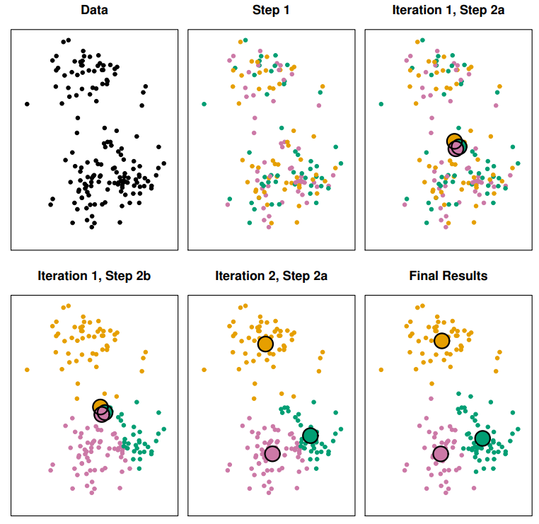
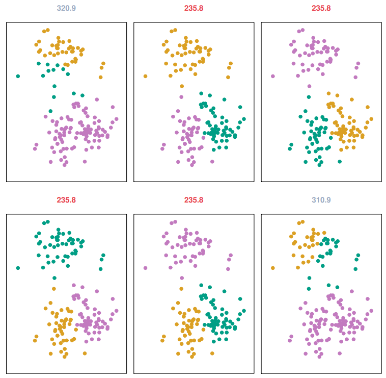
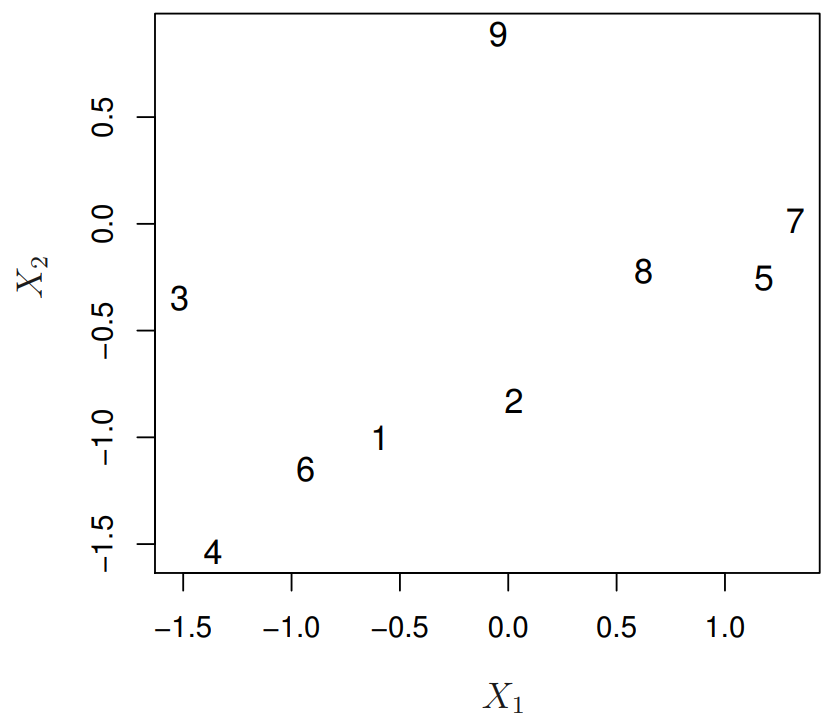
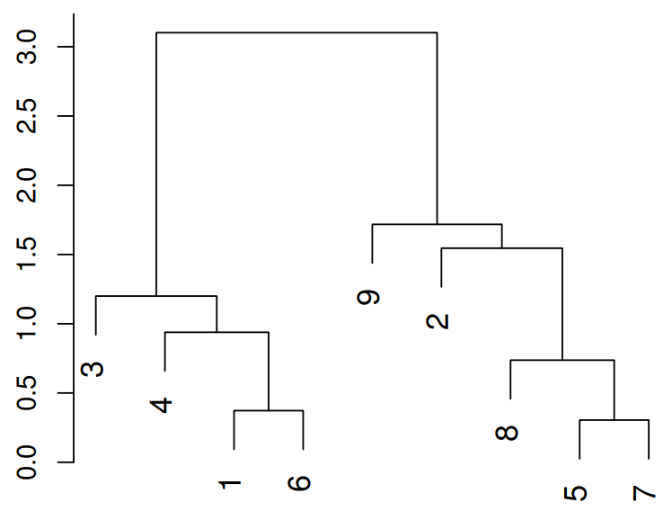
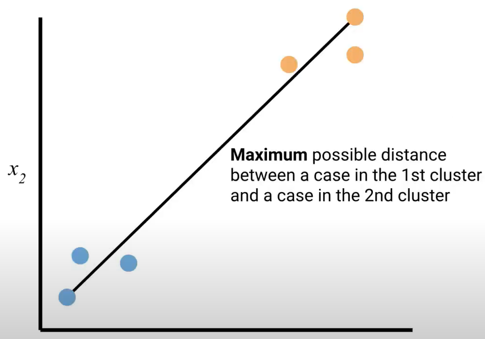
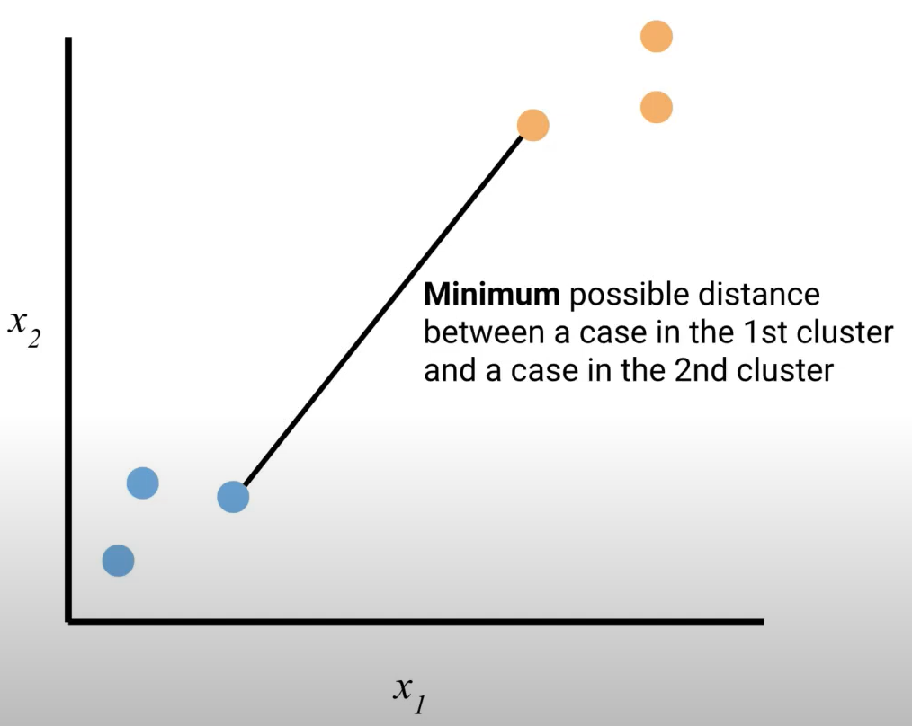
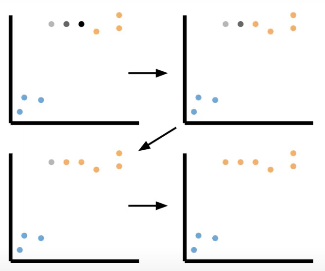
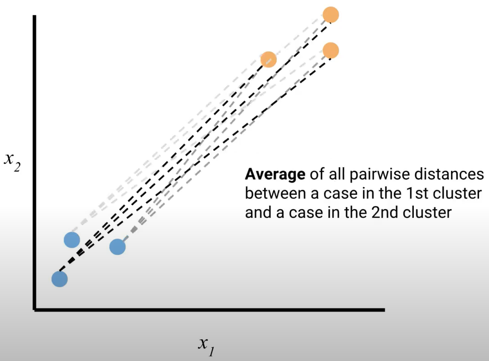

```{r setup, include=FALSE}
knitr::opts_chunk$set(echo = TRUE)
```

# Teoria

## Introdução

Neste artigo, veremos um pouco sobre métodos de agrupamento e, em particular, nos concentraremos nos algoritmos de agrupamento k-means e agrupamento hierárquico. A parte de aprendizado não supervisionado é usada quando não temos valores de saída ou variáveis de resposta. O agrupamento é um exemplo de uma tarefa de aprendizado não supervisionado, porque geralmente apenas queremos encontrar grupos naturais nos dados, sem nos preocuparmos em prever algum tipo de variável de resposta quantitativa ou categórica, como ja fizemos nas tarefas de aprendizado supervisionado de regressão e classificação.

Desse modo, os objetivos gerais do agrupamento são encontrar grupos subjacentes nos dados, e isso pode ocorrer de duas maneiras principais. A primeira maneira é agrupar casos com base em preditores. Por exemplo, podemos querer agrupar certas flores com base em medidas físicas que tiramos da planta, como número de pétalas, comprimento das pétalas ou cor. Com base nas distâncias entre as flores, podemos agrupar os casos. Outra maneira pela qual o agrupamento pode ocorrer é agrupar preditores com base nos casos. Por exemplo, podemos querer agrupar diferentes medidas físicas de flores, ou seja, agrupar diferentes variáveis, para ver se diferentes variáveis estão relacionadas com base em seus valores observados em diferentes flores. Geralmente, o agrupamento ocorre da primeira maneira, onde queremos agrupar casos com base em preditores, observando quão distantes os casos estão entre si.

## K-Means

### Visão Geral

O *k-means* é um algoritmo específico para realizar agrupamento. No algoritmo, atribuímos cada caso exatamente a um dos K *clusters*, e precisamos escolher K antecipadamente. Um bom agrupamento é encontrado minimizando a variação dentro do *cluster*. A configuração matemática é a seguinte: $$min\sum_{k=1}^K W(C_k)$$ Se $c_1$, $c_2$ até $C_K$ são conjuntos contendo os índices dos casos em cada um dos $K$ *clusters*, o que queremos fazer para encontrar um bom agrupamento e minimizar a variação dentro do *cluster* é minimizar essa soma. Essa soma é a soma sobre todos os clusters de $W(C_k)$, que é nossa maneira matemática de denotar alguma medida de variação dentro do cluster para o cluster $K$.

A ideia por trás da minimização da variação dentro do *cluster* é que queremos que a distância entre os casos e um *cluster* seja a menor possível, ou seja, queremos que os casos e o cluster sejam o mais semelhantes possível. Tentamos capturar isso matematicamente com uma medida quantitativa de variação dentro do *cluster*, chamada $W(C_k)$, como mostrado abaixo: $$W(C_k)=\frac{1}{|C_k|}\sum_{a,b \epsilon C_k}\sum_{j=1}^p (x_{aj}-x_{bj})^2$$ A última soma à direita adiciona sobre os $p$ preditores a distância euclidiana ao quadrado entre dois casos, $a$ e $b$. Estamos subtraindo seus valores de preditores, elevando ao quadrado e somando. Queremos que esta soma seja a menor possível para tornar a distância entre dois casos o menor possível. A soma à esquerda adiciona essas distâncias sobre todos os pares possíveis de casos no cluster e, finalmente, dividimos pelo número de casos no cluster para tratar de forma justa clusters maiores e menores.

### Algoritmo

O algoritmo é simples e consiste em 4 etapas:

-   A primeira etapa é a inicialização. Inicialmente, queremos atribuir aleatoriamente cada caso a um dos K clusters;
-   Em seguida, encontramos o centro do cluster. Para cada um dos K clusters, calculamos o centróide do cluster. Normalmente, este é o valor médio de cada preditor para todos os casos no cluster;
-   Em seguida, encontramos o centro do cluster. Para cada cluster, para cada um dos K clusters, calculamos o centróide do cluster. Normalmente, este é o valor médio de cada preditor para todos os casos no cluster;
-   Repetimos as etapas dois e três até que as atribuições de cluster parem de mudar.

É importante notar que este algoritmo fornece um mínimo local. Executar este algoritmo várias vezes com inicializações aleatórias diferentes é crucial porque às vezes diferentes inícios aleatórios fornecerão resultados diferentes, sendo alguns mais ótimos do que outros. Mais ótimo significa ter um valor mais baixo da variação dentro do cluster. Portanto, precisamos executar este algoritmo várias vezes com inicializações aleatórias diferentes e, em última análise, escolher o resultado que nos dá a menor variância dentro do cluster.

### Visualização

Temos alguns dados de exemplo plotados aqui, com duas variáveis preditoras representadas nos eixos $x$ e $y$, e cada ponto representa um caso.



-   A primeira etapa é a inicialização aleatória. Atribuímos aleatoriamente cada caso a um cluster aleatório, como mostrado com as três cores diferentes.
-   Na iteração um das etapas dois e três, combinamos a etapa dois, que envolve encontrar os centróides dos clusters. Para todos os casos nos clusters verde, laranja e rosa, encontramos o centróide do cluster calculando o valor médio de $x_1$ e $x_2$ para os clusters verde, laranja e rosa.
-   Na etapa 3, fazemos a reatribuição, ou seja, reatribuímos cada caso ao cluster que possui o centróide mais próximo. Parece que todos os casos superiores estão mais próximos do centróide laranja, então são reatribuídos ao cluster laranja. Repetimos as etapas 2 e 3 na próxima iteração.
-   Na iteração dois, repetimos a etapa 2, refinimos os centróides. Agora que reatribuímos todos os casos ao cluster com o centróide mais próximo, recalculamos os centróides e observamos que eles se movem mais próximos aos centros naturais dos clusters.
-   Repetimos as etapas 2 e 3 até que as atribuições de cluster parem de mudar significativamente, e nossos resultados finais são mostrados aqui. Acabamos com um agrupamento estável dos clusters laranja, rosa e verde.

Observe a importância de executar este algoritmo com diferentes inicializações aleatórias, diferentes partidas aleatórias, porque podemos obter resultados diferentes a partir de diferentes inícios aleatórios.



Cada um desses seis painéis mostra o mesmo conjunto de dados resultante de uma inicialização aleatória diferente. O agrupamento é o resultado disso, e vemos que agrupamentos diferentes de fato resultam de diferentes inícios aleatórios.

Os números no topo dos painéis mostram a variância total dentro do cluster, a qual desejamos que seja a mais baixa possível. Acontece que, para diferentes inícios aleatórios, os valores mais baixos dessa variância dentro do cluster são 235.8, conforme indicado pelas caixas vermelhas. Mesmo que as cores sejam diferentes, trata-se do mesmo agrupamento, e escolheríamos esse agrupamento a partir desse conjunto de seis inicializações aleatórias diferentes.

### Considerações

Muitas vezes, há várias considerações no agrupamento, especialmente para o k-means, onde precisamos escolher um valor de K antecipadamente, o que pode ser difícil. Normalmente, para avaliar um bom valor para K (o número de clusters), podemos plotar a variação total dentro do cluster em relação a K. Em algum ponto, aumentar o número de clusters não reduzirá substancialmente a variação dentro do cluster, então provavelmente escolheremos K por volta desse ponto.

Outra consideração é que frequentemente calculamos centróides usando a média, mas isso é uma escolha. Poderíamos ter usado uma estatística resumo diferente, como a mediana ou o modo, e na verdade, essas são variações do algoritmo de agrupamento k-means.

Outra consideração é qual métrica de distância devemos usar para medir a distância entre casos. Quando definimos matematicamente a variação dentro do cluster, usamos a distância euclidiana, que é muito convencional. No entanto, podemos considerar diferentes métricas de distância, e diferentes métricas atribuem importância diferente às variáveis na determinação da dissimilaridade entre casos. Dependendo da aplicação, podemos favorecer uma métrica em relação a outras.

Além disso, a escala de diferentes variáveis importa, e será importante considerar se devemos padronizar nossas variáveis para ter variância unitária. Novamente, isso será específico para o contexto. Pensaremos se faz sentido padronizar. Às vezes, todas as nossas variáveis estão na mesma escala e não precisamos nos preocupar com a padronização.

## Hierarchical Clustering

### Visão Geral

No agrupamento hierárquico, não precisamos assumir um número específico de clusters desde o início, como fazemos no agrupamento k-means. No agrupamento hierárquico, usamos distâncias entre casos para construir o que é chamado de dendrograma, que é uma representação em forma de árvore dos casos. O dendrograma representa uma hierarquia de clusters, e esses clusters acabam sendo aninhados dentro de outros clusters.

Quase toda implementação de agrupamento hierárquico utiliza o que é chamado de abordagem ascendente ou aglomerativa, ou seja, começamos com cada caso como seu próprio cluster e, passo a passo, juntamos clusters à medida que avançamos na hierarquia. Isso é, na verdade, o oposto do que fazemos para árvores de decisão. Para árvores de decisão, construímos as árvores usando o algoritmo de divisão binária recursiva, onde começamos com todos os casos em um grupo e dividimos os casos em diferentes grupos passo a passo.

Então, vamos dar uma olhada em um pequeno exemplo para ter uma ideia do processo de agrupamento antes de estudarmos o algoritmo.

{width="50%"}

Aqui temos um conjunto de dados com nove casos, onde plotamos os valores dos parâmetros $x_1$ e $x_2$. Como o agrupamento hierárquico é uma abordagem aglomerativa de baixo para cima, cada caso começa em seu próprio cluster. Na primeira etapa, olhamos para todos os pares possíveis de clusters e encontramos o par mais próximo, que acaba sendo 7 e 5. Então, combinamos os casos 7 e 5 para criar um ramo. Isso também é chamado de fusão de duas folhas para formar um ramo.

Na próxima etapa, novamente precisamos calcular as distâncias entre todos os pares de clusters, mas agora precisamos pensar em como medir a distância entre clusters quando um cluster tem mais de um caso. Existem diferentes escolhas para fazer isso, e essas diferentes maneiras são chamadas de diferentes tipos de ligação. Vamos falar sobre a ligação em breve, mas suponhamos por enquanto que temos um meio de calcular essas distâncias entre clusters.

Acontece que os clusters com os casos individuais 1 e 6 acabam sendo os mais próximos. Então, os fundimos juntos na próxima etapa. Em seguida, fundimos o cluster 8 ao cluster 7 5, para que o cluster original 7 5 acabe sendo aninhado dentro do cluster maior 7 5 8. Continuamos esse processo até que todos os casos estejam em um único cluster. No final do processo, temos um dendrograma completo.

{width="50%"}

Além disso, mais uma coisa a ser observada: a altura vertical em que os clusters são fundidos indica a similaridade entre eles. O fato de o ramo na menor altura ser aquele que conecta 7 e 5 indica que são os dois casos mais próximos. A altura vertical onde o caso 8 se funde ao cluster 7 5 indica a distância entre o caso 8 e o cluster 7 5 como um todo, o que pode ou não ser a distância entre 8 e 7 individualmente ou 8 e 5 individualmente. Isso dependerá da escolha da ligação para medir as distâncias entre clusters.

Outra nota importante é que a distância horizontal não indica o quão próximos dois casos estão. Portanto, 9 e 2 parecem próximos neste dendrograma, mas estão realmente bastante distantes quando olhamos para os dados originais. Por que isso acontece é na verdade um artefato de desenhar esses dendrogramas. Poderíamos ter desenhado o ramo indicado aqui para mostrar o 2 à direita e o cluster 8x7 à esquerda. Isso não teria mudado nada sobre o agrupamento, mas teria feito com que o 9 parecesse mais distante do que realmente é.

Então, com esse contexto em mente, vamos realmente entrar no algoritmo de agrupamento hierárquico.

### Algoritmo

O primeiro passo no processo de agrupamento é calcular uma medida de dissimilaridade ou distância entre todos os pares de casos. Muitas vezes, é utilizada a distância euclidiana ou distância diagonal, mas outras medidas podem ser razoáveis e devem ser cuidadosamente consideradas antes de começarmos efetivamente o agrupamento.

No início, todos os $n$ casos estão em seus próprios clusters, pois este é um método aglomerativo de baixo para cima. Utilizando nossas medidas de distância calculadas entre todos os pares de casos, encontraremos os dois mais próximos e os fundiremos para formar um ramo no dendrograma. Agora temos $n - 1$ clusters. Em seguida, continuamos iterando esse processo de fusão, e entre esses $n - 1$ clusters, encontramos os dois mais próximos e os fundimos. Continuamos assim até que todos os casos estejam em um único cluster. Um ponto importante a ser observado é que, uma vez que os clusters são fundidos, eles permanecem fundidos.

### Distâncias

Ao descrever o algoritmo de agrupamento hierárquico, mencionei a necessidade de ter alguma maneira de medir a distância entre clusters que têm mais de um caso. Métodos de ligação para agrupamento nos oferecem opções para fazer isso, e os tipos comuns de ligação serão explicados abaixo:

-   Na **Ligação Completa**, medimos a distância entre dois clusters usando a distância máxima possível entre um caso do primeiro cluster e um caso do segundo. Em outras palavras, calculamos todas as distâncias duas a duas e dizemos que a distância entre os dois clusters é o máximo dessas distâncias.

{width="50%"}

-   Na **Ligação Simples**, medimos a distância entre dois clusters usando a distância mínima possível entre um caso do primeiro cluster e um caso do segundo. Novamente, calculamos todas as distâncias duas a duas e dizemos que a distância entre os dois clusters é o mínimo dessas distâncias.

{width="50%"}

Um padrão frequente que surge com a ligação simples é que ela tende a criar clusters muito longos e estendidos. Isso significa que, se olharmos para a situação abaixo, vemos que os três casos pretos/cinza que ainda não foram agrupados frequentemente são adicionados um por um. Eles continuam sendo adicionados ao cluster laranja porque a distância entre o cluster laranja e cada um desses casos subsequentes é muito pequena com essa estratégia de ligação.

{width="50%"}

Dependendo da aplicação e do contexto dos dados, isso pode ou não ser sensato. Portanto, esse é apenas um comportamento a ser considerado ao analisar os resultados do agrupamento com ligação simples.

-   Na **Ligação Média**, utilizamos a média de todas as distâncias duas a duas entre os casos como medida da distância entre clusters.

{width="50%"}

-   Na **Ligação do Centróide**, calculamos os centróides dos clusters, assim como fizemos no k-means, e medimos a distância entre clusters como a distância entre seus centróides. A ligação do centróide é frequentemente popular porque é bastante interpretável. Centróides são interpretações claras para medir o centro de um cluster, mas ela pode resultar em comportamentos indesejáveis ao analisar o dendrograma resultante.

### Corte do Dendrograma

Então, acontece que para a ligação simples e completa, podemos cortar um dendrograma em uma certa altura para criar clusters a partir dos ramos que se desprendem. Isso nos fornece interpretações claras sobre as distâncias entre casos e os clusters resultantes.

Cortar árvores resultantes de ligação do centróide e média, na verdade, não tem a mesma interpretação clara, devido à maneira como as distâncias entre clusters são calculadas com esses métodos de ligação.

### Considerações

Para realizar o agrupamento hierárquico, a vantagem interessante desta abordagem de agrupamento é que não precisamos escolher o número de clusters antecipadamente, o que é necessário no k-means. No entanto, cabe a nós escolher a altura em que cortamos a árvore, se estivermos usando ligação simples ou completa.

As considerações sobre como cortar a árvore são muito orientadas pelo contexto científico, assim como no k-means. Precisamos pensar nas métricas de distância e na escala das variáveis. Uma consideração específica para o agrupamento hierárquico é que precisamos escolher o tipo de ligação que desejamos usar, o que também depende do contexto científico e do que se deseja obter dos clusters.

Em última análise, o agrupamento é um procedimento bastante variável, sendo crucial realizar análises de sensibilidade abrangentes, experimentando diferentes métodos e escolhas dentro desses métodos. No final, buscamos obter algum tipo de resultado de consenso a partir de todos esses diferentes tipos de agrupamento.

# Prática 1 - Pacientes Cardíacos

## Introdução

Existem muitos setores em que entender como as coisas se agrupam é benéfico. Por exemplo, os varejistas querem entender as semelhanças entre seus clientes para campanhas publicitárias diretas, e os botânicos classificam as plantas com base em suas características semelhantes compartilhadas. Uma maneira de agrupar objetos é usar algoritmos de agrupamento. Vamos explorar a utilidade dos algoritmos de agrupamento não supervisionados para ajudar os médicos a entender quais tratamentos podem funcionar com seus pacientes.

Vamos agrupar dados anônimos de pacientes que foram diagnosticados com doenças cardíacas. Pacientes com características semelhantes podem responder aos mesmos tratamentos, e os médicos podem se beneficiar ao aprender sobre os resultados do tratamento de pacientes como aqueles que estão tratando. Os dados que estamos analisando vêm do V.A. Centro Médico em Long Beach, CA.

Antes de executar qualquer análise, é essencial ter uma ideia de como são os dados. Os algoritmos de agrupamento que usaremos requerem dados numéricos. Verificaremos se todos os dados são numéricos.

```{r}
#Carregando pacotes
library(tidyverse)
library(ggdendro)
library(plotly)
library(ggridges)

# Carregando os dados
heart = read_csv("heart_disease_patients.csv")

# Visualizando as 10 primeiras linhas
head(heart,  n = 10)
```

## Distribuições

É importante realizar alguma análise exploratória de dados (AED) para nos familiarizarmos com os dados antes de agrupar. A AED nos ajudará a aprender mais sobre as variáveis e tomar uma decisão informada sobre se devemos dimensionar os dados. Como o k-means e o agrupamento hierárquico medem a similaridade entre pontos usando uma fórmula de distância, ele pode colocar ênfase extra em certas variáveis que têm uma escala maior e, portanto, diferenças maiores entre os pontos.

A análise exploratória de dados nos ajuda a entender as características dos pacientes nos dados. Precisamos ter uma ideia das faixas de valores das variáveis e suas distribuições. Isso também será útil quando avaliarmos os grupos de pacientes dos algoritmos. Existem mais pacientes de um gênero? Podem ser um outlier?

```{r}
# Removendo coluna 'id'
heart = heart %>%
  select(-id)

# transformando o df
heart_long = heart %>%
  pivot_longer(cols=everything(), names_to = "variables", values_to = "values")

# Verificando as escalas das variáveis
boxplots <- heart_long %>%
  ggplot(aes(x = variables, y = values, fill = variables)) +
  geom_boxplot(show.legend = FALSE) +
  labs(x = "Variáveis", y = "Valor") +
  theme_bw()

boxplots

## Densidades
ggplot(heart_long, aes(x = values, y = variables, fill = variables)) +
  geom_density_ridges(show.legend = F) +
  theme_bw() + 
  labs(x = "Valores", y = "Variáveis")
```

Podemos ver claramente pelos dois gráficos que as escalas das variáveis são bem diferentes. Portanto, nas especificações do modelo, iremos normalzar as variáveis

## K-Means

```{r}
## pacotes para modelagem
library(tidymodels)
library(tidyclust)
```

Primeiro, configuramos amostras de validação cruzada para nossos dados:

```{r}
## Dados para validação cruzada
set.seed(10)
heart_cv <- rsample::bootstraps(heart, 10)
```

Em seguida, especificamos nosso modelo com um parâmetro de ajuste, criamos um *workflow* e estabelecemos uma faixa de valores possíveis para o num_clusters a serem experimentados. Em seguida, podemos usar tune_cluster() para calcular métricas em cada divisão de validação cruzada, para cada escolha possível do número de clusters.

```{r}
## Especificação k-means
kmeans_spec <- k_means(num_clusters = tune()) %>%
  set_engine("stats")

## Receita
heart_rec <- recipe(~ ., data = heart) %>%
  step_normalize(all_numeric_predictors())

## workflow
kmeans_wflow <- workflow() %>%
  add_recipe(heart_rec) %>%
  add_model(kmeans_spec)

#grid de números de clusters
clust_num_grid <- grid_regular(num_clusters(),
  levels = 10
)

set.seed(123)
## Otimização
kmeans_res <- tune_cluster(
  kmeans_wflow,
  resamples = heart_cv,
  grid = clust_num_grid,
  control = control_grid(save_pred = TRUE, extract = identity),
  metrics = cluster_metric_set(sse_within_total, sse_total, sse_ratio)
)
```

Com a otimização realizada, podemos ver os resultados:

```{r}
kmeans_res %>% collect_metrics()
```

No aprendizado supervisionado, escolheríamos o modelo com o melhor valor de uma métrica-alvo. No entanto, modelos de agrupamento em geral não têm máximos ou mínimos locais desse tipo. Com mais clusters no modelo, sempre esperaríamos que a soma dos quadrados intra-cluster fosse menor.

Uma abordagem comum para escolher o número de clusters é procurar um "cotovelo", ou curva notável, no gráfico da razão WSS/TSS por número de clusters:

```{r}
kmeans_res %>%
  autoplot(metric = "sse_ratio") +
  scale_x_continuous(breaks = seq(0, 10, 1)) +
  theme_bw() 
```

Olhando o gráfico, o erro parece diminuir menos quando o número de clusters é igual a 5. Por isso, vamos escolher este valor.

```{r}
kmeans_wflow <- finalize_workflow_tidyclust(x = kmeans_wflow, 
                                            parameters = data.frame(num_clusters = 5))

kmeans_wflow
```

Decidido o melhor número de clusters vamos ajustar aos dados e visualizar o resultado

```{r}
# modelo final
kmeans_fit <- kmeans_wflow %>%
  fit(heart)

# Predições do modelo
kmeans_pred <- predict(kmeans_fit, heart)

# grafico chol x age
plot1 <- heart %>%
  mutate(cluster = kmeans_pred$.pred_cluster) %>%
  ggplot(aes(x = age, y = chol, color = cluster)) +
  geom_point(shape = 21, size = 3, alpha = 0.7, aes(fill = cluster)) +
  theme_bw()

ggplotly(plot1)
```

Ao analisarmos os resultados, podemos ver que o algoritmo kmeans não foi muito bem em separar os dados em clusters, em relação à estas variáveis. Vamos testar outro modelo.

## Hierarchical Clustering

Uma alternativa ao algoritmo k-means é o agrupamento hierárquico. Esse método funciona bem quando os dados têm uma estrutura aninhada. Os dados de pacientes com doenças cardíacas podem seguir esse tipo de estrutura. Por exemplo, se os homens são mais propensos a exibir características específicas, essas características podem estar aninhadas dentro da variável de gênero. O clustering hierárquico também não requer que o número de clusters seja selecionado antes de executar o algoritmo.

Os clusters podem ser selecionados usando o dendrograma. O dendrograma nos permite ver como as observações são semelhantes entre si e são úteis para nos ajudar a escolher o número de clusters para agrupar os dados. Agora é hora de vermos como o agrupamento hierárquico agrupa os dados.

Primeiro vamos especificar o modelo e já vamos escolher 5 clusters para comparar com o modelo k-means

```{r}
# Especificação do modelo com ligação completa
hcomplete_spec <- hier_clust(
  num_clusters = 5,
  linkage_method = "complete"
)

# workflow com o modelo criado e a receita anterior
hcomplete_wflow <- workflow() %>%
  add_model(hcomplete_spec) %>%
  add_recipe(heart_rec)
```

Depois, fazemos o ajuste nos dados:

```{r}
hcomplete_fit <- hcomplete_wflow %>%
  fit(data = heart)
```

Agora. podemos visualizar o dendrograma formado extraindo o *fit* e plotando com a função ggdendrogram, do pacote ggdendro.

```{r}
# Visualização do dendrograma
hcomplete_fit %>%
  extract_fit_engine() %>%
  ggdendrogram(labels = FALSE)

# Extrair as predições para comparação depois
hcomplete_pred <- hcomplete_fit %>% extract_cluster_assignment()
```

No agrupamento hierárquico, existem várias maneiras de medir a dissimilaridade entre agrupamentos de observações. A ligação completa registra a maior dissimilaridade entre quaisquer dois pontos nos dois grupos que estão sendo comparados. Por outro lado, ligação única é a menor dissimilaridade entre quaisquer dois pontos nos clusters. Diferentes ligações resultarão na formação de diferentes clusters.

Queremos explorar diferentes algoritmos para agrupar nossos pacientes com doenças cardíacas. A melhor maneira de medir a dissimilaridade entre os pacientes pode ser observar a menor diferença entre os pacientes e minimizar essa diferença ao agrupar clusters. É sempre uma boa ideia explorar diferentes medidas de dissimilaridade. Vamos implementar o agrupamento hierárquico usando uma nova função de ligação.

```{r}
# Especificação do modelo com ligação simples
hsingle_spec <- hier_clust(
  num_clusters = 5,
  linkage_method = "single"
)

# workflow com o modelo criado e a receita anterior
hsingle_wflow <- workflow() %>%
  add_model(hsingle_spec) %>%
  add_recipe(heart_rec)

# Ajuste nos dados
hsingle_fit <- hsingle_wflow %>%
  fit(data = heart)

# Visualização do dendrograma
hsingle_fit %>%
  extract_fit_engine() %>%
  ggdendrogram(labels = FALSE)

# Extrair as predições para comparação depois
hsingle_pred <- hsingle_fit %>% extract_cluster_assignment()
```

Os médicos estão interessados em agrupar pacientes semelhantes para determinar tratamentos apropriados. Portanto, eles querem grupos com mais do que alguns pacientes para ver diferentes opções de tratamento. Embora um paciente possa estar sozinho em um cluster, isso significa que o tratamento que recebeu pode não ser recomendado para outra pessoa do grupo.

Assim como o algoritmo k-means, a forma de avaliar agrupamentos hierárquicos é investigar quais pacientes estão agrupados. Existem padrões evidentes nas atribuições de cluster ou eles parecem ser grupos de ruído? Vamos examinar os clusters resultantes dos dois algoritmos.

```{r}
#atribuir os clusters aos dados originais
heart <- heart %>%
  mutate(complete = factor(hcomplete_pred$.cluster),
         single = factor(hsingle_pred$.cluster))

#Visualizando os clusters lig. completa
plot2 <- heart %>%
  ggplot(aes(x = age, y = chol, color = complete)) +
  geom_point() +
  theme_bw() +
  labs(x = "age", y = "chol", color = "Ligação Completa")

plot4 <- heart %>%
  ggplot(aes(x = oldpeak, y = trestbps, color = complete)) +
  geom_point() +
  theme_bw() +
  labs(x = "oldpeak", y = "trestbps", color = "Ligação Completa")

library(patchwork)
plot2 / plot4

#Visualizando os clusters lig. simples
plot3 <- heart %>%
  ggplot(aes(x = age, y = chol, color = single)) +
  geom_point() +
  theme_bw() +
  labs(x = "age", y = "chol", color = "Ligação Simples")

ggplotly(plot3)
```

Para o agrupamento hierárquico, precisamos de um método que coloque um número balanceado de pacientes em cada grupo. Com base na análise acima, o agrupamento hierárquico com ligação completa mostra-se o mais promissor e deve ser o mais explorado!


# Prática 2 - Profissões e salários

## Introdução

Estes são dados do programa OES (Occupational Employment Statistics), que produz anualmente estimativas de empregos e salários. Ele contém a renda média anual de 2001 a 2016 para 22 grupos de ocupação. Gostaríamos de usar esses dados para identificar grupos de ocupações que mantiveram tendências de renda semelhantes.

Antes de começarmos a agrupar esses dados, devemos determinar se alguma etapa de pré-processamento (como dimensionamento e imputação) é necessária:

```{r}
#carregando pacotes
library(tidyverse)
library(ggridges)
library(ggdendro)
library(plotly)

#carregando dados
oes = read_rds("~/Projetos/Clustering National Occupational Mean Wage/oes.rds")

#visualizando as primeiras linhas
head(oes)
```

Podemos ver que os dados não estão em um formato organizado. Então vamos fazer isso para visualizar as distribuições.

```{r}
#transformando dados para um df
oes_tidy = as_tibble(oes)

#transformando os nomes das linhas em uma nova coluna
oes_tidy$occupation = row.names(oes)

#criando uma coluna ano ('year')
oes_tidy = oes_tidy %>%
  pivot_longer(cols = -occupation, names_to = "year", values_to = "salary")

oes_tidy
```

## Distribuições

Agora vamos visualizar nossos dados para ver as distribuições

```{r}
ggplot(oes_tidy, aes(y = occupation, x=salary, fill = occupation)) +
  geom_density_ridges(show.legend = F) +
  theme_bw() +
  labs(x = "Salário", y = "Ocupação")
  
```
Olhando para as distribuições, podemos ver que todas as variáveis estão na mesma escala (salário em dolar). Portanto, nenhuma etapa de pré-processamento é necessária.

## Hierarchical Clustering

Vamos primeiro visualizar o dendrograma:

```{r}
# Calculando a distância euclidiana entre as ocupações
dist_oes = dist(oes, method = "euclidean")

# Gerando uma análise com ligação média 
hc_oes = hclust(dist_oes, method = "average")

# Criando um dendrograma a partir da variável hclust
dend_oes = ggdendrogram(hc_oes)

# dendrogram
plot(dend_oes)
```

Observando o dendrograma, vamos propor uma altura de 100.000 para termos 3 clusters:

```{r include=FALSE}
set_labels_params <- function(nbLabels,
                              direction = c("tb", "bt", "lr", "rl"),
                              fan       = FALSE) {
  if (fan) {
    angle       <-  360 / nbLabels * 1:nbLabels + 90
    idx         <-  angle >= 90 & angle <= 270
    angle[idx]  <-  angle[idx] + 180
    hjust       <-  rep(0, nbLabels)
    hjust[idx]  <-  1
  } else {
    angle       <-  rep(0, nbLabels)
    hjust       <-  0
    if (direction %in% c("tb", "bt")) { angle <- angle + 45 }
    if (direction %in% c("tb", "rl")) { hjust <- 1 }
  }
  list(angle = angle, hjust = hjust, vjust = 0.5)
}

plot_ggdendro <- function(hcdata,
                          direction   = c("lr", "rl", "tb", "bt"),
                          fan         = FALSE,
                          scale.color = NULL,
                          branch.size = 1,
                          label.size  = 3,
                          nudge.label = 0.01,
                          expand.y    = 0.1) {
  
  direction <- match.arg(direction) # if fan = FALSE
  ybreaks   <- pretty(segment(hcdata)$y, n = 5)
  ymax      <- max(segment(hcdata)$y)
  
  ## branches
  p <- ggplot() +
    geom_segment(data         =  segment(hcdata),
                 aes(x        =  x,
                     y        =  y,
                     xend     =  xend,
                     yend     =  yend,
                     linetype =  factor(line),
                     colour   =  factor(clust)),
                 lineend      =  "round",
                 show.legend  =  FALSE,
                 size         =  branch.size)
  
  ## orientation
  if (fan) {
    p <- p +
      coord_polar(direction = -1) +
      scale_x_continuous(breaks = NULL,
                         limits = c(0, nrow(label(hcdata)))) +
      scale_y_reverse(breaks = ybreaks)
  } else {
    p <- p + scale_x_continuous(breaks = NULL)
    if (direction %in% c("rl", "lr")) {
      p <- p + coord_flip()
    }
    if (direction %in% c("bt", "lr")) {
      p <- p + scale_y_reverse(breaks = ybreaks)
    } else {
      p <- p + scale_y_continuous(breaks = ybreaks)
      nudge.label <- -(nudge.label)
    }
  }
  
  # labels
  labelParams <- set_labels_params(nrow(hcdata$labels), direction, fan)
  hcdata$labels$angle <- labelParams$angle
  
  p <- p +
    geom_text(data        =  label(hcdata),
              aes(x       =  x,
                  y       =  y,
                  label   =  label,
                  colour  =  factor(clust),
                  angle   =  angle),
              vjust       =  labelParams$vjust,
              hjust       =  labelParams$hjust,
              nudge_y     =  ymax * nudge.label,
              size        =  label.size,
              show.legend =  FALSE)
  
  # colors and limits
  if (!is.null(scale.color)) {
    p <- p + scale_color_manual(values = scale.color)
  }
  
  ylim <- -round(ymax * expand.y, 1)
  p    <- p + expand_limits(y = ylim)
  
  p
}

dendro_data_k <- function(hc, k) {
  
  hcdata    <-  ggdendro::dendro_data(hc, type = "rectangle")
  seg       <-  hcdata$segments
  labclust  <-  cutree(hc, k)[hc$order]
  segclust  <-  rep(0L, nrow(seg))
  heights   <-  sort(hc$height, decreasing = TRUE)
  height    <-  mean(c(heights[k], heights[k - 1L]), na.rm = TRUE)
  
  for (i in 1:k) {
    xi      <-  hcdata$labels$x[labclust == i]
    idx1    <-  seg$x    >= min(xi) & seg$x    <= max(xi)
    idx2    <-  seg$xend >= min(xi) & seg$xend <= max(xi)
    idx3    <-  seg$yend < height
    idx     <-  idx1 & idx2 & idx3
    segclust[idx] <- i
  }
  
  idx                    <-  which(segclust == 0L)
  segclust[idx]          <-  segclust[idx + 1L]
  hcdata$segments$clust  <-  segclust
  hcdata$segments$line   <-  as.integer(segclust < 1L)
  hcdata$labels$clust    <-  labclust
  
  hcdata
}
```

```{r}
hc_oes %>%
  dendro_data_k(3) %>%
  plot_ggdendro() +
  theme_minimal()
```

Antes de explorarmos esses clusters, precisaremos processar os dados ‘oes’ em um data frame de formato organizado, com cada ocupação atribuída a seu cluster.

```{r}
# Usando rownames_to_column para mover os nomes das linhas para uma coluna do dataframe
df_oes = rownames_to_column(as.data.frame(oes), var = 'occupation')

# Criando um vetor de atribuição de cluster em h = 100.000
cut_oes = cutree(hc_oes, h = 100000)

# Gerando o dataframe oes segmentado
clust_oes = mutate(df_oes, cluster = cut_oes)

# Criando um dataframe organizado reunindo o ano e os valores em duas colunas
oes_tidy = pivot_longer(data =  clust_oes, 
                        cols = "2001":"2016",
                        names_to = "year", 
                        values_to = "mean_salary")
```

Agora, vamos analisar os clusters resultantes:

```{r}
#transformando os clusters em fatores
oes_tidy$cluster = factor(oes_tidy$cluster)

# Plotando a relação entre average_salary e year e colorindo as linhas pelo cluster atribuído
ggplotly(
    ggplot(oes_tidy, aes(x = year, y = mean_salary, color = cluster)) + 
    geom_line(aes(group = occupation)) +
    labs(x="Ano", y="Salário médio")+
    theme_bw()
  )
```

A partir deste cluster, parece que ambas as profissões de Gestão e Jurídica (cluster 1) tiveram o crescimento mais rápido nestes 15 anos. Vamos ver o que podemos obter explorando esses dados usando k-means.

## K-Means {.tabset  .tabset-pills}

Vamos agora aproveitar o gráfico de ‘cotovelo’ k-means para propor o “melhor” número de clusters.

```{r}
#criando uma função para extrair a soma dos quadrados de centros 'k'
soma_quadrados = function(k){
  modelo = kmeans(x = oes, centers = k)
  modelo$tot.withinss
}

#extraindo a soma total dos quadrados dentro do cluster de k = 1 a k = 10
tot_withinss = map_dbl(1:10, soma_quadrados)

# Gerando um dataframe contendo k e tot_withinss
elbow_df = tibble(
  k = 1:10,
  tot_withinss = tot_withinss
)

#Grafico de 'cotovelo'
ggplotly(
  ggplot(elbow_df, aes(x = k, y = tot_withinss)) +
  geom_point()+
  geom_line()+
  scale_x_continuous(breaks = 1:10) +
  theme_minimal()
  )
```

O agrupamento hierárquico resultou em 3 agrupamentos e o método do cotovelo sugere 2. Agora, vamos a distância média de pontos no cluster ao qual foi atribuído para explorar qual deve ser o “melhor” valor de k.

```{r}
#Criando função para extrair 'avg.width' para um número 'k'
library(cluster)

avg_width = function(k){
  model = pam(oes, k = k)
  model$silinfo$avg.width
}

# Executando vários modelos com valor variável de k
sil_width = map_dbl(2:10, avg_width)

#Criando um df contendo k e sil_width
sil_df = tibble(
  k = 2:10,
  sil_width = sil_width
)

# Plotando a relação entre k e sil_width
ggplotly(
  ggplot(sil_df, aes(x = k, y = sil_width)) +
  geom_point()+
  geom_line()+
  scale_x_continuous(breaks = 2:10) +
    theme_minimal()
)
```

Parece que esta análise resulta em outro valor de k, desta vez 7 é o principal valor (embora 2 chegue muito perto

Executamos três métodos diferentes para encontrar o número ideal de clusters e suas atribuições e chegamos a três respostas diferentes. Abaixo encontraremos uma comparação entre os resultados dos 3 clusters (via coloração das ocupações com base nos clusters a que pertencem).

```{r}
#Criando modelos kmeans
kmeans_2 = kmeans(oes, centers = 2)
kmeans_7 = kmeans(oes, centers = 7)

#Extraindo os clusters e atribuindo a uma nova coluna
df_oes = df_oes %>%
  mutate(
    hclust = cut_oes,
    kmeans_2 = kmeans_2$cluster,
    kmeans_7 = kmeans_7$cluster
    )

#arrumando o df
oes_long = df_oes %>%
  pivot_longer(cols = "2001":"2016", names_to = "year", values_to = "mean_sallary") %>%
  mutate(hclust = factor(hclust),
         kmeans_2 = factor(kmeans_2),
         kmeans_7 = factor(kmeans_7))
```

### Agrupamento Hierárquico

```{r}
ggplot(oes_long, aes(x = year, y = mean_sallary, color = hclust))+
  geom_line(aes(group = occupation)) +
  labs(x = "Ano", y="Salário", title = "Agrupamento hierárquico", subtitle = "Com base no dendrograma com distância euclidiana e ligação média") +
  theme_bw()
```


### K-means(k=2)

```{r}
ggplot(oes_long, aes(x = year, y = mean_sallary, color = kmeans_2))+
  geom_line(aes(group = occupation)) +
  labs(x = "Ano", y="Salário", title = "Agrupamento por K-Means: k = 2", subtitle = "Com base no 'Elbow Plot'") +
  theme_bw()
```

### K-means(k=7)

```{r}
ggplot(oes_long, aes(x = year, y = mean_sallary, color = kmeans_7))+
  geom_line(aes(group = occupation)) +
  labs(x = "Ano", y="Saláro", title = "Agrupamento por K-Means: k =7", subtitle = "Com base no 'Silhouette Plot'") +
  theme_bw(
)
```

Todas as 3 afirmações estão corretas, mas não há uma maneira quantitativa de determinar qual dessas abordagens de agrupamento é a correta sem uma exploração mais aprofundada. A melhor maneira de agrupar depende muito de como usaríamos esses dados posteriormente.


# Prática 3 - Segmentação de Clientes

Para essa terceira prática, vamos analisar dados de uma loja, que contem informações de clientes, como genero, idade, renda e o score.

## Análise Exploratória

```{r}
#leitura dos dados
customer_data <-  read.csv("Mall_Customers.csv")
str(customer_data)

#Mudança no nome das colunas
names(customer_data) <- c("id", "gender", "age", "income", "score")
customer_data$gender <- factor(customer_data$gender)
head(customer_data)

skimr::skim(customer_data)
```

### Gênero

```{r}
customer_data %>%
  ggplot(aes(x = gender, fill = gender)) +
  geom_bar(show.legend = F) +
  theme_bw() +
  labs(x = "Gênero", y = "Contagem", title = "Gráfico de barras para comparar gênero")
```

### Idade x Gênero

```{r}
customer_data %>%
  ggplot(aes(x = age)) +
  geom_histogram(bins = 10, fill = "darkblue", alpha = 0.7) +
  theme_bw() +
  labs(x = "Idade", y = "Frequência", title = "Histograma da frequência da Idade")
  

customer_data %>%
  ggplot(aes(x = gender, y = age, fill= gender)) +
  geom_boxplot(show.legend = F) +
  labs(x = "Gênero", y = "Idade", title = "Boxplot da distribuição da Idade por Gênero") +
  theme_bw()
```

### Renda

```{r}
customer_data %>%
  ggplot(aes(x = income)) +
  geom_histogram(aes(y = ..density..), fill = "#660033", bins = 10, alpha = 0.5) +
  geom_density(color = "darkblue", linewidth = 1.2, linetype = "dashed") +
  theme_bw() +
  scale_x_continuous(breaks = seq(0, max(customer_data$income), 20)) +
  labs(x = "Renda", y = "Densidade",title = "Histograma da Renda Anual")
```

### Score x Gênero

```{r}
customer_data %>%
  ggplot(aes(x = gender, y = score, fill = gender))+
  geom_boxplot(show.legend = F) +
  theme_bw() +
  labs(x = "Gênero", y = "Score", title = "Boxplot do Score por Gênero")

customer_data %>%
  ggplot(aes(x = score)) +
  geom_histogram(aes(y = ..density..), fill = "#660033", bins = 10, alpha = 0.5) +
  geom_density(color = "darkblue", linewidth = 1.2, linetype = "dashed") +
  theme_bw() +
  scale_x_continuous(breaks = seq(0, 100, 20)) +
  labs(x = "Score", y = "Densidade",title = "Histograma do Score do consumidor")
```

## K-Means

```{r}
#criando uma função para extrair a soma dos quadrados de centros 'k'
soma_quadrados = function(k){
  modelo = kmeans(x = customer_data[, 3:5], centers = k)
  modelo$tot.withinss
}

#extraindo a soma total dos quadrados dentro do cluster de k = 1 a k = 10
tot_withinss = map_dbl(1:10, soma_quadrados)

# Gerando um dataframe contendo k e tot_withinss
elbow_df = tibble(
  k = 1:10,
  tot_withinss = tot_withinss
)

#Grafico de 'cotovelo'
ggplotly(
  ggplot(elbow_df, aes(x = k, y = tot_withinss)) +
  geom_point()+
  geom_line()+
  scale_x_continuous(breaks = 1:10) +
  theme_minimal()
  )
```

Aparentemente o melhor numero de clusters é 5. Agora, vamos analisar a distância média de pontos no cluster ao qual foi atribuído para explorar qual deve ser o “melhor” valor de k.

```{r}
#Criando função para extrair 'avg.width' para um número 'k'
library(cluster)

avg_width = function(k){
  model = pam(customer_data[, 3:5], k = k)
  model$silinfo$avg.width
}

# Executando vários modelos com valor variável de k
sil_width = map_dbl(2:10, avg_width)

#Criando um df contendo k e sil_width
sil_df = tibble(
  k = 2:10,
  sil_width = sil_width
)

# Plotando a relação entre k e sil_width
ggplotly(
  ggplot(sil_df, aes(x = k, y = sil_width)) +
  geom_point()+
  geom_line()+
  scale_x_continuous(breaks = 2:10) +
    theme_minimal()
)
```

Por essa análise, o número ideal de Clusters deve ser igual a 6:

```{r}
#Criando modelos kmeans
kmeans_6 = kmeans(customer_data[, 3:5], centers = 6)

#Extraindo os clusters e atribuindo a uma nova coluna
customer_data = customer_data %>%
  mutate(
    kmeans = factor(kmeans_6$cluster)
    )

```

### Visualização

```{r}
customer_data %>%
  ggplot(aes(x = age, y = income, color = kmeans)) +
  geom_point(size = 2) +
  labs(x = "Idade", y = "Renda", color = "Cluster", title = "Kmeans com k = 6 clusters") +
  theme_bw()

library(factoextra)
fviz_cluster(kmeans_6, 
             data = customer_data[, 3:5], 
             geom = "point",
             ellipse.type = "convex", 
             ggtheme = theme_bw()
             )
```

Analisando os 2 gráficos, o primeiro é somente entre 2 variáveis. O segundo, a distribuição dos clusters entre os 2 componentes principais. Vemos que o algoritmo faz um bom trabalho em diferenciar os clientes em 6 grupos diferentes

# Referências

- James, G., Witten, D., Hastie, T., & Tibshirani, R. (2021). An introduction to statistical learning: with applications in R (2nd ed.). Springer.

-   Van den Burg, Peter, et al. "tidyclust: A Common API to Clustering." tidymodels, 2022, tidyclust.tidymodels.org/index.html. Accessed Jan. 27, 2024.