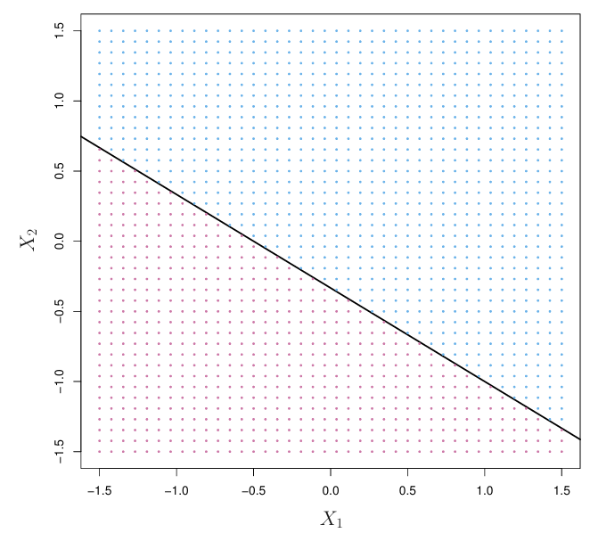
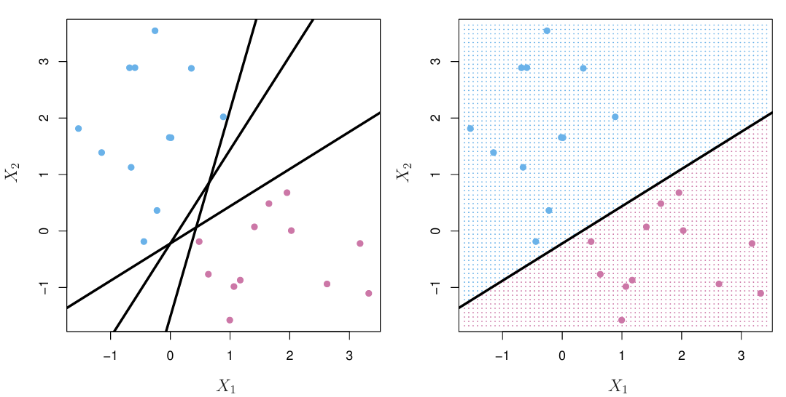
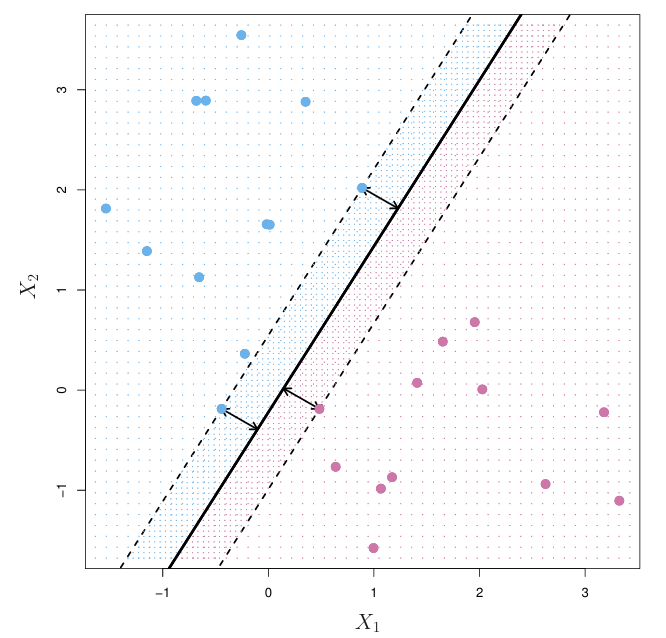
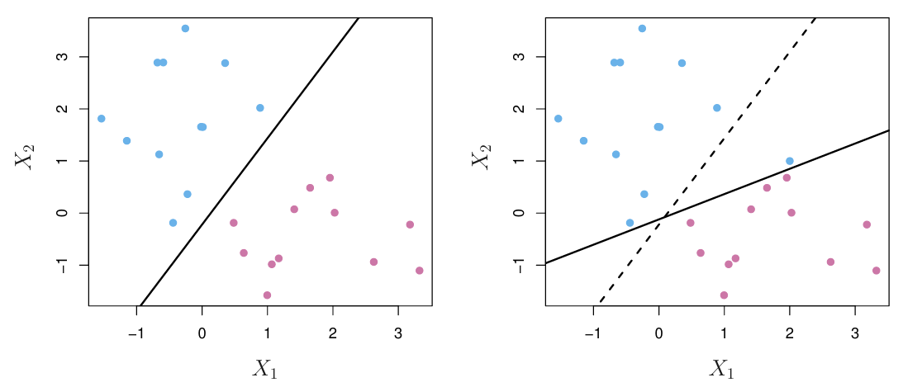
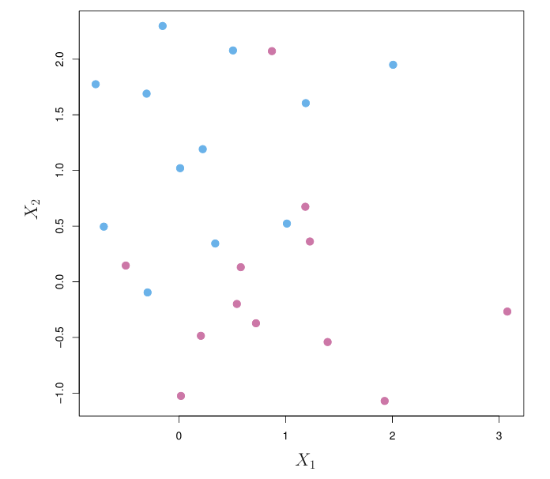
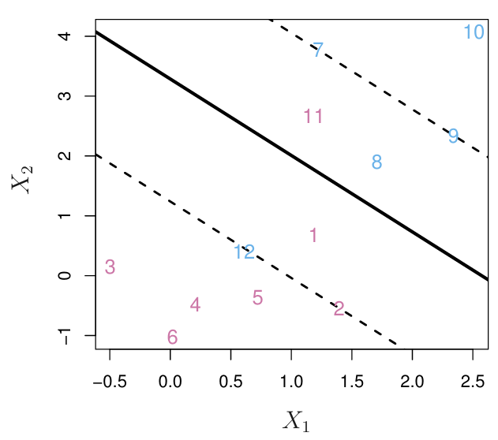
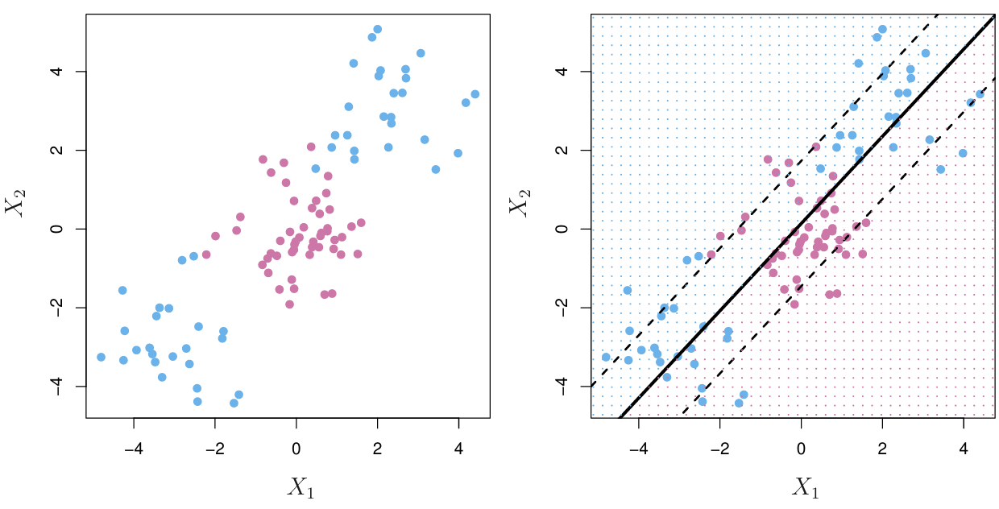
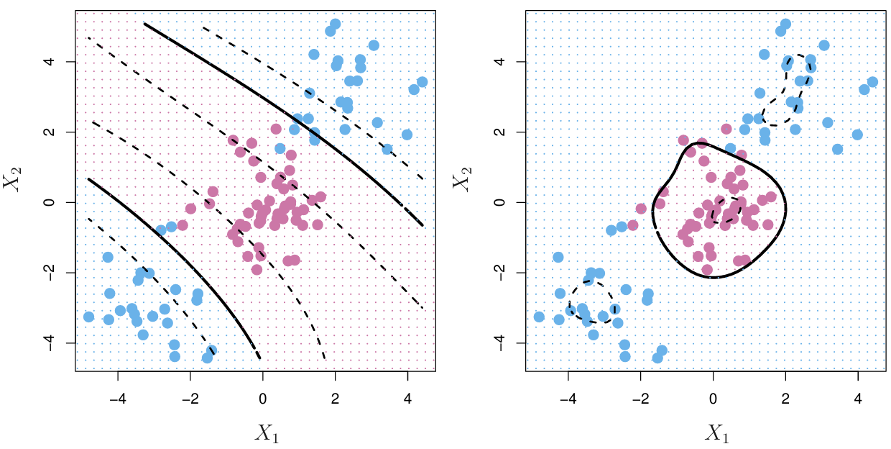

```{r setup, include=FALSE}
knitr::opts_chunk$set(echo = TRUE)
```

# Teoria

## O que é um Hiperplano

A ideia principal é: podemos traçar linhas para separar classes? No exemplo aqui, temos um conjunto de dados de treinamento e temos dois preditores, $X_1$ e $X_2$.

{width="80%"}

Então, para cada caso, que é um ponto, estamos plotando os valores dos preditores $X_1$ e $X_2$, e também estamos colorindo cada ponto de acordo com a classe a que pertencem. Assim, os pontos azuis são da Classe A, enquanto os pontos rosas são da Classe B. Portanto, podemos realmente desenhar uma linha para separar essas duas classes, que é a linha preta. A fórmula para essa linha é $x_2 = -\frac{1}{3} - \frac{2}{3} x_1$. Isso também pode ser reescrito como $1 + 2x_1 + 3x_2 = 0$. Portanto, esta é a fórmula para uma linha separadora. É uma linha que separa perfeitamente as classes A e B. Muitas vezes nos encontramos em situações em que há mais do que dois preditores.

**O que acontece em três dimensões?**

Quando temos três preditores, estamos separando um plano e, em geral, um plano separador pode ser escrito com esta fórmula: $\beta_0 + \beta_1 x_1 + \beta_2 x_2 + \beta_3 x_3 = 0$.

E ainda, se estivermos em $P$ dimensões, existe a noção de hiperplanos separadores. O hiperplano é assim chamado porque está além de um plano, mas em geral a fórmula para um hiperplano separador é a fórmula mostrada abaixo, onde existem $P$ preditores $X_1$ até $X_P$. Então, como realmente usamos hiperplanos ou linhas separadoras para classificar casos?

Aqui, temos a fórmula para esta linha de atualização, $x_2 = -\frac{1}{3} - \frac{2}{3} x_1$, e ela está reescrita na forma de uma função igual a 0. Note que um caso está acima da linha separadora neste exemplo específico e $x_2 > -\frac{1}{3} - \frac{2}{3} x_1$, e isso pode ser reescrito em termos de $1 + 2 x_1 + 3 x_2 > 0$.

Também observe que um caso está abaixo da linha separadora, pertencendo à classe rosa B, se $x_2 < -\frac{1}{3} - \frac{2}{3} x_1$, ou equivalentemente, se $1 + 2 x_1 + 3 x_2 < 0$. Portanto, se um caso estiver acima da linha, prevemos A, e se o caso estiver abaixo da linha, prevemos B.

Então, observe que se chamarmos a Classe A de correspondente ao caso em que a variável de resposta $y = 1$ e chamamos a Classe B de correspondente ao caso em que a resposta $y = -1$ , então um hiperplano separador tem a seguinte propriedade: se apenas multiplicarmos essa combinação linear por $y$, todo o lado esquerdo deve ser maior que 0: $$y(\beta_0 + \beta_1x_1 + \ldots + \beta_px_p)>0$$

## Classificação usando um hiperplano separador

Então, podemos fazer a seguinte observação: acontece que existem infinitos hiperplanos separadores possíveis



Então, tomemos o exemplo à esquerda: existem infinitas possíveis linhas separadoras que poderíamos desenhar para separar os casos azuis e roxos. Uma linha separadora particular é mostrada à direita. Então, dado isso, como realmente encontramos uma solução única? Como encontramos um hiperplano separador possível? A ideia é encontrar o que é chamado de hiperplano separador ótimo. Isso também é chamado de hiperplano de margem máxima.

A ideia é a seguinte: queremos calcular a menor distância de cada caso, de cada ponto, ao hiperplano. A menor distância acontece de ser a distância perpendicular ou ortogonal, e vamos chamar a menor dessas menores distâncias de margem. Nosso objetivo é encontrar um hiperplano que maximize a margem. Isso acaba fornecendo uma solução única para o que um bom hiperplano separador deveria ser. A ideia é que quanto maior for a margem, mais bem separadas estarão as duas classes e, com sorte, isso levará a um melhor desempenho nos dados de teste.

Portanto, para previsão, usamos o hiperplano separador ótimo da mesma forma que um hiperplano geral. Prevemos a Classe A se essa combinação linear for maior que zero e prevemos a Classe B se essa combinação linear for menor que zero.

Então, um exemplo de um hiperplano de margem máxima é mostrado aqui:

{width="70%"}

É a linha sólida indicada no centro, e as linhas tracejadas indicam a margem. Observe que existem três casos, três pontos que estão equidistantes desse hiperplano de margem máxima. Esses são chamados de vetores de suporte, no sentido de que se esses casos se movessem, então o hiperplano também se moveria. Nesse sentido, esses casos, os vetores de suporte, suportam onde o hiperplano de margem máxima está. São apenas esses casos que acabam afetando como desenhamos esse hiperplano de margem máxima, e nenhum outro. Portanto, por exemplo, adicionar um ponto roxo fora da margem não muda a margem de forma alguma, porque ele não é um dos que determinam a menor distância, a menor das menores distâncias, dos casos para esse hiperplano de margem máxima.

## Construção do Classificador de Margem Máxima

Então, como realmente encontramos o hiperplano de margem máxima? É a solução para um problema de otimização que vamos definir aqui. Nossos dados consistem em $n$ casos de treinamento. As variáveis de resposta são $y_1$ até $y_n$. Para cada caso de treinamento, as classes são -1 e 1. Há $n$ vetores de preditores, então $x_1$ até $x_n$, onde cada $x$ é um vetor de $P$ preditores diferentes.

Portanto, a solução para encontrar um hiperplano de margem máxima é o problema de otimização mostrado abaixo. Queremos encontrar os valores de $\beta_0$, $\beta_1$ até $\beta_P$ para resolver o problema de otimização abaixo.

Maximizar $M$ de acordo com:

```{=tex}
\begin{align*}
\quad \sum_{j=1}^{p} \beta_j^2 = 1 \\
& \quad y_i(\beta_0 + \beta_1 x_{i1} + \beta_2 x_{i2} + \dots + \beta_p x_{ip}) \geq M \quad \text{para} \quad i=1,\ldots,n.
\end{align*}
```
Então, maximizamos $M$. Este $M$ é a margem. É o mínimo dessas menores distâncias de cada ponto ao hiperplano. A última restrição diz que todos os casos devem estar a pelo menos $M$ de distância do hiperplano, e esta última restrição é mais uma conveniência. Ela garante que a distância perpendicular de cada ponto ao hiperplano seja igual a esta combinação linear, em oposição a algum múltiplo constante disso. Isso é apenas bom para interpretabilidade.

Uma desvantagem dos hiperplanos de margem máxima é que eles são muito sensíveis às observações de treinamento; ou seja, eles são altamente variáveis.



O hiperplano de margem máxima particular para este conjunto de dados mostrado à esquerda está em preto, mas com a adição de um único ponto de dados azul, o hiperplano de margem máxima se desloca. Ele se desloca de onde estava, representado pela linha tracejada, para onde está agora, representado pela linha preta sólida. É uma mudança considerável.

Outra desvantagem é: o que acontece se os casos não puderem ser perfeitamente separados por um hiperplano?

{width="60%"}

No exemplo aqui, não há uma linha possível que possamos desenhar que separe perfeitamente os casos azuis e roxos. Esta é uma desvantagem do hiperplano de margem máxima, porque assumimos que existe um hiperplano que pode separar perfeitamente as duas classes

## Classificadores de Vetores de Suporte

Uma abordagem alternativa na qual procuramos propositadamente o hiperplano que não classifica perfeitamente todos os casos de treinamento é chamada de classificador de vetores de suporte. Os objetivos são diminuir a sensibilidade às observações individuais, não queremos que o hiperplano separador se mova tanto com a adição de apenas um caso. Queremos classificar a maioria dos casos de treinamento com precisão e esperamos que, no geral, essa pequena quantidade de erros de classificação leve a um melhor desempenho em um conjunto de teste.

```{=tex}
\begin{align*}
& \text{maximizar M de acordo com} \\
& \quad \sum_{j=1}^{p} \beta_j^2 = 1, \\
& \quad y_i(\beta_0 + \beta_1 x_{i1} + \beta_2 x_{i2} + \dots + \beta_p x_{ip}) \geq M (1 - \xi_i), \quad \text{para} \quad i = 1, \ldots, n, \\
& \quad \sum_{i=1}^{n} \xi_i \leq C, \\
& \quad \xi_i \geq 0, \quad \text{para} \quad i = 1, \ldots, n.
\end{align*}
```
Em particular, a maior parte das equações são comuns à construção do hiperplano de margem máxima, mas há alguns recursos adicionais que permitem essa potencial de má classificação. Vamos discutir isso agora.

Essas $\epsilon$ adicionais são chamados de variáveis de folga, e elas permitem que casos sejam classificados incorretamente. Então, se olharmos para a restrição mostrada aqui, veremos que há esse $1 - \epsilon$ adicional ao que tínhamos antes quando construímos o hiperplano de margem máxima.

Acontece que quando um $\epsilon$ é igual a zero, o caso $i$ (cada $\epsilon$ corresponde a um caso) está no lado correto da margem. Por que isso? Porque quando $\epsilon = 0$, essa condição acaba sendo a mesma condição que usamos para garantir que cada caso de treinamento estivesse a pelo menos $M$ de distância daquele hiperplano separador.

Então, quando $\epsilon > 0$, essa quantidade à direita será menor que $M$, e isso será o caso quando o caso $i$ estiver no lado errado da margem. Pode estar no lado correto do hiperplano, mas não está além daquela distância $M$; não está além da margem.

Finalmente, quando $\epsilon_i > 1$, essa quantidade $M (1 - \epsilon)$ se torna negativa, e nesse caso o caso $i$ está no lado errado da margem e do hiperplano, sendo completamente mal classificado.

Finalmente, temos essas restrições de que essas variáveis de folga, esses $\epsilon$, não são negativas e têm que somar a um orçamento, então, no total, têm que ser menores ou iguais a uma constante $C$. Podemos pensar em $C$ como algum tipo de orçamento.

Vamos obter um pouco mais de intuição sobre o problema de otimização com este pequeno exemplo.

{width="70%"}

Neste conjunto de treinamento, há 12 casos das classes azul e roxa. O hiperplano estimado pelo classificador de vetores de suporte é esta linha preta sólida e a margem é indicada pelas linhas tracejadas. Abaixo do hiperplano está o lado roxo e acima do hiperplano está o lado azul. Vamos aprofundar um pouco mais nesta restrição superior do problema de otimização.

Quando $\epsilon = 0$, esta é a situação em que os casos estão no lado correto da margem. Acontece que os casos 2, 3, 4, 5 e 6 estão no lado correto da margem porque estão na linha tracejada ou além dela. Para a classe roxa, isso significa que estão além da margem e, de forma similar, para o lado azul, os casos 7, 9 e 10 estão no lado correto da margem, ou seja, estão além da linha tracejada no lado superior. Além disso, o caso 9 está exatamente na margem.

Quando $\epsilon_i > 0$ mas $\epsilon_i < 1$, esta é a situação em que um caso está no lado correto do hiperplano (a linha preta sólida), mas no lado errado da margem. Para a classe roxa, isso é o caso 1, porque está de fato abaixo do hiperplano separador, mas não está no lado correto da margem, ou seja, não está abaixo da linha tracejada. Similarmente, para a classe azul, o caso 8 está corretamente acima do hiperplano, mas não está acima da margem.

Finalmente, quando $\epsilon > 1$, esta é a situação em que um caso está completamente no lado errado do hiperplano. Para a classe roxa, isso é o caso 11, que está acima do hiperplano quando deveria estar abaixo, e para a classe azul, isso é o caso 12, que está abaixo do hiperplano quando deveria estar acima.

Acontece que os casos que estão diretamente na margem (a linha tracejada) ou no lado errado da margem são chamados de vetores de suporte. São apenas esses casos que afetam a posição do hiperplano (linha sólida).

## Otimização Computacional

Acontece que resolver o problema de otimização para o classificador de vetores de suporte envolve apenas calcular os produtos internos das observações, em vez de usar as próprias observações. Vamos definir o que é um produto interno.

Se eu tiver dois vetores $\mathbf{x}_a$ e $\mathbf{x}_b$ que têm $P$ componentes, então isso é como uma situação com $P$ preditores. O produto interno é definido por esses colchetes angulares mostrados aqui, e é definido como esta soma:

$$
\langle \mathbf{x}_a, \mathbf{x}_b \rangle = \sum_{i=1}^{P} x_{ai} \cdot x_{bi}
$$

Esta soma não é tão intuitiva, então vejamos um exemplo. Se $\mathbf{x}_a$ é o vetor $(1, 2, 3, 4)$, com quatro preditores, e $\mathbf{x}_b$ é $(2, 3, 4, 5)$, calculamos o produto interno pegando as entradas correspondentes de cada elemento nos vetores, multiplicando-as e somando-as juntas. Então, $1$ e $2$ são multiplicados, $2$ e $3$, $3$ e $4$, e $4$ e $5$. Somamos esses produtos e obtemos um produto interno de $40$.

Como mais um exemplo, temos os dois vetores $(1, 2, 3, 4)$ e $(5, 6, -0.5, 2.5)$. Novamente, multiplicamos as entradas correspondentes e somamos esses produtos juntos, e aqui obtemos um produto interno de $0$.

Acontece que podemos usar produtos internos para escrever a fórmula de uma função de hiperplano. A função de hiperplano $f(\mathbf{x})$ pode ser denotada desta forma mostrada aqui com produtos internos:

$$
f(\mathbf{x}) = \beta_0 + \sum_{i=1}^{n} \alpha_i \langle \mathbf{x}_i, \mathbf{x} \rangle
$$

Originalmente, tínhamos denotado hiperplanos com esta combinação linear:

$$
\beta_0 + \beta_1 x_1 + \beta_2 x_2 + \cdots + \beta_p x_p = 0
$$

Acontece que podemos escrever a fórmula para o hiperplano nesta notação com produtos internos também. Isso será útil quando introduzirmos uma melhoria ao classificador de vetores de suporte.

## Limitações

Existem limitações no classificador de vetores de suporte, como a sensibilidade a dados de treinamento ligeiramente diferentes, mas também é limitado pelo fato de que só podemos traçar fronteiras de decisão lineares.



Em particular, na situação de dados mostrada acima, os casos roxos estão completamente no meio, entre os casos azuis nas extremidades. Então, na verdade, não podemos traçar apenas uma linha para separar essas duas classes. De fato, o hiperplano que é estimado no classificador de vetores de suporte é mostrado à direita com a linha preta sólida, e a margem é mostrada com as linhas tracejadas. Vemos que essa fronteira de decisão não separa de forma alguma as classes azul e roxa. Portanto, o que precisamos são algumas transformações não lineares para nos ajudar.

## Máquinas de vetores de suporte

A ideia das máquinas de vetores de suporte é enriquecer o espaço dos preditores usando transformações de variáveis. Isso é muito semelhante à ideia que usamos quando falamos sobre splines no outro artigo, quando queríamos lidar com relações não lineares. Essas transformações são realizadas por algo chamado funções kernel, que serão denotadas como uma função $K$ que recebe como entrada dois vetores $\mathbf{X}$ e $\mathbf{X}_i$.

Para reiterar o que foi introduzido anteriormente, acontece que o classificador de vetores de suporte pode ser escrito nesta forma mostrada aqui com produtos internos. Há apenas uma ligeira modificação para adaptar isso para expressar as máquinas de vetores de suporte. Em vez de usar o produto interno nesta soma, substituímos esse produto interno por uma generalização: substituímos por funções kernel, que são essas transformações potencialmente não lineares dos preditores. $$f(x) = \beta_0 + \sum_{i \in S} \alpha_i K(x, x_i)$$

Para tornar isso concreto, vejamos um exemplo.



Este é o mesmo conjunto de dados problemático que vimos anteriormente, onde um classificador de vetores de suporte tentou apenas traçar uma fronteira de decisão linear e não se saiu bem. Dois exemplos de funções kernel são mostrados aqui: o kernel polinomial à esquerda $$K(x_i, \mathbf{x}_i') = \left(1 + \sum_{j=1}^{p} x_{ij} x_{i'j} \right)^d$$ e o kernel radial à direita $$K(\mathbf{x}_i, \mathbf{x}_i') = \exp\left(-\gamma \sum_{j=1}^{p} (x_{ij} - x_{i'j})^2\right).
$$ Essas duas funções definem transformações não lineares das variáveis preditoras e, com base nas imagens, vemos que fronteiras de decisão não lineares são realmente formadas.

À esquerda, com o kernel polinomial, se olharmos entre as linhas sólidas, essa versão não linear de um hiperplano separador, vemos que essas linhas de fato separam melhor as classes azul e roxa. Da mesma forma, com o kernel radial, essa transformação não linear também ajuda a separar melhor as classes azul e roxa. Vemos que quase todos os pontos roxos estão contidos dentro daquele círculo preto sólido.

## Resumo

Em resumo, a ideia motivadora por trás das máquinas de vetores de suporte é o hiperplano de margem máxima. Há hiperplanos que separam perfeitamente as classes, e para construí-los, maximizamos a margem, que é a menor distância de cada caso ao hiperplano.

A desvantagem desses hiperplanos de margem máxima é que são bastante sensíveis a novos dados, e pode até não ser o caso de as classes serem perfeitamente separáveis. Portanto, o classificador de vetores de suporte tenta aliviar algumas dessas preocupações permitindo intencionalmente que alguns casos sejam classificados erroneamente. Fazemos isso com variáveis de folga, e descobrimos que a extensão da classificação incorreta pode ser ajustada, então temos um parâmetro de ajuste. Temos que considerar o trade-off entre viés e variância. 

E, finalmente, esses dois classificadores anteriores também são limitados, pois só desenham fronteiras de decisão lineares. As máquinas de vetores de suporte tentam reconciliar e melhorar isso, estendendo o classificador de vetores de suporte, fazendo transformações não lineares das variáveis.

# Prática

Nosso objetivo de modelagem é prever se um título na Netflix é uma série de TV ou um filme com base em sua descrição.

## Estatística Descritiva

Vamos começar lendo os dados e analisar sua estrutura:

```{r echo=TRUE, message=FALSE, warning=FALSE}
## carregar pacote tidyverse
library(tidyverse)

## Carregar os dados
netflix_titles <- read_csv("netflix_titles.csv")

## Ver a estrutura
glimpse(netflix_titles)

skimr::skim(netflix_titles)
```
Vemos que apenas uma coluna é numérica, mas pode ser considerada como uma data. Todas as outras são caracteres. Também há algumass informações faltando em algumas variáveis.

Começando a análise, observamos que há 2 tipos de filmes, quais são eles?

```{r}
netflix_titles %>%
  count(type)
```
Também vemos que há uma variável descrição. Vamos ver do que ela se trata antes de começar a modelagem:

```{r}
netflix_titles %>%
  slice_sample(n = 10) %>%
  pull(description)
```
Quais são as palavras mais usadas em cada categoria?

```{r message=FALSE, warning=FALSE}
library(tidytext)

netflix_titles %>%
  unnest_tokens(word, description) %>%             # Separa as palavras de cada descrição em tokens individuais
  anti_join(get_stopwords()) %>%                   # Remove as palavras comuns (stopwords) do conjunto de dados
  count(type, word, sort = TRUE) %>%               # Conta a frequência de cada palavra, agrupada por tipo (TV show ou movie)
  group_by(type) %>%                               # Agrupa os resultados por tipo
  slice_max(n, n = 15) %>%                         # Seleciona as 15 palavras mais frequentes para cada tipo
  ungroup() %>%                                    # Remove o agrupamento
  mutate(word = reorder_within(word, n, type)) %>% # Reordena as palavras dentro de cada tipo de acordo com a frequência
  ggplot(aes(n, word, fill = type)) +              # Cria um gráfico de barras com as palavras mais frequentes
  geom_col(show.legend = FALSE, alpha = 0.8) +     # Adiciona as barras ao gráfico
  scale_y_reordered() +                            # Ajusta a escala do eixo y para manter a ordem das palavras
  facet_wrap(~type, scales = "free") +             # Cria facetas separadas para cada tipo (TV show ou movie)
  labs(                                            # Adiciona rótulos ao gráfico
    x = "Frequência da Palavra", y = NULL,
    title = "Palavras mais frequentes nas descrições da Netflix por frequência",
    subtitle = "Depois de remover palavras comuns"
  ) +
  theme_bw()
```

Há algumas diferenças mesmo entre as palavras mais frequentes, então esperamos poder treinar um modelo para distinguir essas categorias.

## Modelagem

### Separação

Podemos começar carregando o metapacote tidymodels, dividindo nossos dados em conjuntos de treinamento e teste, e criando amostras de validação cruzada

```{r message=FALSE, warning=FALSE}
library(tidymodels)

set.seed(123)
netflix_split <- netflix_titles %>%
  select(type, description) %>%
  initial_split(strata = type)

netflix_train <- training(netflix_split)
netflix_test <- testing(netflix_split)

set.seed(234)
netflix_folds <- vfold_cv(netflix_train, strata = type)
netflix_folds
```

### Feature Engineering
A seguir, vamos criar nossa receita (*recipes*) e nosso modelo, e então juntá-los em um fluxo de trabalho (*workflow*) de modelagem.

```{r}
# Importa a biblioteca textrecipes, que é usada para a preparação de texto para modelagem
library(textrecipes)

# Importa a biblioteca themis, que é usada para lidar com desbalanceamento de classes
library(themis)


netflix_rec <- recipe(type ~ description, data = netflix_train) %>% # Cria uma receita de engenharia de recursos para o modelo de texto
  step_tokenize(description) %>%                                    # Passo 1: Tokeniza a descrição, dividindo-a em palavras individuais
  step_tokenfilter(description, max_tokens = 1e3) %>%               # Passo 2: Filtra os tokens, limitando o número máximo de tokens a 1000
  step_tfidf(description) %>%                                       # Passo 3: Calcula a frequência inversa do documento (TF-IDF) para cada palavra na descrição
  step_normalize(all_numeric_predictors()) %>%                      # Passo 4: Normaliza os preditores numéricos (no caso improvável de eles existirem)
  step_smote(type)                                                  # Passo 5: Aplica a técnica SMOTE (Synthetic Minority Over-sampling Technique) para lidar com o desbalanceamento de classes

# Retorna a receita
netflix_rec

```
### Modelo

Agora, especificamos o modelo:

```{r}
svm_spec <- svm_linear() %>%
  set_mode("classification") %>%
  set_engine("LiblineaR")

netflix_wf <- workflow() %>%
  add_recipe(netflix_rec) %>%
  add_model(svm_spec)

netflix_wf
```
SVMs lineares são frequentemente uma boa escolha inicial para modelos de texto. Quando você usa um SVM, lembre-se de incluir step_normalize()!

Agora vamos ajustar este fluxo de trabalho (*workflow*) às amostras que criamos anteriormente. O modelo SVM linear não suporta probabilidades de classe, então precisamos definir um conjunto de métricas personalizado que inclua apenas métricas para probabilidades de classe rígidas.

```{r eval=FALSE, include=TRUE}
doParallel::registerDoParallel()
set.seed(123)
svm_rs <- fit_resamples(
  netflix_wf,
  netflix_folds,
  metrics = metric_set(accuracy, recall, precision),
  control = control_resamples(save_pred = TRUE)
)

collect_metrics(svm_rs)
```

```{r include=FALSE}
svm_rs <- readRDS("svm_rs.rds")
```

Podemos usar conf_mat_resampled() para calcular uma matriz de confusão separada para cada resample, e depois calcular a média das contagens das células.

```{r}
svm_rs %>%
  conf_mat_resampled(tidy = FALSE) %>%
  autoplot()
```

### Ajuste nos dados de teste

Em seguida, vamos ajustar nosso modelo pela última vez no conjunto de treinamento inteiro de uma vez e avaliar no conjunto de teste. Esta é a primeira vez que estamos utilizando o conjunto de teste.

```{r}
final_fit<- last_fit(
  netflix_wf,
  netflix_split,
  metrics = metric_set(accuracy, recall, precision)
)
collect_metrics(final_fit)
```

O desempenho no conjunto de teste é aproximadamente o mesmo que encontramos com nossos dados de treinamento, o que é bom.
Podemos explorar como o modelo está se saindo para ambas as classes positivas e negativas com uma matriz de confusão.

```{r}
collect_predictions(final_fit) %>%
  conf_mat(type, .pred_class)
```

Há um *workflow* ajustado na coluna .workflow do tibble final_fit que pode ser salvo e usado para previsão posteriormente. Aqui, vamos extrair o ajuste e aprender sobre as explicações do modelo.

```{r}
netflix_fit <- pull_workflow_fit(final_fit$.workflow[[1]])

tidy(netflix_fit) %>%
  arrange(estimate)
```
Esses termos são as palavras que criamos durante o *feature engineering*. Vamos criar uma visualização para vê-los melhor.

```{r}
tidy(netflix_fit) %>%
  filter(term != "Bias") %>%
  group_by(sign = estimate > 0) %>%
  slice_max(abs(estimate), n = 15) %>%
  ungroup() %>%
  mutate(
    term = str_remove(term, "tfidf_description_"),
    sign = if_else(sign, "Mais de séries de TV", "Mais de filmes")
  ) %>%
  ggplot(aes(abs(estimate), fct_reorder(term, abs(estimate)), fill = sign)) +
  geom_col(alpha = 0.8, show.legend = FALSE) +
  facet_wrap(~sign, scales = "free") +
  labs(
    x = "Coeficiente do SVM linear", y = NULL,
    title = "Quais palavras são mais preditivas para filmes versus séries de TV?",
    subtitle = "Para a descrição de filmes e séries de TV na Netflix"
  ) +
  theme_bw()
```

