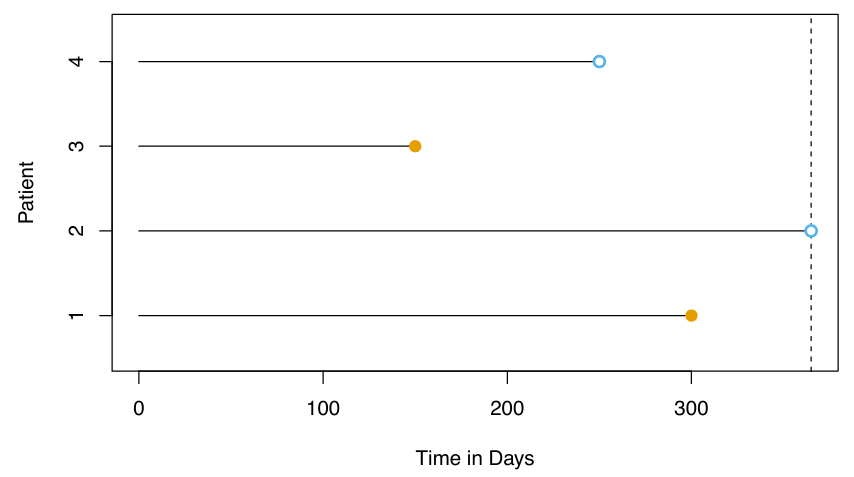
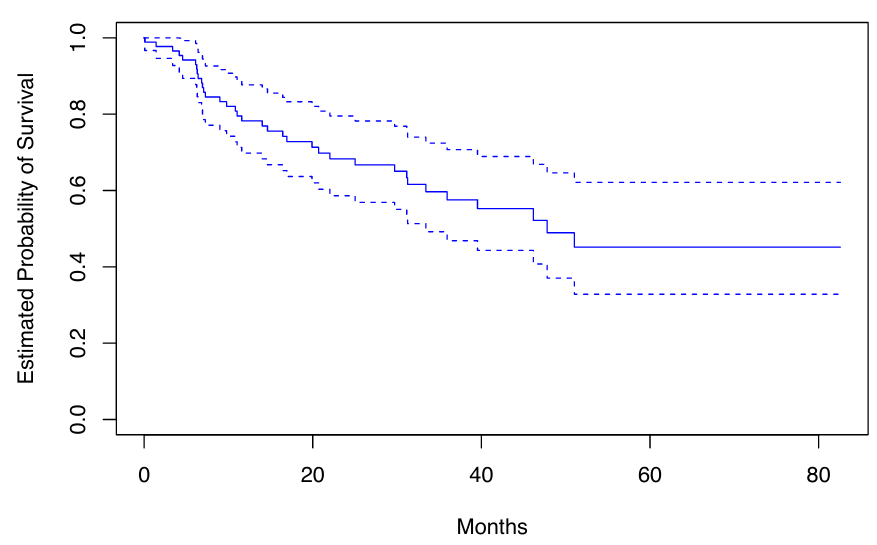
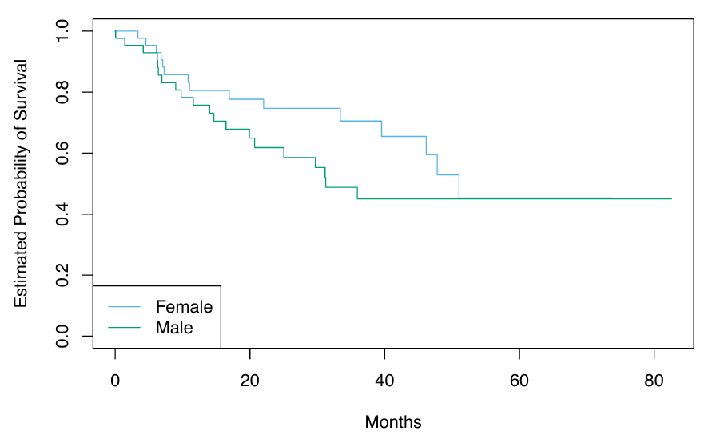
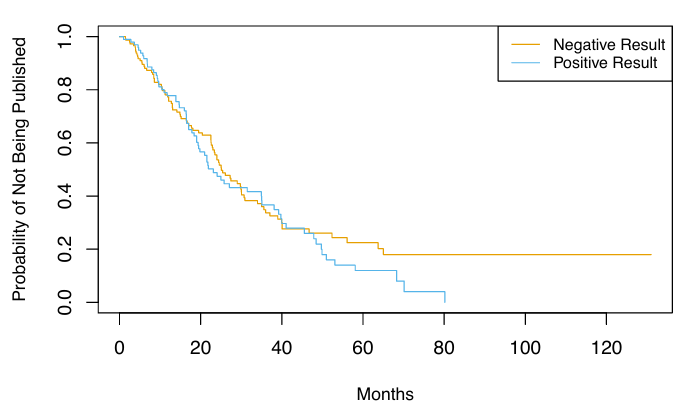
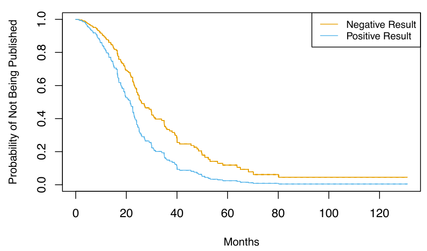
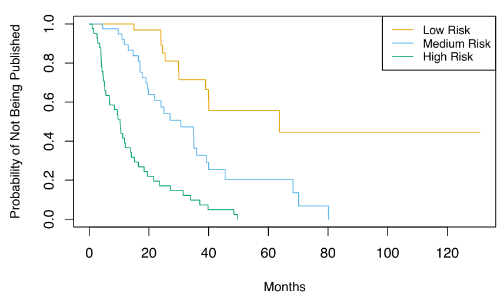

```{r setup, include=FALSE}
knitr::opts_chunk$set(echo = TRUE)
```

# Teoria

## Introdução

Neste artigo, discutiremos análise de sobrevivência e dados de sobrevivência censurados. Esses temas surgem na análise de um tipo específico de variável de resultado: o tempo até que um evento ocorra.

Por exemplo, em um estudo médico de cinco anos com pacientes tratados para câncer, queremos ajustar um modelo para prever o tempo de sobrevivência dos pacientes, utilizando características como medidas de saúde inicial ou tipo de tratamento. No entanto, muitos pacientes podem ter sobrevivido até o final do estudo, resultando em tempos de sobrevivência censurados, onde sabemos que é pelo menos cinco anos, mas não seu valor real.

A análise de sobrevivência é relevante não apenas em estudos médicos, mas também em outras áreas, como prever a perda de clientes em uma empresa ou mesmo modelar dados onde medições estão limitadas por um certo valor. Apesar de ser amplamente estudada em estatística, a análise de sobrevivência recebeu relativamente pouca atenção na comunidade de aprendizado de máquina.

## Tempos de sobrevivência e censura

Para cada indivíduo, supomos que existe um tempo verdadeiro de sobrevivência, $T$, bem como um tempo verdadeiro de censura, $C$. O tempo de sobrevivência também é conhecido como tempo de censura por falha ou tempo de evento. O tempo de sobrevivência representa o momento em que ocorre o evento de interesse, como a morte do paciente ou o cancelamento da assinatura do cliente. Em contraste, o tempo de censura é o momento em que ocorre a censura, como quando o paciente sai do estudo ou quando o estudo é encerrado.

Observamos ou o tempo de sobrevivência $T$ ou o tempo de censura $C$. Especificamente, observamos a variável aleatória $$Y = \min(T,C)\quad \text{(1)}$$ Em outras palavras, se o evento ocorrer antes da censura (ou seja, $T < C$), então observamos o tempo de sobrevivência verdadeiro $T$; no entanto, se a censura ocorrer antes do evento ($T > C$), então observamos o tempo de censura. Também observamos um indicador de status, onde é 1 se observamos o tempo de sobrevivência verdadeiro e 0 se observamos o tempo de censura.

Suponha agora que observamos pares $(Y, \delta)$ para $n$ indivíduos, que denotamos como $(y_1, \delta_1), \ldots, (y_n, \delta_n)$. A Figura 1 mostra um exemplo de um estudo médico fictício onde observamos $n = 4$ pacientes ao longo de um período de acompanhamento de 365 dias. Para os pacientes 1 e 3, observamos o tempo até o evento (como morte ou recidiva da doença) $T = t_i$. O paciente 2 estava vivo quando o estudo terminou, e o paciente 4 saiu do estudo ou foi "perdido para acompanhamento"; para esses pacientes, observamos $C = c_i$. Portanto, $y_1 = t_1$, $y_3 = t_3$, $y_2 = c_2$, $y_4 = c_4$, $\delta_1 = \delta_3 = 1$ e $\delta_2 = \delta_4 = 0$.



## Um olhar mais atento sobre a censura

Para analisar dados de sobrevivência, precisamos fazer algumas suposições sobre o motivo pelo qual ocorreu a censura. Por exemplo, suponha que vários pacientes abandonem um estudo sobre câncer precocemente devido a doença grave. Uma análise que não leve em consideração o motivo pelo qual os pacientes abandonaram o estudo provavelmente superestimará o verdadeiro tempo médio de sobrevivência. Da mesma forma, suponha que homens gravemente doentes sejam mais propensos a abandonar o estudo do que mulheres gravemente doentes. Nesse caso, uma comparação dos tempos de sobrevivência entre homens e mulheres pode erroneamente sugerir que os homens sobrevivem mais do que as mulheres.

Em geral, precisamos assumir que o mecanismo de censura é independente: condicional às características, o tempo do evento T é independente do tempo de censura C. Os dois exemplos acima violam a suposição de censura independente. Tipicamente, não é possível determinar a independência do mecanismo de censura apenas a partir dos dados. Em vez disso, é necessário considerar cuidadosamente o processo de coleta de dados para determinar se a censura independente é uma suposição razoável.

Aqui, focamos na censura à direita, que ocorre quando $T \geq Y$, ou seja, o tempo verdadeiro do evento T é pelo menos tão grande quanto o tempo observado Y. A censura à direita deriva seu nome do fato de que o tempo é tipicamente exibido da esquerda para a direita, como na Figura 1. No entanto, outros tipos de censura são possíveis. Por exemplo, na censura à esquerda, o tempo verdadeiro do evento T é menor ou igual ao tempo observado Y. Um exemplo seria um estudo sobre a duração da gravidez, onde supomos que investigamos os pacientes 250 dias após a concepção, quando alguns já tiveram seus bebês. Então, sabemos que para esses pacientes, a duração da gravidez é inferior a 250 dias.

Mais genericamente, a censura por intervalo se refere à situação em que não conhecemos o tempo exato do evento, mas sabemos que ele ocorre em algum intervalo. Por exemplo, isso ocorre se investigarmos os pacientes semanalmente para determinar se o evento ocorreu. Embora a censura à esquerda e a censura por intervalo possam ser tratadas utilizando variantes das ideias apresentadas aqui, a seguir focaremos especificamente na censura à direita.

## A curva de sobrevivência de Kaplan-Meier

A curva de sobrevivência, ou função de sobrevivência, é definida como $$ S(t) = \Pr(T > t) \quad \text{(2)} $$ Esta função decrescente quantifica a probabilidade de sobreviver além do tempo $t$. Por exemplo, suponha que uma empresa esteja interessada em modelar a rotatividade de clientes. Seja $T$ o tempo em que um cliente cancela a assinatura do serviço da empresa. Então, $S(t)$ representa a probabilidade de um cliente cancelar depois do tempo $t$. Quanto maior o valor de $S(t)$, menos provável é que o cliente cancele antes do tempo $t$.

Consideraremos a tarefa de estimar a curva de sobrevivência. Nossa investigação é motivada pelo conjunto de dados *BrainCancer*, que contém os tempos de sobrevivência de pacientes com tumores cerebrais primários submetidos a tratamento com métodos de radioterapia estereotáxica. Os preditores incluem o volume do tumor bruto (**gtv**, em centímetros cúbicos), **sexo** (masculino ou feminino), **diagnóstico** (meningioma, glioma de baixo grau, glioma de alto grau ou outro), **localização do tumor** (infratentorial ou supratentorial), **índice de Karnofsky (ki)** e **método estereotáxico** (radiocirurgia estereotáxica ou radioterapia estereotáxica fracionada, abreviados como SRS e SRT, respectivamente). Apenas 53 dos 88 pacientes estavam vivos ao final do estudo.

Agora, consideramos a tarefa de estimar a curva de sobrevivência (2) para esses dados. Para estimar $S(20) = \Pr(T > 20)$, a probabilidade de um paciente sobreviver pelo menos $t = 20$ meses, é tentador simplesmente calcular a proporção de pacientes que sabemos ter sobrevivido além de 20 meses, ou seja, a proporção de pacientes para os quais $Y > 20$. Isso resulta em 48/88, ou aproximadamente 55%. No entanto, isso não parece estar completamente correto, já que $Y$ e $T$ representam quantidades diferentes. Em particular, 17 dos 40 pacientes que não sobreviveram aos 20 meses foram censurados, e essa análise assume implicitamente que $T < 20$ para todos esses pacientes censurados; obviamente, não sabemos se isso é verdadeiro.

Alternativamente, para estimar $S(20)$, poderíamos considerar calcular a proporção de pacientes para os quais $Y > 20$, dos 71 pacientes que não foram censurados até o tempo $t = 20$; isso resulta em 48/71, ou aproximadamente 68%. No entanto, isso também não está completamente correto, pois significa ignorar completamente os pacientes que foram censurados antes do tempo $t = 20$, embora o momento em que foram censurados possa ser informativo. Por exemplo, um paciente censurado no tempo $t = 19.9$ provavelmente teria sobrevivido além de $t = 20$ se não tivesse sido censurado.

Vimos que a estimativa de $S(t)$ é complicada pela presença de censura. Agora apresentamos uma abordagem para superar esses desafios. Deixamos $d_1 < d_2 < \ldots < d_K$ denotar os $K$ tempos de morte únicos entre os pacientes não censurados, e deixamos $q_k$ denotar o número de pacientes que morreram no tempo $d_k$. Para $k = 1, \ldots, K$, deixamos $r_k$ denotar o número de pacientes vivos e no estudo imediatamente antes de $d_k$; estes são os pacientes em risco. O conjunto de pacientes que estão em risco em um dado momento é conhecido como o conjunto de risco.

Pela lei da probabilidade total, $$ \Pr(T > d_k) = \Pr(T > d_k \mid T > d_{k-1}) \Pr(T > d_{k-1}) + \Pr(T > d_k \mid T \leq d_{k-1}) \Pr(T \leq d_{k-1}). $$ O fato de $d_{k-1} < d_k$ implica que $\Pr(T > d_k \mid T \leq d_{k-1}) = 0$ (é impossível para um paciente sobreviver além do tempo $d_k$ se ele ou ela não sobreviveu até um tempo anterior $d_{k-1}$). Portanto, $$ S(d_k) = \Pr(T > d_k) = \Pr(T > d_k \mid T > d_{k-1}) \Pr(T > d_{k-1}). $$ Substituindo novamente (2), vemos que $$ S(d_k) = \Pr(T > d_k \mid T > d_{k-1}) S(d_{k-1}). $$ Isso implica que $$ S(d_k) = \Pr(T > d_k \mid T > d_{k-1}) \cdot \ldots \cdot \Pr(T > d_2 \mid T > d_1) \Pr(T > d_1). $$ Agora, basta substituir as estimativas de cada um dos termos no lado direito da equação anterior. É natural usar o estimador $$ \Pr(T > d_j \mid T > d_{j-1}) = \frac{r_j - q_j}{r_j}, $$ que é a fração do conjunto de risco no tempo $d_j$ que sobreviveu além do tempo $d_j$. Isso leva ao estimador de Kaplan-Meier da curva de sobrevivência: $$ S(d_k) = \prod_{j=1}^{k} \left( 1 - \frac{q_j}{r_j} \right). \quad \text{(3)} $$ Para tempos $t$ entre $d_k$ e $d_{k+1}$, definimos $S(t) = S(d_k)$. Consequentemente, a curva de sobrevivência de Kaplan-Meier tem uma forma escalonada.

A curva de sobrevivência de Kaplan-Meier para os dados *BrainCancer* é mostrada na Figura 2. Cada ponto na curva sólida e escalonada mostra a probabilidade estimada de sobreviver além do tempo indicado no eixo horizontal. A probabilidade estimada de sobrevivência além de 20 meses é de 71%, o que é significativamente maior do que as estimativas ingênuas de 55% e 68% apresentadas anteriormente.



A construção sequencial do estimador de Kaplan-Meier - começando no tempo zero e mapeando os eventos observados conforme eles se desenrolam no tempo - é fundamental para muitas das técnicas chave na análise de sobrevivência. Estas incluem o teste de *log-rank* e o modelo de risco proporcional de *Cox*.

## Teste Log-Rank

Agora continuamos nossa análise dos dados do *BrainCancer*. Queremos comparar a sobrevivência de homens e mulheres.



A Figura 3 mostra as curvas de sobrevivência de Kaplan-Meier para os dois grupos. As mulheres parecem se sair um pouco melhor até cerca de 50 meses, mas depois as duas curvas se estabilizam em cerca de 50%. Como podemos realizar um teste formal de igualdade das duas curvas de sobrevivência?

À primeira vista, um teste t de duas amostras parece uma escolha óbvia: poderíamos testar se o tempo médio de sobrevivência entre as mulheres é igual ao tempo médio de sobrevivência entre os homens. Mas a presença de censura cria uma complicação. Para superar esse desafio, realizaremos um teste de *log-rank*, que examina como os eventos em cada grupo se desenrolam sequencialmente no tempo.

Lembre-se que $d_1 < d_2 < \cdots < d_K$ são os tempos de morte únicos entre os pacientes não censurados, $r_k$ é o número de pacientes em risco no tempo $d_k$, e $q_k$ é o número de pacientes que morreram no tempo $d_k$. Definimos ainda $r_{1k}$ e $r_{2k}$ como o número de pacientes nos grupos 1 e 2, respectivamente, que estão em risco no tempo $d_k$. Da mesma forma, definimos $q_{1k}$ e $q_{2k}$ como o número de pacientes nos grupos 1 e 2, respectivamente, que morreram no tempo $d_k$. Note que $r_{1k} + r_{2k} = r_k$ e $q_{1k} + q_{2k} = q_k$.

Em cada tempo de morte $d_k$, construímos uma tabela $2 \times 2$ de contagens na forma mostrada na Tabela 1. Observe que, se os tempos de morte são únicos (ou seja, nenhum dos dois indivíduos morre ao mesmo tempo), então um dos $q_{1k}$ e $q_{2k}$ é igual a um, e o outro é igual a zero.

$$
\begin{array}{|c|c|c|c|}
\hline
              & \textbf{Grupo 1}      & \textbf{Grupo 2}     & \textbf{Total}      \\ \hline
\textbf{Morreram}     & q_{1k} & q_{2k} & q_k \\ \hline
\textbf{Sobreviveram} & r_{1k} - q_{1k} & r_{2k} - q_{2k} & r_k - q_k \\ \hline
\textbf{Total}        & r_{1k} & r_{2k} & r_k \\ \hline
\end{array}
$$

A ideia principal por trás da estatística do teste de log-rank é a seguinte. Para testar $H_0: E(X) = \mu$ para alguma variável aleatória $X$, uma abordagem é construir uma estatística de teste da forma $$ W = \frac{X - \mu}{\text{Var}(X)}. \quad \text{(4)} $$ Para construir a estatística do teste de *log-rank*, calculamos uma quantidade que assume exatamente a forma (4), com $X = \sum_{k=1}^{K} q_{1k}$, onde $q_{1k}$ está no canto superior esquerdo da Tabela 1.

Em maiores detalhes, se não houver diferença na sobrevivência entre os dois grupos, e condicionando os totais das linhas e colunas na Tabela 11.1, o valor esperado de $q_{1k}$ é $$ \mu_k = \frac{r_{1k}}{r_k} q_k. \quad \text{(5)} $$ Então, o valor esperado de $X = \sum_{k=1}^{K} q_{1k}$ é $\mu = \sum_{k=1}^{K} \frac{r_{1k}}{r_k} q_k$. Além disso, pode-se mostrar que a variância de $q_{1k}$ é $$ \text{Var}(q_{1k}) = \frac{q_k (r_{1k} / r_k) (1 - r_{1k} / r_k) (r_k - q_k)}{r_k - 1}. \quad \text{(6)} $$ Embora $q_{11}, \ldots, q_{1K}$ possam ser correlacionados, ainda assim estimamos $$ \text{Var} \left( \sum_{k=1}^{K} q_{1k} \right) = \sum_{k=1}^{K} \text{Var}(q_{1k}) = \sum_{k=1}^{K} \frac{q_k (r_{1k} / r_k) (1 - r_{1k} / r_k) (r_k - q_k)}{r_k - 1}. \quad \text{(7)} $$ Portanto, para calcular a estatística do teste de log-rank, procedemos como em (4), com $X = \sum_{k=1}^{K} q_{1k}$, utilizando (5) e (7). Ou seja, calculamos $$ W = \frac{\sum_{k=1}^{K} (q_{1k} - \mu_k)}{\sqrt{\sum_{k=1}^{K} \text{Var}(q_{1k})}} = \frac{\sum_{k=1}^{K} \left( q_{1k} - \frac{r_{1k}}{r_k} q_k \right)}{\sqrt{\sum_{k=1}^{K} \frac{q_k (r_{1k} / r_k) (1 - r_{1k} / r_k) (r_k - q_k)}{r_k - 1}}}. \quad \text{(8)} $$

Quando o tamanho da amostra é grande, a estatística do teste de *log-rank* $W$ tem aproximadamente uma distribuição normal padrão; isso pode ser usado para calcular um valor-p para a hipótese nula de que não há diferença entre as curvas de sobrevivência nos dois grupos.

Comparando os tempos de sobrevivência de mulheres e homens nos dados do *BrainCancer*, obtemos uma estatística do teste de log-rank de $W = 1.2$, que corresponde a um valor-p bilateral de 0.2 usando a distribuição nula teórica, e um valor-p de 0.25 usando a distribuição nula por permutação com 1.000 permutações. Portanto, não podemos rejeitar a hipótese nula de que não há diferença nas curvas de sobrevivência entre mulheres e homens.

O teste de *log-rank* está intimamente relacionado ao modelo de riscos proporcionais de Cox.

## Modelos de regressão com resposta de sobrevivência

Agora consideramos a tarefa de ajustar um modelo de regressão aos dados de sobrevivência. As observações são da forma $(Y, \delta)$, onde $Y = \min(T,C)$ é o tempo de sobrevivência (possivelmente censurado), e $\delta$ é uma variável indicadora que é igual a 1 se $T \leq C$. Além disso, $\mathbf{X} \in \mathbb{R}^p$ é um vetor de $p$ características. Desejamos prever o verdadeiro tempo de sobrevivência $T$.

Como a quantidade observada $Y$ é positiva e pode ter uma longa cauda à direita, podemos ser tentados a ajustar uma regressão linear de $\log(Y)$ em $\mathbf{X}$. Mas, como você pode imaginar, a censura cria novamente um problema, pois estamos realmente interessados em prever $T$ e não $Y$. Para superar essa dificuldade, em vez disso, fazemos uso de uma construção sequencial, similar às construções da curva de sobrevivência de Kaplan-Meier e o teste log-rank.

### A Função de Risco

A função de risco ou taxa de risco — também conhecida como força de mortalidade — é formalmente definida como $$
h(t) = \lim_{\Delta t \to 0} \frac{\Pr(t < T \leq t + \Delta t \mid T > t)}{\Delta t}, \quad \text{(9)}
$$ onde $T$ é o tempo de sobrevivência (não observado). É a taxa de mortalidade no instante após o tempo $t$, dado que a sobrevivência passou desse tempo. Na equação acima, tomamos o limite conforme $\Delta t$ se aproxima de zero, então podemos pensar em $\Delta t$ como sendo um número extremamente pequeno. Assim, mais informalmente, isso implica que $$
h(t) \approx \frac{\Pr(t < T \leq t + \Delta t \mid T > t)}{\Delta t}
$$ para algum $\Delta t$ arbitrariamente pequeno.

Por que deveríamos nos importar com a função de risco? Em primeiro lugar, ela está intimamente relacionada com a curva de sobrevivência, como veremos a seguir. Em segundo lugar, acontece que uma abordagem chave para modelar dados de sobrevivência como uma função de covariáveis depende fortemente da função de risco; apresentaremos essa abordagem — o modelo de riscos proporcionais de Cox — em seguida.

Agora consideramos a função de risco $h(t)$ em mais detalhes. Recorde que para dois eventos $A$ e $B$, a probabilidade de $A$ dado $B$ pode ser expressa como $\Pr(A \mid B) = \Pr(A \cap B) / \Pr(B)$, ou seja, a probabilidade de que $A$ e $B$ ocorram dividida pela probabilidade de que $B$ ocorra. Além disso, recorde que $S(t) = \Pr(T > t)$. Assim, $$
h(t) = \lim_{\Delta t \to 0} \frac{\Pr((t < T \leq t + \Delta t) \cap (T > t)) / \Delta t}{\Pr(T > t)}  \\
=  \lim_{\Delta t \to 0} \frac{\Pr(t < T \leq t + \Delta t) / \Delta t}{\Pr(T > t)} \\
= \frac{f(t)}{S(t)}, \quad \text{(10)}
$$ onde $$
f(t) = \lim_{\Delta t \to 0} \frac{\Pr(t < T \leq t + \Delta t)}{\Delta t} \quad \text{(11)}
$$ é a função de densidade de probabilidade associada a $T$, ou seja, é a taxa instantânea de morte no tempo $t$. A segunda igualdade na equação acima fez uso do fato de que se $t < T \leq t + \Delta t$, então deve ser o caso de $T > t$.

A equação acima implica uma relação entre a função de risco $h(t)$, a função de sobrevivência $S(t)$ e a função de densidade de probabilidade $f(t)$. Na verdade, estas são três maneiras equivalentes de descrever a distribuição de $T$.

A verossimilhança associada à $i$-ésima observação é $$
L_i = \begin{cases} 
f(y_i) & \text{se a } i\text{-ésima observação não está censurada} \\
S(y_i) & \text{se a } i\text{-ésima observação está censurada}
\end{cases} \\
= f(y_i)^{\delta_i} S(y_i)^{1 - \delta_i}. \quad \text{(12)}
$$ A intuição por trás desta equação é a seguinte: se $Y = y_i$ e a $i$-ésima observação não está censurada, então a verossimilhança é a probabilidade de morrer em um pequeno intervalo em torno do tempo $y_i$. Se a $i$-ésima observação está censurada, então a verossimilhança é a probabilidade de sobreviver pelo menos até o tempo $y_i$. Assumindo que as $n$ observações são independentes, a verossimilhança para os dados toma a forma $$
L = \prod_{i=1}^n f(y_i)^{\delta_i} S(y_i)^{1 - \delta_i} = \prod_{i=1}^n h(y_i)^{\delta_i} S(y_i), \quad \text{(13)}
$$ onde a segunda igualdade decorre da equação acima.

Agora consideramos a tarefa de modelar os tempos de sobrevivência. Se assumirmos uma sobrevivência exponencial, ou seja, que a função de densidade de probabilidade do tempo de sobrevivência $T$ tem a forma $f(t) = \lambda e^{-\lambda t}$, então estimar o parâmetro $\lambda$ maximizando a verossimilhança é direto. Alternativamente, poderíamos assumir que os tempos de sobrevivência são extraídos de uma família de distribuições mais flexível, como a família Gamma ou Weibull. Outra possibilidade é modelar os tempos de sobrevivência não parametricamente, como foi feito usando o estimador de Kaplan-Meier.

No entanto, o que realmente gostaríamos de fazer é modelar o tempo de sobrevivência como uma função das covariáveis. Para fazer isso, é conveniente trabalhar diretamente com a função de risco, em vez da função de densidade de probabilidade. Uma abordagem possível é assumir uma forma funcional para a função de risco $h(t \mid \mathbf{x}_i)$, como $h(t \mid \mathbf{x}_i) = \exp(\beta_0 + \sum_{j=1}^p \beta_j x_{ij})$, onde a função exponencial garante que a função de risco seja não negativa. Note que a função de risco exponencial é especial, pois não varia com o tempo. Dada $h(t \mid \mathbf{x}_i)$, poderíamos calcular $S(t \mid \mathbf{x}_i)$. Substituindo essas equações na verossimilhança, poderíamos então maximizar a verossimilhança para estimar o parâmetro $\beta = (\beta_0, \beta_1, \ldots, \beta_p)^T$. No entanto, essa abordagem é bastante restritiva, no sentido de que nos obriga a fazer uma suposição muito rígida sobre a forma da função de risco $h(t \mid \mathbf{x}_i)$. Na próxima seção, consideraremos uma abordagem muito mais flexível.

### Riscos Proporcionais

#### A suposição de riscos proporcionais

A suposição de riscos proporcionais afirma que $$
h(t \mid \mathbf{x}_i) = h_0(t) \exp \left( \sum_{j=1}^{p} x_{ij} \beta_j \right), \quad \text{(14)}
$$ onde $h_0(t) \geq 0$ é uma função não especificada, conhecida como risco basal. É a função de risco para um indivíduo cujas características são $x_{i1} = \cdots = x_{ip} = 0$. O nome "riscos proporcionais" surge do fato de que a função de risco para um indivíduo com o vetor de características $\mathbf{x}_i$ é alguma função desconhecida $h_0(t)$ vezes o fator $\exp \left( \sum_{j=1}^{p} x_{ij} \beta_j \right)$. A quantidade $\exp \left( \sum_{j=1}^{p} x_{ij} \beta_j \right)$ é chamada de risco relativo para o vetor de características $\mathbf{x}_i = (x_{i1}, \ldots, x_{ip})^T$, em relação ao vetor de características $\mathbf{x}_i = (0, \ldots, 0)^T$.

O que significa que a função de risco basal $h_0(t)$ em (14) não é especificada? Basicamente, não fazemos suposições sobre sua forma funcional. Permitimos que a probabilidade instantânea de morte no tempo $t$, dado que o indivíduo sobreviveu pelo menos até o tempo $t$, assuma qualquer forma. Isso significa que a função de risco é muito flexível e pode modelar uma ampla gama de relações entre as covariáveis e o tempo de sobrevivência. Nossa única suposição é que um aumento de uma unidade em $x_{ij}$ corresponde a um aumento em $h(t \mid \mathbf{x}_i)$ por um fator de $\exp(\beta_j)$.

Uma ilustração da suposição de riscos proporcionais (14) é mostrada na Figura 4, em um cenário simples com uma única covariável binária $x_i \in \{0, 1\}$ (de modo que $p = 1$). Na linha superior, a suposição de riscos proporcionais (14) é válida. Assim, as funções de risco dos dois grupos são um múltiplo constante uma da outra, de modo que, na escala logarítmica, a diferença entre elas é constante. Além disso, as curvas de sobrevivência nunca se cruzam e, de fato, a diferença entre as curvas de sobrevivência tende a aumentar (inicialmente) ao longo do tempo. Em contraste, na linha inferior, (14) não é válida. Vemos que as funções de risco logarítmico para os dois grupos se cruzam, assim como as curvas de sobrevivência.

![**Figura 4** - No topo: Em um exemplo simples com \\( p = 1 \\) e uma covariável binária \\( x_i \\in \\{0, 1\\} \\), as funções de risco logarítmico e de sobrevivência sob o modelo (14) são mostradas (verde para \\( x_i = 0 \\) e preto para \\( x_i = 1 \\)). Devido à suposição de riscos proporcionais (14), as funções de risco logarítmico diferem por uma constante, e as funções de sobrevivência não se cruzam. Na parte inferior: Novamente, temos uma única covariável binária \\( x_i \\in \\{0, 1\\} \\). No entanto, a suposição de riscos proporcionais (14) não se mantém. As funções de risco logarítmico se cruzam, assim como as funções de sobrevivência.](images/clipboard-1765851521.png)

#### Modelo de Riscos Proporcionais de Cox

Como a forma de $h_0(t)$ na suposição de riscos proporcionais (14) é desconhecida, não podemos simplesmente substituir $h(t|x_i)$ na verossimilhança (13) e então estimar $\beta = (\beta_1, \ldots, \beta_p)^T$ por máxima verossimilhança. A mágica do modelo de riscos proporcionais de Cox reside no fato de que é possível estimar $\beta$ sem ter que especificar a forma de $h_0(t)$.

Para realizar isso, utilizamos a mesma lógica "sequencial no tempo" que usamos para derivar a curva de sobrevivência de Kaplan-Meier e o teste log-rank. Para simplificar, assumimos que não há empates entre os tempos de falha, ou morte: ou seja, cada falha ocorre em um tempo distinto. Assumimos que $\delta_i = 1$, ou seja, a $i$-ésima observação não é censurada, e assim $y_i$ é seu tempo de falha.

Então, a função de risco para a $i$-ésima observação no tempo $y_i$ é $h(y_i | x_i) = h_0(y_i) \exp \left( \sum_{j=1}^{p} x_{ij} \beta_j \right)$, e o risco total no tempo $y_i$ para as observações em risco é

$$ \sum_{i : y_i \geq y_i} h_0(y_i) \exp \left( \sum_{j=1}^{p} x_{ij} \beta_j \right). $$

Portanto, a probabilidade de que a $i$-ésima observação seja a que falhe no tempo $y_i$ (em oposição a uma das outras observações no conjunto de risco) é

$$ \frac{h_0(y_i) \exp \left( \sum_{j=1}^{p} x_{ij} \beta_j \right)}{\sum_{i : y_i \geq y_i} h_0(y_i) \exp \left( \sum_{j=1}^{p} x_{ij} \beta_j \right)} = \frac{\exp \left( \sum_{j=1}^{p} x_{ij} \beta_j \right)}{\sum_{i : y_i \geq y_i} \exp \left( \sum_{j=1}^{p} x_{ij} \beta_j \right)}. \quad \text{(15)}$$

Note que a função de risco basal não especificada $h_0(y_i)$ cancela-se no numerador e denominador!

A verossimilhança parcial é simplesmente o produto dessas probabilidades em todas as observações não censuradas,

$$ \text{PL}(\beta) = \prod_{i : \delta_i = 1} \frac{\exp \left( \sum_{j=1}^{p} x_{ij} \beta_j \right)}{\sum_{i : y_i \geq y_i} \exp \left( \sum_{j=1}^{p} x_{ij} \beta_j \right)}. \quad \text{(14)}\quad \text{(16)}$$

Criticamente, a verossimilhança parcial é válida independentemente do valor verdadeiro de $h_0(t)$, tornando o modelo muito flexível e robusto.

Para estimar $\beta$, simplesmente maximizamos a verossimilhança parcial (16) com respeito a $\beta$. Como é o caso da regressão logística, não existe uma solução em forma fechada, e assim são necessários algoritmos iterativos.

Além de estimar $\beta$, também podemos obter outras saídas do modelo, como no contexto da regressão dos mínimos quadrados e na regressão logística. Por exemplo, podemos obter valores p correspondentes a hipóteses nulas específicas (por exemplo, $H_0 : \beta_j = 0$), bem como intervalos de confiança associados aos coeficientes.

#### Conexão com o teste Log-Rank

Suponha que temos apenas um único preditor ($p = 1$), que assumimos ser binário, ou seja, $x_i \in \{0,1\}$. Para determinar se há uma diferença entre os tempos de sobrevivência das observações no grupo $\{i : x_i = 0\}$ e no grupo $\{i : x_i = 1\}$, podemos considerar duas abordagens possíveis:

$\textbf{Abordagem \#1:}$ Ajustar um modelo de riscos proporcionais de Cox e testar a hipótese nula $H_0 : \beta = 0$. (Como $p = 1$, $\beta$ é um escalar.)

$\textbf{Abordagem \#2:}$ Realizar um teste log-rank para comparar os dois grupos.

Qual devemos preferir?

Na verdade, há uma relação estreita entre essas duas abordagens. Em particular, ao seguir a Abordagem #1, há várias maneiras possíveis de testar $H_0$. Uma maneira é conhecida como teste de escore. Acontece que, no caso de um único covariável binário, o teste de escore para $H_0 : \beta = 0$ no modelo de riscos proporcionais de Cox é exatamente igual ao teste log-rank. Em outras palavras, não importa se seguimos a Abordagem #1 ou a Abordagem #2!

#### Detalhes Adicionais

A discussão do modelo de riscos proporcionais de Cox passou por cima de algumas sutilezas:

-   Não há intercepto em (14) nem nas equações que se seguem, porque um intercepto pode ser absorvido no risco basal $h_0(t)$.
-   Assumimos que não há tempos de falha empatados. No caso de empates, a forma exata da verossimilhança parcial (16) é um pouco mais complicada e várias aproximações computacionais devem ser usadas.
-   
    (16) é conhecida como verossimilhança parcial porque não é exatamente uma verossimilhança. Ou seja, não corresponde exatamente à probabilidade dos dados sob a suposição (14). No entanto, é uma aproximação muito boa.
-   Focamos apenas na estimação dos coeficientes $\beta = (\beta_1, ..., \beta_p)^T$. No entanto, às vezes também podemos querer estimar o risco basal $h_0(t)$, por exemplo, para que possamos estimar a curva de sobrevivência $S(t|x)$ para um indivíduo com vetor de características $x$.

### Exemplo: dados sobre câncer cerebral

A Tabela abaixo mostra o resultado do ajuste do modelo de riscos proporcionais aos dados de *BrainCancer*, descritos anteriormente. A coluna de coeficientes exibe $\hat{\beta}_j$. Os resultados indicam, por exemplo, que o risco estimado para um paciente do sexo masculino é $e^{0.18} = 1.2$ vezes maior do que para uma paciente do sexo feminino: em outras palavras, mantendo todas as outras características constantes, os homens têm 1.2 vezes mais chances de morrer do que as mulheres, em qualquer momento. No entanto, o valor de $p$ é 0.61, o que indica que essa diferença entre homens e mulheres não é significativa.

Como outro exemplo, vemos também que cada aumento de uma unidade no índice Karnofsky corresponde a um multiplicador de $\exp(-0.05) = 0.95$ na chance instantânea de morrer. Em outras palavras, quanto maior o índice Karnofsky, menor a chance de morrer em qualquer ponto do tempo. Esse efeito é altamente significativo, com um valor de $p$ de 0.0027.

```{r echo=FALSE}
# Criando os dados da tabela
library(gt)

dados <- data.frame(
  Variavel = c("sex[Male]", "diagnosis[LG Glioma]", "diagnosis[HG Glioma]", "diagnosis[Other]", 
               "loc[Supratentorial]", "ki", "gtv", "stereo[SRT]"),
  Coeficiente = c(0.18, 0.92, 2.15, 0.89, 0.41, -0.05, 0.03, 0.18),
  `std.Error` = c(0.36, 0.64, 0.45, 0.66, 0.70, 0.02, 0.02, 0.60),
  `z-statistic` = c(0.51, 1.43, 4.78, 1.35, 0.63, -3.00, 1.54, 0.30),
  `p-valor` = c(0.61, 0.15, 0.00, 0.18, 0.53, "<0.01", 0.12, 0.77)
)

dados %>%
  gt() %>%
  tab_header(
    title = "Resultados do modelo de riscos proporcionais de Cox ajustados aos dados do BrainCancer.",
    subtitle = "A variável diagnóstico é qualitativa com quatro níveis: meningioma, glioma LG, glioma HG, ou outro. As variáveis sexo, loc, e estéreo são binárias."
  ) 
```

### Exemplo: Publication Data

Agora, consideramos o conjunto de dados da Publicação envolvendo o tempo até a publicação de artigos de periódicos que relatam os resultados de ensaios clínicos financiados pelo National Heart, Lung, and Blood Institute. Para 244 ensaios, o tempo em meses até a publicação é registrado. Dos 244 ensaios, apenas 156 foram publicados durante o período do estudo; os estudos restantes foram censurados. As covariáveis incluem se o ensaio focou em um desfecho clínico (clinend), se o ensaio envolveu múltiplos centros (multi), o mecanismo de financiamento dentro dos Institutos Nacionais de Saúde (mech), tamanho da amostra do ensaio (sampsize), orçamento (budget), impacto (impacto, relacionado ao número de citações) e se o ensaio produziu um resultado positivo (posres). Esta última covariável é especialmente interessante, pois vários estudos sugeriram que ensaios positivos têm uma taxa de publicação mais alta.

A Figura 5 mostra as curvas de Kaplan-Meier para o tempo até a publicação, estratificadas pelo resultado positivo ou negativo do estudo. Observamos uma evidência leve de que o tempo até a publicação é menor para estudos com resultado positivo. No entanto, o teste de log-rank resultou em um valor-p muito pouco impressionante de 0,36.



Agora consideramos uma análise mais cuidadosa que utiliza todos os preditores disponíveis. Os resultados do ajuste do modelo de riscos proporcionais de Cox usando todos os recursos disponíveis são mostrados na Tabela 3. Descobrimos que a chance de publicação de um estudo com resultado positivo é $e^{0.55} = 1,74$ vezes maior do que a chance de publicação de um estudo com resultado negativo em qualquer momento, mantendo todas as outras covariáveis fixas. O valor-p muito pequeno associado a posres na Tabela 3 indica que este resultado é altamente significativo. Isso é notável, especialmente à luz de nossa descoberta anterior de que um teste de log-rank comparando o tempo até a publicação para estudos com resultados positivos versus negativos resultou em um valor-p de 0,36.

Como podemos explicar essa discrepância? A resposta vem do fato de que o teste de log-rank não considerou nenhuma outra covariável, enquanto os resultados na Tabela 3 são baseados em um modelo de Cox que utiliza todas as covariáveis disponíveis. Em outras palavras, após ajustarmos todas as outras covariáveis, então se o estudo produziu ou não um resultado positivo é altamente preditivo do tempo até a publicação.

```{r echo=FALSE}
library(gt)

# Dados da tabela
data <- data.frame(
  Variable = c("posres[Yes]", "multi[Yes]", "clinend[Yes]", 
               "mech[K01]", "mech[K23]", "mech[P01]", "mech[P50]", 
               "mech[R01]", "mech[R18]", "mech[R21]", "mech[R24,K24]", 
               "mech[R42]", "mech[R44]", "mech[RC2]", "mech[U01]", 
               "mech[U54]", "sampsize", "budget", "impact"),
  Coefficient = c(0.55, 0.15, 0.51, 1.05, -0.48, -0.31, 0.60, 
                  0.10, 1.05, -0.05, 0.81, -14.78, -0.57, -14.92, 
                  -0.22, 0.47, 0.00, 0.00, 0.06),
  Std.error = c(0.18, 0.31, 0.27, 1.06, 1.05, 0.78, 1.06, 
                0.32, 1.05, 1.06, 1.05, 3414.38, 0.77, 2243.60, 
                0.32, 1.07, 0.00, 0.00, 0.01),
  z_statistic = c(3.02, 0.47, 1.89, 1.00, -0.45, -0.40, 0.57, 
                  0.30, 0.99, -0.04, 0.77, -0.00, -0.73, -0.01, 
                  -0.70, 0.44, 0.19, 1.67, 8.23),
  p_value = c(0.00, 0.64, 0.06, 0.32, 0.65, 0.69, 0.57, 
              0.76, 0.32, 0.97, 0.44, 1.00, 0.46, 0.99, 
              0.48, 0.66, 0.85, 0.09, 0.00)
)

# Criando a tabela gt
tbl <- data %>%
  gt() %>%
  tab_header(
    title = "Tabela 3: Coeficientes do Modelo",
    subtitle = "Resultados da análise de Cox utilizando todos os preditores disponíveis"
  ) %>%
  cols_label(
    Variable = "Variável",
    Coefficient = "Coeficiente",
    Std.error = "Erro Padrão",
    z_statistic = "Estatística Z",
    p_value = "Valor-p"
  ) %>%
  fmt_number(
    columns = c(Coefficient, Std.error, z_statistic, p_value),
    decimals = 2
  )
# Exibindo a tabela
tbl

```

Para obter mais insights sobre esse resultado, na Figura 6 exibimos estimativas das curvas de sobrevivência associadas a resultados positivos e negativos, ajustando para os outros preditores. Para produzir essas curvas de sobrevivência, estimamos a função de risco basal subjacente $h_0(t)$. Também precisamos selecionar valores representativos para os outros preditores; utilizamos o valor médio para cada preditor, exceto para o preditor categórico mech, para o qual usamos a categoria mais prevalente (R01). Ajustando para os outros preditores, agora observamos uma clara diferença nas curvas de sobrevivência entre estudos com resultados positivos versus negativos.

Outras insights interessantes podem ser obtidos a partir da Tabela 3. Por exemplo, estudos com um desfecho clínico são mais propensos a serem publicados em qualquer momento do que aqueles com um desfecho não clínico. O mecanismo de financiamento não parece estar significativamente associado ao tempo até a publicação.



## Simplificação do Modelo de Cox

Nesta seção, ilustramos que os métodos de encolhimento podem ser aplicados ao contexto de dados de sobrevivência. Em particular, motivados pela formulação "perda + penalidade", consideramos a minimização de uma versão penalizada do log parcial negativo da verossimilhança em (16),

$$
-\log \left( \prod_{i:\delta_i=1}^{I} \frac{\exp \left( \sum_{j=1}^{p} x_{ij}\beta_j \right)}{\sum_{y': y_i'\geq y_i} \exp \left( \sum_{j=1}^{p} x_{i'j}\beta_j \right)}\right) + \lambda P(\beta) \quad \text{(17)},
$$

com relação a $\beta = (\beta_1, \ldots, \beta_p)^T$. Podemos tomar $P(\beta) = \sum_{j=1}^{p} |\beta_j|$, que corresponde a uma penalidade lasso, ou $P(\beta) = \sum_{j=1}^{p} \beta_j^2$, que corresponde a uma penalidade ridge.

Em (17), $\lambda$ é um parâmetro de ajuste não negativo; tipicamente, o minimizamos ao longo de uma faixa de valores de $\lambda$. Quando $\lambda = 0$, então minimizar (17) é equivalente a simplesmente maximizar a verossimilhança parcial usual de Cox (16). No entanto, quando $\lambda > 0$, então minimizar (17) produz estimativas de coeficientes encolhidas. Quando $\lambda$ é grande, usar uma penalidade ridge resultará em coeficientes pequenos que não são exatamente iguais a zero. Em contraste, para um valor suficientemente grande de $\lambda$, usar uma penalidade lasso resultará em alguns coeficientes que são exatamente iguais a zero.

Agora aplicamos o modelo de Cox penalizado por lasso aos dados da Publicação. Primeiro, dividimos aleatoriamente os 244 ensaios em conjuntos de treinamento e teste de tamanho igual. Os resultados da validação cruzada no conjunto de treinamento são mostrados na Figura 7. O "desvio da deviance da verossimilhança parcial", mostrado no eixo y, é o dobro do log negativo da verossimilhança parcial validada cruzadamente; ele desempenha o papel do erro de validação cruzada. Note a forma em "U" do desvio da deviance da verossimilhança parcial: o erro de validação cruzada é minimizado para um nível intermediário de complexidade do modelo. Especificamente, isso ocorre quando apenas dois preditores, $\texttt{budget}$ e $\texttt{impact}$, têm coeficientes estimados não nulos.

![**Figura 7** - Os resultados da validação cruzada para o modelo de Cox penalizado por lasso são mostrados. O eixo y exibe o desvio da deviance da verossimilhança parcial, que desempenha o papel do erro de validação cruzada. O eixo x exibe a norma \\(1\\) (ou seja, a soma dos valores absolutos) dos coeficientes do modelo de Cox penalizado por lasso com parâmetro de ajuste \\( \\lambda \\), dividida pela norma \\(1\\) dos coeficientes do modelo de Cox não penalizado. A linha tracejada indica o mínimo erro de validação cruzada.](images/clipboard-3407521660.png)

Agora, como aplicamos este modelo ao conjunto de teste? Isso levanta um ponto conceitual importante: essencialmente, não há uma maneira simples de comparar os tempos de sobrevivência previstos e os tempos de sobrevivência reais no conjunto de teste. O primeiro problema é que algumas das observações estão censuradas, então os tempos de sobrevivência reais para essas observações são não observados. O segundo problema surge do fato de que no modelo de Cox, ao invés de prever um único tempo de sobrevivência dado um vetor de covariáveis $x$, estimamos uma curva de sobrevivência inteira, $S(t|x)$, como função de $t$.

Portanto, para avaliar o ajuste do modelo, devemos adotar uma abordagem diferente, que envolve estratificar as observações usando as estimativas dos coeficientes. Em particular, para cada observação de teste, calculamos o escore de "risco" $$
\text{budget}_i \cdot \hat{\beta}_{\text{budget}} + \text{impact}_i \cdot \hat{\beta}_{\text{impact}},
$$ onde $\hat{\beta}_{\text{budget}}$ e $\hat{\beta}_{\text{impact}}$ são as estimativas dos coeficientes para esses dois recursos no conjunto de treinamento. Então, usamos esses escores de risco para categorizar as observações com base em seu "risco". Por exemplo, o grupo de alto risco consiste nas observações para as quais $\text{budget}_i \cdot \hat{\beta}_{\text{budget}} + \text{impact}_i \cdot \hat{\beta}_{\text{impact}}$ é maior; pela (14), vemos que essas são as observações para as quais a probabilidade instantânea de ser publicado a qualquer momento no tempo é maior. Em outras palavras, o grupo de alto risco consiste nos ensaios que provavelmente serão publicados mais cedo. Nos dados da Publicação, estratificamos as observações em tercis de baixo, médio e alto risco. As curvas de sobrevivência resultantes para cada um dos três estratos são exibidas na Figura 8. Observamos que há uma separação clara entre os três estratos e que os estratos estão corretamente ordenados em termos de baixo, médio e alto risco de publicação.



## Tópicos Adicionais

### Área Sob a Curva para Análise de Sobrevivência

A área sob a curva ROC — frequentemente referida como "AUC" — é uma forma de quantificar o desempenho de um classificador de duas classes. Defina o escore para a i-ésima observação como a estimativa do classificador de Pr(Y = 1 | X = x_i). Descobre-se que se considerarmos todos os pares consistindo de uma observação na Classe 1 e uma observação na Classe 2, então o AUC é a fração de pares para os quais o escore da observação na Classe 1 excede o escore da observação na Classe 2.

Isso sugere uma maneira de generalizar a noção de AUC para análise de sobrevivência. Calculamos um escore de risco estimado, \( \hat{y}_i = \hat{\beta}_1 x_{i1} + \ldots + \hat{\beta}_p x_{ip} \), para \( i = 1, \ldots, n \), usando os coeficientes do modelo de Cox. Se \( \hat{y}_i > \hat{y}_j \), então o modelo prevê que a i-ésima observação tem um risco maior do que a j-ésima observação, e assim o tempo de sobrevivência \( t_i \) será maior do que \( t_j \). Portanto, é tentador tentar generalizar o AUC calculando a proporção de observações para as quais \( t_i > t_j \) e \( \hat{y}_i > \hat{y}_j \).

No entanto, as coisas não são tão simples, porque lembramos que não observamos $( t_1, \ldots, t_n \}$; em vez disso, observamos os tempos (possivelmente censurados) \( y_1, \ldots, y_n \), bem como os indicadores de censura \( \delta_1, \ldots, \delta_n \).

Portanto, o índice de concordância de Harrell (ou C-index) calcula a proporção de pares de observações para as quais \( \hat{y}_i > \hat{y}_j \) e \( y_i > y_j \):

$$
C = \frac{\sum_{i,j : y_i > y_j} I(\hat{y}_i > \hat{y}_j)\delta{i'}}{\sum_{i,j} I(\hat{y}_i > \hat{y}_j)\delta{i'}},
$$

onde a variável indicadora \( I(\hat{y}_i > \hat{y}_j) \) é igual a um se \( \hat{y}_i > \hat{y}_j \), e zero caso contrário. O numerador e o denominador são multiplicados pelo indicador de status \( \delta_i \), já que se a i-ésima observação não está censurada (ou seja, \( \delta_i = 1 \)), então \( y_i > y_j \) implica que \( t_i > t_j \). Por outro lado, se \( \delta_i = 0 \), então \( y_i > y_j \) não implica necessariamente que \( t_i > t_j \).

Ajustamos um modelo de riscos proporcionais de Cox no conjunto de treinamento dos dados de Publicação e calculamos o C-index no conjunto de teste. Isso resultou em \( C = 0.733 \). Em termos simples, dado dois artigos aleatórios do conjunto de teste, o modelo pode prever com 73.3% de precisão qual será publicado primeiro.

### Escolha da Escala Temporal

Nos exemplos considerados até agorao, tem sido bastante claro como definir o tempo. Por exemplo, no exemplo de Publicação, o tempo zero para cada artigo foi definido como o tempo calendário no final do estudo, e o tempo de falha foi definido como o número de meses que se passaram desde o final do estudo até a publicação do artigo.

No entanto, em outros contextos, as definições de tempo zero e tempo de falha podem ser mais sutis. Por exemplo, ao examinar a associação entre fatores de risco e ocorrência de doenças em um estudo epidemiológico, pode-se usar a idade do paciente para definir o tempo, de modo que o tempo zero seja a data de nascimento do paciente. Com essa escolha, a associação entre idade e sobrevivência não pode ser medida; no entanto, não há necessidade de ajustar para idade na análise.

Ao examinar covariáveis associadas à sobrevivência livre de doença (ou seja, o tempo decorrido entre o tratamento e a recorrência da doença), pode-se usar a data do tratamento como tempo zero.

### Covariáveis Dependentes do Tempo

Uma característica poderosa do modelo de riscos proporcionais é sua capacidade de lidar com covariáveis dependentes do tempo, ou seja, preditores cujo valor pode mudar ao longo do tempo. Por exemplo, suponha que medimos a pressão arterial de um paciente a cada semana durante o curso de um estudo médico. Nesse caso, podemos pensar na pressão arterial para a i-ésima observação não como xi, mas sim como $x_i(t)$ no tempo $t$.

Como a verossimilhança parcial em (16) é construída sequencialmente no tempo, lidar com covariáveis dependentes do tempo é direto. Em particular, substituímos simplesmente $x_{ij}$ e $x_{i'j}$ em (16) por $x_{ij}(y_i)$ e $x_{i'j}(y_i)$, respectivamente; esses são os valores atuais dos preditores no tempo $y_i$. Por outro lado, covariáveis dependentes do tempo representariam um desafio muito maior dentro do contexto de uma abordagem paramétrica tradicional, como em (13).

Um exemplo de covariáveis dependentes do tempo aparece na análise de dados do Programa de Transplante de Coração de Stanford. Pacientes que precisavam de um transplante cardíaco foram colocados em uma lista de espera. Alguns pacientes receberam um transplante, enquanto outros morreram ainda na lista de espera. O objetivo principal da análise era determinar se um transplante estava associado a uma maior sobrevida dos pacientes.

Uma abordagem ingênua usaria uma covariável fixa para representar o status de transplante: ou seja, $x_i = 1$ se o paciente $i$ já recebeu um transplante, e $x_i = 0$ caso contrário. Mas essa abordagem ignora o fato de que os pacientes precisaram viver tempo suficiente para receber um transplante, e, portanto, em média, pacientes mais saudáveis receberam transplantes. Esse problema pode ser resolvido usando uma covariável dependente do tempo para o transplante: $x_i(t) = 1$ se o paciente recebeu um transplante até o tempo $t$, e $x_i(t) = 0$ caso contrário.

### Verificação da Assunção de Riscos Proporcionais

Vimos que o modelo de riscos proporcionais de Cox depende da suposição de riscos proporcionais (14). Embora os resultados do modelo de Cox sejam geralmente robustos contra violações dessa suposição, ainda é uma boa ideia verificar se ela é válida. No caso de uma característica qualitativa, podemos plotar a função log-hazard para cada nível da característica. Se (14) for válida, então as funções log-hazard devem diferir apenas por uma constante, como visto no painel superior esquerdo da Figura 4. No caso de uma característica quantitativa, podemos adotar uma abordagem semelhante ao estratificar a característica.

### Árvores de Sobrevivência

Já discutimos procedimentos de aprendizado flexíveis e adaptativos, como árvores, florestas aleatórias e boosting, que aplicamos tanto em configurações de regressão quanto de classificação. A maioria dessas abordagens pode ser generalizada para o contexto da análise de sobrevivência. 

Por exemplo, árvores de sobrevivência são uma modificação das árvores de classificação e regressão que utilizam um critério de divisão que maximiza a diferença entre as curvas de sobrevivência nos nós filhos resultantes. Posteriormente, as árvores de sobrevivência podem ser usadas para criar florestas aleatórias de sobrevivência.

# Prática

Realizaremos análises de sobrevivência em três conjuntos de dados separados. Analisaremos os dados do *BrainCancer*, os dados da Publicação, e finalmente, um conjunto de dados simulado de um centro de chamadas.

## Dados *BrainCancer*

Começamos com o conjunto de dados *BrainCancer*, que faz parte do pacote ISLR2.

```{r}
library(ISLR2)
```
As linhas indexam os 88 pacientes, enquanto as colunas contêm os 8 preditores.

```{r}
names(BrainCancer)
```
Primeiramente, examinamos brevemente os dados.

```{r}
table(BrainCancer$sex)
table(BrainCancer$diagnosis)
table(BrainCancer$status)
```
Antes de iniciar uma análise, é importante saber como a variável de status foi codificada. A maioria dos softwares, incluindo o R, utiliza a convenção em que status = 1 indica uma observação não censurada, e status = 0 indica uma observação censurada. 

No entanto, alguns cientistas podem usar a codificação oposta. No conjunto de dados BrainCancer, 35 pacientes morreram antes do final do estudo. Para iniciar a análise, recriamos a curva de sobrevivência de Kaplan-Meier mostrada na Figura 2, utilizando a função survfit() da biblioteca survival do R. Aqui, o tempo corresponde a $y_i$, o tempo até o evento i (seja censura ou morte).

```{r}
library(survival)

fit.surv <- survfit(Surv(time, status) ~ 1, data = BrainCancer)

plot(fit.surv, xlab = "Meses",  ylab = "Probabilidade Estimada de Sobrevivência")
```
A seguir, criamos curvas de sobrevivência de Kaplan-Meier estratificadas por sexo, com o objetivo de reproduzir a Figura 3.

```{r}
fit.sex <- survfit(Surv(time, status) ~ sex, data = BrainCancer)

plot(fit.sex, xlab = "Meses", ylab = "Probabilidade Estimada de Sobrevivência", col = c(2,4))
 legend("bottomleft", levels(BrainCancer$sex), col = c(2,4), lty = 1)
```
Conforme discutido, podemos realizar um teste de log-rank para comparar a sobrevivência entre homens e mulheres, utilizando a função survdiff().

```{r}
logrank.test <- survdiff(Surv(time, status) ~ sex, data = BrainCancer) ; logrank.test
```
O valor de p resultante é 0.2, indicando falta de evidências de diferença na sobrevivência entre os dois sexos.
Em seguida, ajustamos modelos de riscos proporcionais de Cox usando a função $\texttt{coxph()}$. Para começar, consideramos um modelo que utiliza o sexo como único preditor.

```{r}
fit.cox <- coxph(Surv(time, status) ~ sex, data = BrainCancer)
summary(fit.cox)
```
Note que os valores das razões de verossimilhança, Wald e teste de escore foram arredondados. É possível exibir mais dígitos adicionais.

```{r}
summary(fit.cox)$logtest[1]
summary(fit.cox)$waldtest[1]
summary(fit.cox)$sctest[1]
```
Independentemente do teste que utilizamos, não há evidência clara de diferença na sobrevivência entre homens e mulheres.

```{r}
logrank.test$chisq
```
Como aprendemos, o teste de escore do modelo de Cox é exatamente igual à estatística do teste de log-rank!
Agora ajustamos um modelo que utiliza preditores adicionais.

```{r}
fit.all <- coxph(
 Surv(time, status) ~ sex + diagnosis + loc + ki + gtv +
 stereo, data = BrainCancer)

fit.all
```
A variável de diagnóstico foi codificada de modo que o basal corresponda ao meningioma. Os resultados indicam que o risco associado ao glioma de alto grau (HG) é mais de oito vezes maior (ou seja, \( e^{2.15} = 8.62 \)) do que o risco associado ao meningioma. Em outras palavras, após ajuste para os outros preditores, os pacientes com glioma de alto grau têm uma sobrevida muito pior em comparação com aqueles com meningioma. Além disso, valores mais altos do índice de Karnofsky (KI) estão associados a um menor risco, ou seja, a uma sobrevivência mais longa.

Finalmente, plotamos curvas de sobrevivência para cada categoria de diagnóstico, ajustando para os outros preditores. Para criar esses gráficos, configuramos os valores dos outros preditores iguais à média para variáveis quantitativas e ao valor modal para fatores. Primeiro, criamos um dataframe com quatro linhas, uma para cada nível de diagnóstico. A função $\texttt{survfit()}$ produzirá uma curva para cada uma das linhas neste dataframe, e uma chamada para $\texttt{plot()}$ as exibirá todas no mesmo gráfico.

```{r fig.height=5}
modaldata <- data.frame(
 diagnosis = levels(BrainCancer$diagnosis),
 sex = rep("Female", 4),
 loc = rep("Supratentorial", 4),
 ki = rep(mean(BrainCancer$ki), 4),
 gtv = rep(mean(BrainCancer$gtv), 4),
 stereo = rep("SRT", 4)
 )

survplots <- survfit(fit.all, newdata = modaldata)

plot(survplots, xlab = "Meses",
 ylab = "Probabilidade de Sobrevivência", col = 2:5)
 legend("bottomleft", levels(BrainCancer$diagnosis), col = 2:5, lty = 1)
```
## Dados *Publication*

A base de dados *Publication* pode ser encontrada na biblioteca ISLR2. Primeiramente, reproduzimos a Figura 5 plotando as curvas de Kaplan-Meier estratificadas pela variável posres, que registra se o estudo teve um resultado positivo ou negativo.

```{r}
fit.posres <-  survfit(
 Surv(time, status) ~ posres, data = Publication
 )

plot(fit.posres, xlab = "Meses",
 ylab = "Probabilidade de Não Ser Publicado", col = 3:4)
 legend("topright", c("Resultado Negativo", "Resultado Positivo"),
 col = 3:4, lty = 1)
```

Como discutido anteriormente, os valores de p obtidos ao ajustar o modelo de riscos proporcionais de Cox para a variável posres são bastante altos, não fornecendo evidências de diferença no tempo até a publicação entre estudos com resultados positivos versus negativos.

```{r}
fit.pub <- coxph(Surv(time, status)~ posres,
 data = Publication)

fit.pub
```
Como esperado, o teste de log-rank fornece uma conclusão idêntica.

```{r}
logrank.test <-survdiff(Surv(time, status) ~ posres,
 data = Publication)

logrank.test
```
No entanto, os resultados mudaram drasticamente quando incluímos outros preditores no modelo. Aqui, excluímos a variável mecanismo de financiamento.

```{r}
fit.pub2 <-coxph(Surv(time, status) ~.- mech,
 data = Publication)

fit.pub2
```
Observamos que há várias variáveis estatisticamente significativas, incluindo se o ensaio clínico focou em um desfecho clínico, o impacto do estudo e se o estudo teve resultados positivos ou negativos.

## Dados *CallCenter*

Nesta seção, vamos simular dados de sobrevivência utilizando a função `sim.survdata()` do pacote `coxed`, que faz parte da biblioteca `coxed`. Os dados simulados representarão os tempos de espera observados (em segundos) de 2.000 clientes que ligaram para um centro de atendimento. Neste contexto, ocorre censura se um cliente desligar antes que sua chamada seja atendida.

Existem três covariáveis:

- **Operadores**: Número de operadores disponíveis no centro de atendimento no momento da ligação, variando de 5 a 15.
- **Centro**: Localização do centro de atendimento (A, B ou C).
- **Hora do dia**: Manhã, Tarde ou Noite.

Geramos os dados para essas covariáveis de modo que todas as possibilidades sejam igualmente prováveis: por exemplo, chamadas de manhã, tarde e noite têm a mesma probabilidade, assim como qualquer número de operadores de 5 a 15 é igualmente provável.

```{r}
set.seed(4)
N <- 2000
Operators <- sample(5:15, N, replace = T)
Center <-sample(c("A", "B", "C"), N, replace = T)
Time <-sample(c("Morn.", "After.", "Even."), N, replace = T)
X <- model.matrix(~ Operators + Center + Time)[,-1]
```

É válido dar uma olhada na matriz de design 𝑋, para garantir que entendemos como as variáveis foram codificadas.

```{r}
X[1:5, ]
```
Próximo passo, especificamos os coeficientes e a função de risco.

```{r}
true.beta <- c(0.04,-0.3, 0, 0.2,-0.2)
h.fn <-function(x) return(0.00001 * x)
```

Aqui, definimos o coeficiente associado aos Operadores como 0.04; em outras palavras, cada operador adicional leva a um aumento de 1.041 vezes no "risco" de que a ligação seja atendida, dado os covariáveis Centro e Hora. Isso faz sentido: quanto maior o número de operadores disponíveis, menor é o tempo de espera! O coeficiente associado ao Centro=B é 0.3, sendo que o Centro=A é tratado como linha de base. Isso significa que o risco de uma chamada ser atendida no Centro B é 0.74 vezes o risco de ser atendida no Centro A; em outras palavras, os tempos de espera são um pouco mais longos no Centro B.

Agora estamos prontos para gerar dados sob o modelo de riscos proporcionais de Cox. A função sim.survdata() nos permite especificar o tempo máximo possível de falha, que neste caso corresponde ao tempo máximo de espera possível para um cliente; aqui, definimos isso como igual a 1.000 segundos.

```{r}
library(coxed)
queuing <-sim.survdata(N = N, T = 1000, X = X,
 beta = true.beta, hazard.fun = h.fn)

names(queuing)

```
Os dados "observados" são armazenados em queuing$data, onde y corresponde ao tempo do evento e failed é um indicador se a ligação foi atendida (failed = T) ou se o cliente desligou antes da ligação ser atendida (failed = F). Observamos que quase 90% das chamadas foram atendidas.

```{r}
head(queuing$data)
mean(queuing$data$failed)
```
Agora, plotamos as curvas de sobrevivência de Kaplan-Meier. Primeiro, estratificamos por Center, depois por tempo

```{r}

par(mfrow = c(1, 2))
fit.Center <-survfit(Surv(y, failed)~ Center,
 data = queuing$data)

plot(fit.Center, xlab = "Segundos",
 ylab = "Probabilidade de Ainda Estar em Espera",
 col = c(2, 4, 5))
 legend("topright",
 c("Call Center A", "Call Center B", "Call Center C"),
 col = c(2, 4, 5), lty = 1)
 
fit.Time <-survfit(Surv(y, failed) ~Time,
 data = queuing$data)

plot(fit.Time, xlab = "Segundos",
 ylab = "Probabilidade de Ainda Estar em Espera",
 col = c(2, 4, 5))
 legend("topright", c("Manhã", "Tarde", "Noite"),
 col = c(5, 2, 4), lty = 1)
```
Parece que as chamadas no Centro de Atendimento B levam mais tempo para serem atendidas do que as chamadas nos Centros A e C. Da mesma forma, parece que os tempos de espera são mais longos de manhã e mais curtos nas horas da noite. Podemos usar um teste de log-rank para determinar se essas diferenças são estatisticamente significativas

```{r}
survdiff(Surv(y, failed) ~Center, data = queuing$data)
survdiff(Surv(y, failed) ~Time, data = queuing$data)
```
Descobrimos que as diferenças entre os centros são altamente significativas, assim como as diferenças entre os horários do dia. Finalmente, ajustamos o modelo de riscos proporcionais de Cox aos dados.

```{r}
fit.queuing <-coxph(Surv(y, failed)~ .,
 data = queuing$data)

fit.queuing
```
Os p-valores para Centro = B, Tempo = Noite e Tempo = Manhã são muito pequenos. Também é evidente que o risco — isto é, o risco instantâneo de que uma chamada seja atendida — aumenta com o número de operadores. Como geramos os dados nós mesmos, sabemos que os coeficientes verdadeiros para Operadores, Centro = B, Centro = C, Tempo = Noite e Tempo = Manhã são 0,04, 0,3, 0, 0,2 e 0,2, respectivamente. As estimativas dos coeficientes resultantes do modelo de Cox são bastante precisas.


