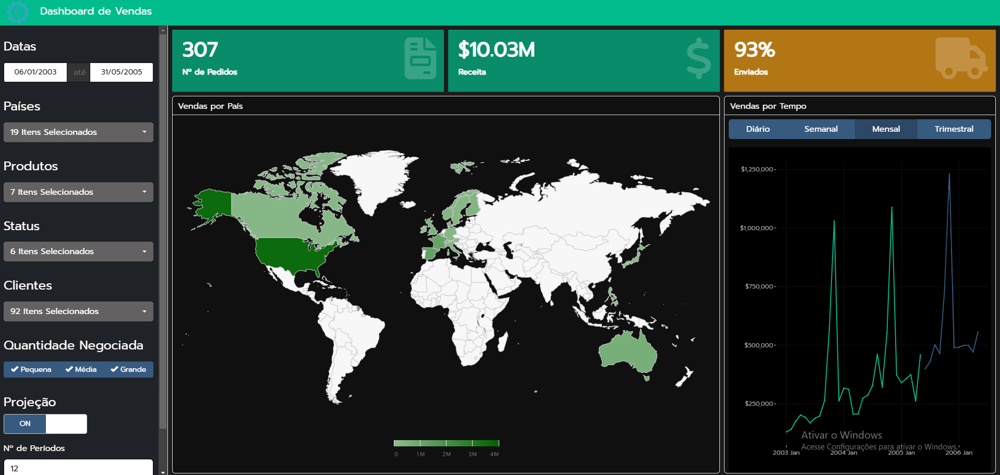

# Visite o Dashboard de Vendas

O dashboard de vendas foi desenvolvido para analisar as tendências de vendas de diferentes produtos e períodos de tempo. Ele foi construído usando Shiny e Flexdashboard para permitir uma interação intuitiva com os dados.

Você pode acessar o dashboard diretamente [clicando aqui](https://feyama.shinyapps.io/dashboard-venda/).

  <!-- Isso é opcional, caso queira incluir uma imagem -->

# Funcionalidades

- Visualização interativa das vendas ao longo do tempo.
- Filtros por categoria de produto, período e região.
- Gráficos dinâmicos que permitem uma análise aprofundada.

Não deixe de conferir todas as funcionalidades acessando o [dashboard de vendas](https://feyama.shinyapps.io/dashboard-venda/).
